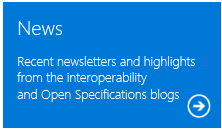

# Open Specifications Dev Center

Through the Open Specifications program, Microsoft is helping developers open new opportunities by making technical documents related to interoperability for certain popular Microsoft products available to view and download from MSDN at no charge. This documentation includes protocols, computer languages, standards support, and data portability.

Although the technical documents are freely available, many of them include patented inventions. Some of these patents are available at no charge under the patent promises. The remaining patents are available through various programs. For more information, please see the Programs and Patents links.

You can learn about the Microsoft commitment to interoperability by watching our Open Specifications Plugfest videos, such as the [Interoperability Protocols Keynote]("https://channel9.msdn.com/events/open-specifications-plugfests/redmond-interoperability-protocols-plugfest-2015/microsoft-redmond-plugfest-2015-keynote"). Find the videos and other support for Open Specifications implementations by using the Documentation, News, Plugfests and Events, Test Tools, Support, and Case Studies links.

|||||
|---|---|---|---|
|||||
|||||