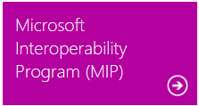
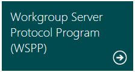
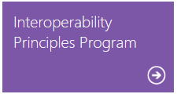
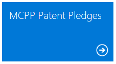

# Programs

The technical documents are available to [view and download from MSDN]("https://msdn.microsoft.com/library/dd208104.aspx") at no charge. Many of the technical specifications include patented inventions. Some of those patents are available at no charge under the [Open Specification Promise]("https://msdn.microsoft.com/openspecifications/dn646765") or the [Community Promise]("https://msdn.microsoft.com/openspecifications/dn646766"). For information, see the [Patents]("https://msdn.microsoft.com/openspecifications/dn750984") page. The remaining patents are available primarily through three programs, which principally vary with respect to the scope of the protocols and technical specifications covered. For each program, Microsoft makes available lists identifying the patents and patent applications that cover each of the specifications included.

* **Microsoft Interoperability Program (MIP)** — This program includes technical specifications for communications protocols in specific versions of the Windows client operating system, the Windows Server operating system, Microsoft PC Productivity Applications, Exchange Server, and Microsoft SharePoint products and technologies that are used by certain Microsoft client and server products, as well as certain standards, languages, and file formats supported by such products.

* **Workgroup Server Protocol Program (WSPP)** — This program includes technical specifications for communications protocols between specific versions of the Windows client operating system and the Windows Server operating system as well as between specific versions of the Windows Server operating systems to provide file, print and user and group administration services in a Windows workgroup network.

* **Interoperability Principles Program** — Microsoft makes additional patent license agreements available for the technical specifications for the communications protocols used by its high-volume products pursuant to the [Interoperability Principles]("https://msdn.microsoft.com/openspecifications/dn646764") announced February 21, 2008.

In addition, Microsoft makes available a warranty on certain technical specifications and the implementation of specific standards in certain products through MIP and WSPP.

**NOTE:** The **Microsoft Communications Protocol Program (MCPP)** has been superseded by other programs and is no longer available. But the Microsoft patent pledges for implementation of the MCPP technical specifications remain.

|||||
|---|---|---|---|
|||||