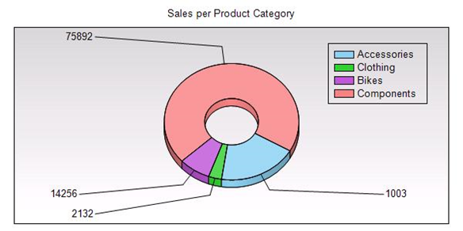

<html dir="LTR" xmlns:mshelp="http://msdn.microsoft.com/mshelp" xmlns:ddue="http://ddue.schemas.microsoft.com/authoring/2003/5" xmlns:xlink="http://www.w3.org/1999/xlink" xmlns:tool="http://www.microsoft.com/tooltip">
    <head>
        <meta http-equiv="Content-Type" content="text/html; CHARSET=utf-8"></meta>
        <meta name="save" content="history"></meta>
        <title>3.5 Doughnut Chart</title>
        <xml>
            <mshelp:toctitle title="3.5 Doughnut Chart"></mshelp:toctitle>
            <mshelp:rltitle title="[MS-RDL]: Doughnut Chart"></mshelp:rltitle>
            <mshelp:keyword index="A" term="44f4fcd2-588c-487a-be24-9c98cd51fd64"></mshelp:keyword>
            <mshelp:attr name="DCSext.ContentType" value="open specification"></mshelp:attr>
            <mshelp:attr name="AssetID" value="44f4fcd2-588c-487a-be24-9c98cd51fd64"></mshelp:attr>
            <mshelp:attr name="TopicType" value="kbRef"></mshelp:attr>
            <mshelp:attr name="DCSext.Title" value="[MS-RDL]: Doughnut Chart" />
        </xml>
    </head>
    <body>
        

            <h1 class="heading">3.5 Doughnut Chart</h1>
        

        

            

                

                

                    

<b><i>Applies to </i></b><a href="a7e2ad00-07c8-4f6d-80ab-3ad55df7b233.md"><b><i>RDL 2003/10</i></b></a><b>
<i>and </i></b><a href="3ebe2912-4958-4832-b391-cad1f5e13338.md"><b><i>RDL 2005/01</i></b></a>

The following sample report shows a doughnut <a href="b2482b3f-74ab-4ca8-a9e5-c07955011743.md#gt_8e07039d-d1d3-4336-a478-f35e8cacc26c">chart</a>.

<b>Figure 14: Doughnut chart example</b>

The following table shows the data that this chart is bound
to.

<table>
 <thead>
  <tr>
   <th>
   
Product category name

   </th>
   <th>
   
Year

   </th>
   <th>
   
Quantity

   </th>
  </tr>
 </thead>
 <tr>
  <td rowspan="5">
  
Accessories

  </td>
  <td>
  
2001

  </td>
  <td>
  
1003

  </td>
 </tr>
 <tr>
  <td>
  
2002

  </td>
  <td>
  
27207

  </td>
 </tr>
 <tr>
  <td>
  
2003

  </td>
  <td>
  
23734

  </td>
 </tr>
 <tr>
  <td>
  
2003

  </td>
  <td>
  
103978

  </td>
 </tr>
 <tr>
  <td>
  
2004

  </td>
  <td>
  
292660

  </td>
 </tr>
 <tr>
  <td rowspan="5">
  
Bikes

  </td>
  <td>
  
2001

  </td>
  <td>
  
14256

  </td>
 </tr>
 <tr>
  <td>
  
2002

  </td>
  <td>
  
49810

  </td>
 </tr>
 <tr>
  <td>
  
2003

  </td>
  <td>
  
30773

  </td>
 </tr>
 <tr>
  <td>
  
2003

  </td>
  <td>
  
43241

  </td>
 </tr>
 <tr>
  <td>
  
2004

  </td>
  <td>
  
42456

  </td>
 </tr>
 <tr>
  <td rowspan="5">
  
Clothing

  </td>
  <td>
  
2001

  </td>
  <td>
  
2132

  </td>
 </tr>
 <tr>
  <td>
  
2002

  </td>
  <td>
  
16927

  </td>
 </tr>
 <tr>
  <td>
  
2003

  </td>
  <td>
  
16515

  </td>
 </tr>
 <tr>
  <td>
  
2003

  </td>
  <td>
  
18862

  </td>
 </tr>
 <tr>
  <td>
  
2004

  </td>
  <td>
  
19234

  </td>
 </tr>
 <tr>
  <td rowspan="5">
  
Components

  </td>
  <td>
  
2001

  </td>
  <td>
  
75892

  </td>
 </tr>
 <tr>
  <td>
  
2002

  </td>
  <td>
  
332885

  </td>
 </tr>
 <tr>
  <td>
  
2003

  </td>
  <td>
  
266860

  </td>
 </tr>
 <tr>
  <td>
  
2003

  </td>
  <td>
  
314930

  </td>
 </tr>
 <tr>
  <td>
  
2004

  </td>
  <td>
  
661065

  </td>
 </tr>
</table>

This chart shows the sum of the quantity for each product
category regardless of the year. The following RDL snippet shows how the chart
is specified to display data the way it looks in the preceding picture.

<dl>
<dd>

<pre> &lt;Chart Name=&quot;chart1&quot;&gt;
   &lt;DataSetName&gt;SalesPerProduct&lt;/DataSetName&gt;
   &lt;PointWidth&gt;0&lt;/PointWidth&gt;
   &lt;Palette&gt;Pastel&lt;/Palette&gt;
   &lt;Subtype&gt;Plain&lt;/Subtype&gt;
   &lt;Type&gt;Doughnut&lt;/Type&gt;
   &lt;Top&gt;0.125in&lt;/Top&gt;
   &lt;Left&gt;0.125in&lt;/Left&gt;
   &lt;Width&gt;6.25in&lt;/Width&gt;
   &lt;Height&gt;3.125in&lt;/Height&gt;
   &lt;CategoryAxis /&gt;
   &lt;ValueAxis /&gt;
</pre>

</dd></dl>

This is a doughnut chart bound to a <a href="a14782b0-2e2f-4305-83a3-3de3fd750b6a.md">DataSet</a> that is called
&quot;SalesPerProduct&quot; with a Pastel palette.

<dl>
<dd>

<pre>   &lt;SeriesGroupings&gt;
     &lt;SeriesGrouping&gt;
       &lt;DynamicSeries&gt;
         &lt;Grouping Name=&quot;chart1_SeriesGroup1&quot;&gt;
           &lt;GroupExpressions&gt;
               GroupExpression&gt;=Fields!ProductCategoryName.Value&lt;/GroupExpression&gt;
           &lt;/GroupExpressions&gt;
         &lt;/Grouping&gt;
         &lt;Label&gt;=Fields!ProductCategoryName.Value&lt;/Label&gt;
       &lt;/DynamicSeries&gt;
     &lt;/SeriesGrouping&gt;
   &lt;/SeriesGroupings&gt;
</pre>

</dd></dl>

The series grouping specifies that each Product Category
value is in the legend. Note that the <a href="2f1df157-da20-4f51-bff5-d928549c3c93.md">Label</a> element specifies
the text of the item in the legend. The number of the series groups is the
number of slices in the chart. The sizes of the slices are determined by the
following value.

<dl>
<dd>

<pre>   &lt;ChartData&gt;
     &lt;ChartSeries&gt;
       &lt;DataPoints&gt;
         &lt;DataPoint&gt;
           &lt;DataValues&gt;
             &lt;DataValue&gt;
               &lt;Value&gt;=Sum(Fields!Quantity.Value)&lt;/Value&gt;
             &lt;/DataValue&gt;
           &lt;/DataValues&gt;
           &lt;DataLabel&gt;
             &lt;Style /&gt;
             &lt;Value&gt;=Fields!Quantity.Value&lt;/Value&gt;
             &lt;Position&gt;BottomRight&lt;/Position&gt;
             &lt;Visible&gt;true&lt;/Visible&gt;
           &lt;/DataLabel&gt;
         &lt;/DataPoint&gt;
       &lt;/DataPoints&gt;
     &lt;/ChartSeries&gt;
   &lt;/ChartData&gt;
</pre>

</dd></dl>

As shown in the figure, each slice has its value displayed
as a <a href="64273976-3568-4d05-b4ee-300c53a5736c.md">DataLabel</a> element
as specified in the above RDL.

<dl>
<dd>

<pre>   &lt;Legend&gt;
     &lt;Visible&gt;true&lt;/Visible&gt;
     &lt;Style&gt;
       &lt;BorderStyle&gt;
         &lt;Default&gt;Solid&lt;/Default&gt;
       &lt;/BorderStyle&gt;
     &lt;/Style&gt;
     &lt;InsidePlotArea&gt;true&lt;/InsidePlotArea&gt;
   &lt;/Legend&gt;
</pre>

</dd></dl>

The <a href="ee6c1c5b-1389-43fb-989a-62fbf0cb5f6f.md">Legend</a>
element is displayed inside the <a href="264492fb-4969-4fed-8fed-adab6179097f.md">PlotArea</a> element with the
gradient background color specified by the <b>PlotArea</b> element in the
following RDL.

<dl>
<dd>

<pre>   &lt;PlotArea&gt;
     &lt;Style&gt;
       &lt;BackgroundColor&gt;LightGrey&lt;/BackgroundColor&gt;
       &lt;BackgroundGradientType&gt;TopBottom&lt;/BackgroundGradientType&gt;
       &lt;BorderStyle&gt;
         &lt;Default&gt;Solid&lt;/Default&gt;
       &lt;/BorderStyle&gt;
     &lt;/Style&gt;
   &lt;/PlotArea&gt;
</pre>

</dd></dl>

Because this is a 3D chart, the <a href="2617763c-2b85-4f0d-9e3f-1828abb52b23.md">ThreeDProperties</a> element
is required as well in the following RDL.

<dl>
<dd>

<pre>   &lt;ThreeDProperties&gt;
     &lt;Enabled&gt;true&lt;/Enabled&gt;
     &lt;Rotation&gt;30&lt;/Rotation&gt;
     &lt;Inclination&gt;30&lt;/Inclination&gt;
     &lt;Shading&gt;Real&lt;/Shading&gt;
     &lt;WallThickness&gt;50&lt;/WallThickness&gt;
   &lt;/ThreeDProperties&gt;
</pre>

</dd></dl>

The following RDL specifies the chart title text and the
chart style.

<dl>
<dd>

<pre>   &lt;Style&gt;
     &lt;BackgroundColor&gt;White&lt;/BackgroundColor&gt;
   &lt;/Style&gt;
   &lt;Title&gt;
     &lt;Caption&gt;Sales per Product Category&lt;/Caption&gt;
   &lt;/Title&gt;
 &lt;/Chart&gt;
</pre>

</dd></dl>

                

            

        

    </body>
</html>