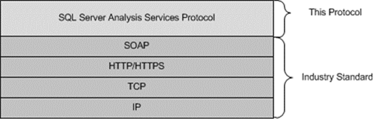
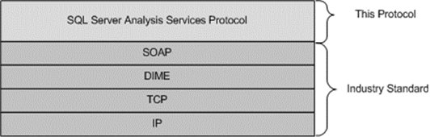

<html dir="LTR" xmlns:mshelp="http://msdn.microsoft.com/mshelp" xmlns:ddue="http://ddue.schemas.microsoft.com/authoring/2003/5" xmlns:xlink="http://www.w3.org/1999/xlink" xmlns:tool="http://www.microsoft.com/tooltip">
    <head>
        <meta http-equiv="Content-Type" content="text/html; CHARSET=utf-8"></meta>
        <meta name="save" content="history"></meta>
        <title>1.4 Relationship to Other Protocols</title>
        <xml>
            <mshelp:toctitle title="1.4 Relationship to Other Protocols"></mshelp:toctitle>
            <mshelp:rltitle title="[MS-SSAS]: Relationship to Other Protocols"></mshelp:rltitle>
            <mshelp:keyword index="A" term="a30f0c6e-1cc1-4905-a373-1c0f1637a372"></mshelp:keyword>
            <mshelp:attr name="DCSext.ContentType" value="open specification"></mshelp:attr>
            <mshelp:attr name="AssetID" value="a30f0c6e-1cc1-4905-a373-1c0f1637a372"></mshelp:attr>
            <mshelp:attr name="TopicType" value="kbRef"></mshelp:attr>
            <mshelp:attr name="DCSext.Title" value="[MS-SSAS]: Relationship to Other Protocols" />
        </xml>
    </head>
    <body>
        

            <h1 class="heading">1.4 Relationship to Other Protocols</h1>
        

        

            

                

                

                    

Microsoft SQL Server Analysis Services uses the SOAP
messaging protocol for formatting requests and responses as specified either in
<a href="https://go.microsoft.com/fwlink/?LinkId=90520">[SOAP1.1]</a> or in <a href="https://go.microsoft.com/fwlink/?LinkId=94664">[SOAP1.2-1/2007]</a> and <a href="https://go.microsoft.com/fwlink/?LinkId=119124">[SOAP1.2-2/2007]</a>. It
transmits these messages using HTTP <a href="https://go.microsoft.com/fwlink/?LinkId=402094">[RFC7230]</a>, HTTPS <a href="https://go.microsoft.com/fwlink/?LinkId=90383">[RFC2818]</a>, or TCP <a href="https://go.microsoft.com/fwlink/?LinkId=150872">[RFC793]</a>.

This protocol uses SOAP over HTTP or HTTPS, as shown in the
following layering diagram:

<b>Figure 2: SOAP over HTTP or HTTPS</b>

Analysis Services uses SOAP over Direct Internet Message
Encapsulation <a href="https://go.microsoft.com/fwlink/?LinkId=89847">[DIME]</a>
and TCP/IP, as shown in the following layering diagram:

<b>Figure 3: SOAP over DIME and TCP/IP</b>

                

            

        

    </body>
</html>