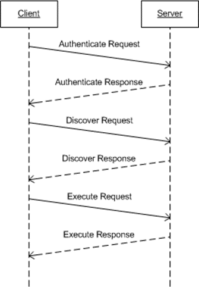

<html dir="LTR" xmlns:mshelp="http://msdn.microsoft.com/mshelp" xmlns:ddue="http://ddue.schemas.microsoft.com/authoring/2003/5" xmlns:xlink="http://www.w3.org/1999/xlink" xmlns:tool="http://www.microsoft.com/tooltip">
    <head>
        <meta http-equiv="Content-Type" content="text/html; CHARSET=utf-8"></meta>
        <meta name="save" content="history"></meta>
        <title>1.3 Overview</title>
        <xml>
            <mshelp:toctitle title="1.3 Overview"></mshelp:toctitle>
            <mshelp:rltitle title="[MS-SSAS]: Overview"></mshelp:rltitle>
            <mshelp:keyword index="A" term="dfab855b-d575-40a5-8ef6-820996ace09c"></mshelp:keyword>
            <mshelp:attr name="DCSext.ContentType" value="open specification"></mshelp:attr>
            <mshelp:attr name="AssetID" value="dfab855b-d575-40a5-8ef6-820996ace09c"></mshelp:attr>
            <mshelp:attr name="TopicType" value="kbRef"></mshelp:attr>
            <mshelp:attr name="DCSext.Title" value="[MS-SSAS]: Overview" />
        </xml>
    </head>
    <body>
        

            <h1 class="heading">1.3 Overview</h1>
        

        

            

                

                

                    

Microsoft SQL Server Analysis Services provides methods for
a client to communicate with, and perform operations on, an <a href="8676f5ce-62d4-4244-a326-634bfed4aba4.md#gt_3f8f73d9-c597-447c-b67e-47ec9930a916">analysis server</a>. This
protocol is based on SOAP and XML for Analysis (XMLA) <a href="https://go.microsoft.com/fwlink/?LinkId=282742">[XMLA]</a>. This protocol
supports TCP/IP as an underlying transport mechanism in addition to HTTP/HTTPS.

Analysis Services defines the following operations: <b>Authenticate</b>,
<b>Discover</b>, and <b>Execute</b>.

<b>Authenticate</b> is used by the client and server to
exchange UTF-8 (<a href="https://go.microsoft.com/fwlink/?LinkId=90331">[RFC2279]</a>)
encoded <a href="8676f5ce-62d4-4244-a326-634bfed4aba4.md#gt_6b49ccf2-3d93-4d1e-9ecd-e5e7873eec24">security token</a> <a href="8676f5ce-62d4-4244-a326-634bfed4aba4.md#gt_5730e966-96d3-404f-a42a-ba9b8380beb3">data blocks</a> as part of the
authentication process. For more information about authentication, see section <a href="772a1bad-da72-46c9-a406-8cee8ba99277.md">4.1.2</a>.

<b>Discover</b> is used to obtain information from an
analysis server, such as a list of catalogs on a server. Properties are used to
control what data is obtained. This generic interface and the use of properties
allow extensibility without rewriting existing functions. For more information,
see section <a href="49346daa-9c9b-4188-a9fe-ee267768b253.md">3.1.4.2</a>.

<b>Execute</b> is used to execute commands against a
particular analysis server and optionally get back a result set either in a
tabular or multidimensional form. For more information, see section <a href="d2b8314d-7a17-4bf1-82c2-db3cd467bc17.md">3.1.4.3</a>.

By using the <b>Authenticate</b>, <b>Discover</b>, and <b>Execute</b>
operations, the transfer of data between a client and an analysis server can be
achieved.

The following diagram illustrates this concept:  

<b>Figure 1: Data transfer between a client and an analysis
server via the Authenticate, Discover, and Execute operations</b>

                

            

        

    </body>
</html>