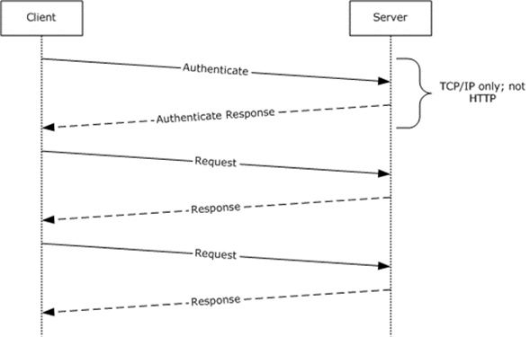

<html dir="LTR" xmlns:mshelp="http://msdn.microsoft.com/mshelp" xmlns:ddue="http://ddue.schemas.microsoft.com/authoring/2003/5" xmlns:xlink="http://www.w3.org/1999/xlink" xmlns:tool="http://www.microsoft.com/tooltip">
    <head>
        <meta http-equiv="Content-Type" content="text/html; CHARSET=utf-8"></meta>
        <meta name="save" content="history"></meta>
        <title>1.3 Overview</title>
        <xml>
            <mshelp:toctitle title="1.3 Overview"></mshelp:toctitle>
            <mshelp:rltitle title="[MS-SSAS8]: Overview"></mshelp:rltitle>
            <mshelp:keyword index="A" term="6e38dbb5-00c3-4cfe-b087-ad124f86f6f6"></mshelp:keyword>
            <mshelp:attr name="DCSext.ContentType" value="open specification"></mshelp:attr>
            <mshelp:attr name="AssetID" value="6e38dbb5-00c3-4cfe-b087-ad124f86f6f6"></mshelp:attr>
            <mshelp:attr name="TopicType" value="kbRef"></mshelp:attr>
            <mshelp:attr name="DCSext.Title" value="[MS-SSAS8]: Overview" />
        </xml>
    </head>
    <body>
        

            <h1 class="heading">1.3 Overview</h1>
        

        

            

                

                

                    

SQL Server Analysis Services Version 8.0 provides methods
for a client to communicate with, and perform operations on, an <a href="c527450b-f5bd-424b-8c98-ba6365288f35.html#gt_055c223a-52f1-4d41-b95b-d7c60eaa388f">Online Analytical Processing
(OLAP)</a> server. 

The client and server exchange messages as binary packages
over TCP/IP. Alternatively, the same binary packages can be exchanged between
the client and server by wrapping them in HTTP or HTTPS, with a few exceptions
in binary package composition as noted in section <a href="52457140-43c9-4e21-b694-1c87ecc51533.html">2.1.2</a>. 

This protocol specification documents the content of these
messages. Requests are initiated by the client and responded to by the server.
In this protocol, the client and server are very tightly coupled and at times
exchange memory blocks and pointers to memory blocks with each other. Both the
client and server can modify the blocks and pointers and pass them back to the
other. This protocol assumes that the client and server have shared information
about how the memory is configured on the other end of the protocol.

The following diagram illustrates this concept.

<b>Figure 1: Data transfer between a client and an analysis
server</b>

                

            

        

    </body>
</html>