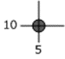

<html dir="LTR" xmlns:mshelp="http://msdn.microsoft.com/mshelp" xmlns:ddue="http://ddue.schemas.microsoft.com/authoring/2003/5" xmlns:xlink="http://www.w3.org/1999/xlink" xmlns:tool="http://www.microsoft.com/tooltip">
    <head>
        <meta http-equiv="Content-Type" content="text/html; CHARSET=utf-8"></meta>
        <meta name="save" content="history"></meta>
        <title>3.1.2 Geometry Point Structure</title>
        <xml>
            <mshelp:toctitle title="3.1.2 Geometry Point Structure"></mshelp:toctitle>
            <mshelp:rltitle title="[MS-SSCLRT]: Geometry Point Structure"></mshelp:rltitle>
            <mshelp:keyword index="A" term="dc988cb6-4812-4ec6-91cd-cce329f6ecda"></mshelp:keyword>
            <mshelp:attr name="DCSext.ContentType" value="open specification"></mshelp:attr>
            <mshelp:attr name="AssetID" value="dc988cb6-4812-4ec6-91cd-cce329f6ecda"></mshelp:attr>
            <mshelp:attr name="TopicType" value="kbRef"></mshelp:attr>
            <mshelp:attr name="DCSext.Title" value="[MS-SSCLRT]: Geometry Point Structure" />
        </xml>
    </head>
    <body>
        

            <h1 class="heading">3.1.2 Geometry Point Structure</h1>
        

        

            

                

                

                    

POINT(5 10) holds a 0-dimension feature that represents a
point location. The following figure shows a geometry point feature located at
the intersection of 5 on the x-axis and 10 on the y-axis (the actual point is
surrounded by a circular symbol to make it easier to see).

<b>Figure 1: A geometry point</b>

POINT (5 10) in SRID 4326 is represented by the following
binary string:           

<dl>
<dd>

<pre> 0xE6100000 01 0C 0000000000001440 0000000000002440
</pre>

</dd></dl>

This string is interpreted as shown in the following table.

<table>
 <thead>
  <tr>
   <th>
   
Binary value

   </th>
   <th>
   
Description

   </th>
  </tr>
 </thead>
 <tr>
  <td>
  
E6100000

  </td>
  <td>
  
SRID = 4326

  </td>
 </tr>
 <tr>
  <td>
  
01

  </td>
  <td>
  
Version = 1

  </td>
 </tr>
 <tr>
  <td>
  
0C

  </td>
  <td>
  
Serialization Properties = V + P (geometry is valid,
  single point)

  </td>
 </tr>
 <tr>
  <td>
  
0000000000001440

  </td>
  <td>
  
X = 5

  </td>
 </tr>
 <tr>
  <td>
  
0000000000002440

  </td>
  <td>
  
Y = 10

  </td>
 </tr>
</table>

 

                

            

        

    </body>
</html>