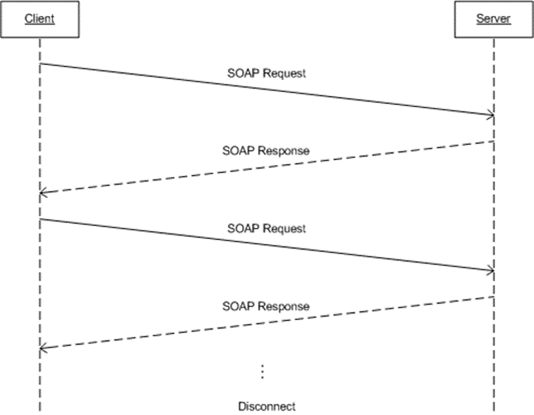

<html dir="LTR" xmlns:mshelp="http://msdn.microsoft.com/mshelp" xmlns:ddue="http://ddue.schemas.microsoft.com/authoring/2003/5" xmlns:xlink="http://www.w3.org/1999/xlink" xmlns:tool="http://www.microsoft.com/tooltip">
    <head>
        <meta http-equiv="Content-Type" content="text/html; CHARSET=utf-8"></meta>
        <meta name="save" content="history"></meta>
        <title>1.3 Overview</title>
        <xml>
            <mshelp:toctitle title="1.3 Overview"></mshelp:toctitle>
            <mshelp:rltitle title="[MS-SSNWS]: Overview"></mshelp:rltitle>
            <mshelp:keyword index="A" term="08236df6-cd52-48ee-9224-031d2e8ae6ff"></mshelp:keyword>
            <mshelp:attr name="DCSext.ContentType" value="open specification"></mshelp:attr>
            <mshelp:attr name="AssetID" value="08236df6-cd52-48ee-9224-031d2e8ae6ff"></mshelp:attr>
            <mshelp:attr name="TopicType" value="kbRef"></mshelp:attr>
            <mshelp:attr name="DCSext.Title" value="[MS-SSNWS]: Overview" />
        </xml>
    </head>
    <body>
        

            <h1 class="heading">1.3 Overview</h1>
        

        

            

                

                

                    

The Native Web Services Protocol is an application-level
protocol that is used to transfer requests and responses between clients and
database server systems. In such systems, the client will typically establish a
connection with the server. Once the connection is established using the HTTP (<a href="https://go.microsoft.com/fwlink/?LinkId=90372">[RFC2616]</a>) or HTTPS (<a href="https://go.microsoft.com/fwlink/?LinkId=90383">[RFC2818]</a>) protocol, <a href="4baedaec-b5a7-4176-be88-e1cec659ab8c.html#gt_96185df3-4677-478c-b239-f72fcf514c59">SOAP messages</a>, SOAP1.1 (<a href="https://go.microsoft.com/fwlink/?LinkId=90520">[SOAP1.1]</a>) or SOAP1.2
(<a href="https://go.microsoft.com/fwlink/?LinkId=90521">[SOAP1.2-1/2003]</a>, <a href="https://go.microsoft.com/fwlink/?LinkId=90522">[SOAP1.2-2/2003]</a>), are
used to communicate between the client and the server.

The NWS protocol uses the security facilities built into
HTTP or HTTPS for <a href="4baedaec-b5a7-4176-be88-e1cec659ab8c.html#gt_8e961bf0-95ba-4f58-9034-b67ccb27f317">authentication</a>
and identification and also for channel encryption negotiation. The protocol
uses the facilities built into SOAP for specification of requests from client
to server (including Transact SQL queries; for more information, see <a href="https://go.microsoft.com/fwlink/?LinkId=90148">[MSDN-TSQL]</a>) and for
returning data from server to client. The following diagram depicts a
(simplified) typical flow of communication in the protocol.

<b>Figure 1: Communication flow in the Native Web Services
protocol</b>

The following example is a high-level description of the
messages exchanged between the client and the server to execute a simple client
request such as the execution of an [MSDN-TSQL] statement. It is assumed that
the client and the server have already established a connection and
authentication has succeeded.

<dl>
<dd>

<pre>    Client:SOAP sqlbatch
</pre>

</dd></dl>

The server executes the statement and then sends back the
results to the client.

<dl>
<dd>

<pre>    Server:SOAP sqlbatchResponse
</pre>

</dd></dl>

                

            

        

    </body>
</html>