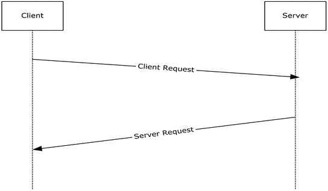

<html dir="LTR" xmlns:mshelp="http://msdn.microsoft.com/mshelp" xmlns:ddue="http://ddue.schemas.microsoft.com/authoring/2003/5" xmlns:xlink="http://www.w3.org/1999/xlink" xmlns:tool="http://www.microsoft.com/tooltip">
    <head>
        <meta http-equiv="Content-Type" content="text/html; CHARSET=utf-8"></meta>
        <meta name="save" content="history"></meta>
        <title>2.4.1.2 Named SQL Server Instance Resolution/Enumeration</title>
        <xml>
            <mshelp:toctitle title="2.4.1.2 Named SQL Server Instance Resolution/Enumeration"></mshelp:toctitle>
            <mshelp:rltitle title="[MS-SSSO]: Named SQL Server Instance Resolution/Enumeration"></mshelp:rltitle>
            <mshelp:keyword index="A" term="0a4ddedb-9121-4908-b721-ad8f0958f728"></mshelp:keyword>
            <mshelp:attr name="DCSext.ContentType" value="open specification"></mshelp:attr>
            <mshelp:attr name="AssetID" value="0a4ddedb-9121-4908-b721-ad8f0958f728"></mshelp:attr>
            <mshelp:attr name="TopicType" value="kbRef"></mshelp:attr>
            <mshelp:attr name="DCSext.Title" value="[MS-SSSO]: Named SQL Server Instance Resolution/Enumeration" />
        </xml>
    </head>
    <body>
        

            <h1 class="heading">2.4.1.2 Named SQL Server Instance Resolution/Enumeration</h1>
        

        

            

                

                

                    

This use case describes how the connectivity protocol
details of a named instance of Microsoft SQL Server are discovered. The actors
are the application and the SQL Server Browser.

<b>Actions</b>

<ol><li>
    A database
application sends an SSRP <mshelp:link keywords="1ea6e25f-bff9-4364-ba21-5dc449a601b7" tabindex="0">[MC-SQLR]</mshelp:link>
message to the SQL Server Browser service with the name of the desired instance
of SQL Server. 

</li><li>
    The SQL Server
Browser responds either with protocol details that specify where the instance
of SQL Server is listening or with an error indicating that there is no such
named instance of SQL Server.

</li><li>
    The database
application has a list of instances of SQL Server to which it can connect.

</li></ol>

<b>Figure 12: Named SQL Server instance resolution use case</b>

                

            

        

    </body>
</html>