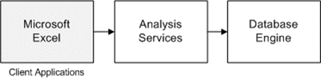

<html dir="LTR" xmlns:mshelp="http://msdn.microsoft.com/mshelp" xmlns:ddue="http://ddue.schemas.microsoft.com/authoring/2003/5" xmlns:xlink="http://www.w3.org/1999/xlink" xmlns:tool="http://www.microsoft.com/tooltip">
    <head>
        <meta http-equiv="Content-Type" content="text/html; CHARSET=utf-8"></meta>
        <meta name="save" content="history"></meta>
        <title>3.2.1 Obtaining Data via Analysis Services</title>
        <xml>
            <mshelp:toctitle title="3.2.1 Obtaining Data via Analysis Services"></mshelp:toctitle>
            <mshelp:rltitle title="[MS-SSSO]: Obtaining Data via Analysis Services"></mshelp:rltitle>
            <mshelp:keyword index="A" term="14af939c-87f2-426a-bab6-e73e166a9502"></mshelp:keyword>
            <mshelp:attr name="DCSext.ContentType" value="open specification"></mshelp:attr>
            <mshelp:attr name="AssetID" value="14af939c-87f2-426a-bab6-e73e166a9502"></mshelp:attr>
            <mshelp:attr name="TopicType" value="kbRef"></mshelp:attr>
            <mshelp:attr name="DCSext.Title" value="[MS-SSSO]: Obtaining Data via Analysis Services" />
        </xml>
    </head>
    <body>
        

            <h1 class="heading">3.2.1 Obtaining Data via Analysis Services</h1>
        

        

            

                

                

                    

The steps for this example are similar to those in section <a href="a96fd13e-ce8e-41f2-b472-7b16ce2bd9ec.md">3.2.2</a>, but a pivot table
is published by Microsoft Excel at the Analysis Services server, that is, a
pivot table is manipulated and data is retrieved from the Analysis Services
server.

<b>Figure 16: User obtaining data via Analysis Services</b>

                

            

        

    </body>
</html>