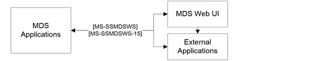

<html dir="LTR" xmlns:mshelp="http://msdn.microsoft.com/mshelp" xmlns:ddue="http://ddue.schemas.microsoft.com/authoring/2003/5" xmlns:xlink="http://www.w3.org/1999/xlink" xmlns:tool="http://www.microsoft.com/tooltip">
    <head>
        <meta http-equiv="Content-Type" content="text/html; CHARSET=utf-8"></meta>
        <meta name="save" content="history"></meta>
        <title>2.1.2 Master Data Services</title>
        <xml>
            <mshelp:toctitle title="2.1.2 Master Data Services"></mshelp:toctitle>
            <mshelp:rltitle title="[MS-SSSO]: Master Data Services"></mshelp:rltitle>
            <mshelp:keyword index="A" term="17748f36-32b5-438a-b6dc-d97b2440419b"></mshelp:keyword>
            <mshelp:attr name="DCSext.ContentType" value="open specification"></mshelp:attr>
            <mshelp:attr name="AssetID" value="17748f36-32b5-438a-b6dc-d97b2440419b"></mshelp:attr>
            <mshelp:attr name="TopicType" value="kbRef"></mshelp:attr>
            <mshelp:attr name="DCSext.Title" value="[MS-SSSO]: Master Data Services" />
        </xml>
    </head>
    <body>
        

            <h1 class="heading">2.1.2 Master Data Services</h1>
        

        

            

                

                

                    

Master Data Services (MDS) provides master data management
(MDM) capabilities that help provide customers with a single authoritative data
source to ensure the integrity of the data they use to make decisions. MDS
includes an any-domain hub, a set of services, and an interface that enables
organizations to manage important data assets for both line-of-business and
analytic applications. MDS is a SQL Server database application, a Windows
Communication Foundation (WCF) Services application, and an ASPX application
that includes the following:

<ul><li>
 
<b>Master Data Hub</b> for central storage, authoritative source,
versioning, rules, and transactions.

</li><li>
 
<b>Stewardship Portal</b> for model management, documentation,
workflow, and integration.

</li></ul>
MDS includes protocols that communicate between the MDS
application and the MDS web user interface and between the MDS application and
external applications <mshelp:link keywords="ab7df855-59f8-4d31-9d8a-9ab6e4b7a459" tabindex="0">[MS-SSMDSWS]</mshelp:link>
<mshelp:link keywords="484fe9af-35ad-489f-a672-b3acad9db116" tabindex="0">[MS-SSMDSWS-15]</mshelp:link>,
as shown in the following figure.

MDS uses the Tabular Data Stream (TDS) protocol <mshelp:link keywords="b46a581a-39de-4745-b076-ec4dbb7d13ec" tabindex="0">[MS-TDS]</mshelp:link>
to communicate with the Database Engine.

<b>Figure 3: MDS architecture</b>

                

            

        

    </body>
</html>