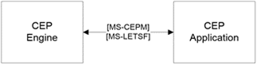

<html dir="LTR" xmlns:mshelp="http://msdn.microsoft.com/mshelp" xmlns:ddue="http://ddue.schemas.microsoft.com/authoring/2003/5" xmlns:xlink="http://www.w3.org/1999/xlink" xmlns:tool="http://www.microsoft.com/tooltip">
    <head>
        <meta http-equiv="Content-Type" content="text/html; CHARSET=utf-8"></meta>
        <meta name="save" content="history"></meta>
        <title>2.1.6 Complex Event Processing Engine</title>
        <xml>
            <mshelp:toctitle title="2.1.6 Complex Event Processing Engine"></mshelp:toctitle>
            <mshelp:rltitle title="[MS-SSSO]: Complex Event Processing Engine"></mshelp:rltitle>
            <mshelp:keyword index="A" term="21a43505-90d4-4ac3-9775-704eebd3fbd0"></mshelp:keyword>
            <mshelp:attr name="DCSext.ContentType" value="open specification"></mshelp:attr>
            <mshelp:attr name="AssetID" value="21a43505-90d4-4ac3-9775-704eebd3fbd0"></mshelp:attr>
            <mshelp:attr name="TopicType" value="kbRef"></mshelp:attr>
            <mshelp:attr name="DCSext.Title" value="[MS-SSSO]: Complex Event Processing Engine" />
        </xml>
    </head>
    <body>
        

            <h1 class="heading">2.1.6 Complex Event Processing Engine</h1>
        

        

            

                

                

                    

The SQL Server Platform includes a <a href="20049766-3c6e-4f20-a20e-64785e88f6f2.md#gt_cdd92241-e9af-4c1f-af49-76373626468f">Complex Event Processing (CEP)</a>
Engine. This is a separate engine with no dependencies on Microsoft SQL Server
and its other components, such as Reporting Services, Analysis Services, and
the Database Engine. Client applications can communicate with the CEP Engine
via <a href="20049766-3c6e-4f20-a20e-64785e88f6f2.md#gt_a96bfb18-c329-40f5-89fd-df7a94b89882">web services</a> for
manageability, as shown in the following figure. These client applications can
also include database applications that are built on SQL Server.

<b>Figure 8: CEP Engine architecture</b>

The client-side CEP library communicates to the server by
using the Complex Event Processing Engine Manageability (CEPM) protocol <mshelp:link keywords="76d533d1-8c07-46af-8a31-3f2520cda70c" tabindex="0">[MS-CEPM]</mshelp:link>.
The CEPM protocol uses the LINQ Expression Tree serialization format <mshelp:link keywords="697e4fad-ab35-4861-a3f5-a62466a3ae68" tabindex="0">[MS-LETSF]</mshelp:link>
to communicate expressions from client to server.

                

            

        

    </body>
</html>