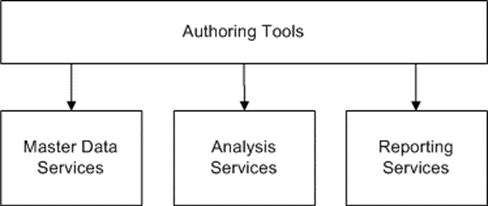
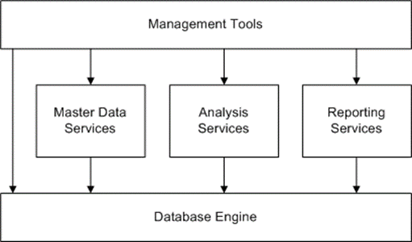

<html dir="LTR" xmlns:mshelp="http://msdn.microsoft.com/mshelp" xmlns:ddue="http://ddue.schemas.microsoft.com/authoring/2003/5" xmlns:xlink="http://www.w3.org/1999/xlink" xmlns:tool="http://www.microsoft.com/tooltip">
    <head>
        <meta http-equiv="Content-Type" content="text/html; CHARSET=utf-8"></meta>
        <meta name="save" content="history"></meta>
        <title>3.1 Configuring and Administering Multiple Servers</title>
        <xml>
            <mshelp:toctitle title="3.1 Configuring and Administering Multiple Servers"></mshelp:toctitle>
            <mshelp:rltitle title="[MS-SSSO]: Configuring and Administering Multiple Servers"></mshelp:rltitle>
            <mshelp:keyword index="A" term="4cf4424f-ac9e-47c9-b464-cb6cfd355377"></mshelp:keyword>
            <mshelp:attr name="DCSext.ContentType" value="open specification"></mshelp:attr>
            <mshelp:attr name="AssetID" value="4cf4424f-ac9e-47c9-b464-cb6cfd355377"></mshelp:attr>
            <mshelp:attr name="TopicType" value="kbRef"></mshelp:attr>
            <mshelp:attr name="DCSext.Title" value="[MS-SSSO]: Configuring and Administering Multiple Servers" />
        </xml>
    </head>
    <body>
        

            <h1 class="heading">3.1 Configuring and Administering Multiple Servers</h1>
        

        

            

                

                

                    

This example shows a user setting up an enterprise system by
using authoring and management tools so that all servers can be administered
from a central location. 

Content for these servers—the <a href="20049766-3c6e-4f20-a20e-64785e88f6f2.md#gt_3f8f73d9-c597-447c-b67e-47ec9930a916">analysis server</a>, the <a href="20049766-3c6e-4f20-a20e-64785e88f6f2.md#gt_cbdd3a12-e9ec-43e2-ac97-9c47f171f96a">report server</a>, and the MDS
server—is defined by using authoring tools.

<b>Figure 14: Defining content for the servers</b>

Management tools are then used to set up the enterprise
system.

<b>Figure 15: Using management tools to set up the system</b>

                

            

        

    </body>
</html>