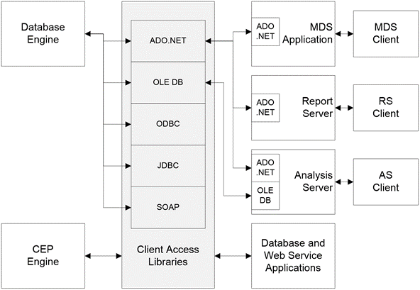

<html dir="LTR" xmlns:mshelp="http://msdn.microsoft.com/mshelp" xmlns:ddue="http://ddue.schemas.microsoft.com/authoring/2003/5" xmlns:xlink="http://www.w3.org/1999/xlink" xmlns:tool="http://www.microsoft.com/tooltip">
    <head>
        <meta http-equiv="Content-Type" content="text/html; CHARSET=utf-8"></meta>
        <meta name="save" content="history"></meta>
        <title>2.1 Overview</title>
        <xml>
            <mshelp:toctitle title="2.1 Overview"></mshelp:toctitle>
            <mshelp:rltitle title="[MS-SSSO]: Overview"></mshelp:rltitle>
            <mshelp:keyword index="A" term="a414c6e6-9d5c-4c29-a58d-5713f564d93b"></mshelp:keyword>
            <mshelp:attr name="DCSext.ContentType" value="open specification"></mshelp:attr>
            <mshelp:attr name="AssetID" value="a414c6e6-9d5c-4c29-a58d-5713f564d93b"></mshelp:attr>
            <mshelp:attr name="TopicType" value="kbRef"></mshelp:attr>
            <mshelp:attr name="DCSext.Title" value="[MS-SSSO]: Overview" />
        </xml>
    </head>
    <body>
        

            <h1 class="heading">2.1 Overview</h1>
        

        

            

                

                

                    

Microsoft SQL Server is a database management and analysis
system for e-commerce, line-of-business, and data warehousing solutions,
providing storage and query retrieval.

The following figure shows a high-level architectural view
of SQL Server elements that work together to achieve interoperability. Note
that Microsoft delivers the implementation of the protocols described as client
access libraries, which are used by Microsoft and third-party applications.

<b>Figure 1: SQL Server architecture overview</b>

                

            

        

    </body>
</html>