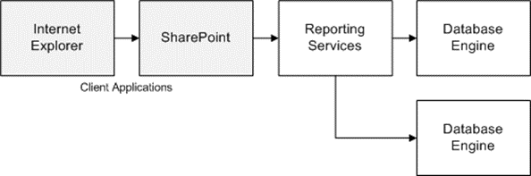

<html dir="LTR" xmlns:mshelp="http://msdn.microsoft.com/mshelp" xmlns:ddue="http://ddue.schemas.microsoft.com/authoring/2003/5" xmlns:xlink="http://www.w3.org/1999/xlink" xmlns:tool="http://www.microsoft.com/tooltip">
    <head>
        <meta http-equiv="Content-Type" content="text/html; CHARSET=utf-8"></meta>
        <meta name="save" content="history"></meta>
        <title>3.2.2 Obtaining Data via Reporting Services</title>
        <xml>
            <mshelp:toctitle title="3.2.2 Obtaining Data via Reporting Services"></mshelp:toctitle>
            <mshelp:rltitle title="[MS-SSSO]: Obtaining Data via Reporting Services"></mshelp:rltitle>
            <mshelp:keyword index="A" term="a96fd13e-ce8e-41f2-b472-7b16ce2bd9ec"></mshelp:keyword>
            <mshelp:attr name="DCSext.ContentType" value="open specification"></mshelp:attr>
            <mshelp:attr name="AssetID" value="a96fd13e-ce8e-41f2-b472-7b16ce2bd9ec"></mshelp:attr>
            <mshelp:attr name="TopicType" value="kbRef"></mshelp:attr>
            <mshelp:attr name="DCSext.Title" value="[MS-SSSO]: Obtaining Data via Reporting Services" />
        </xml>
    </head>
    <body>
        

            <h1 class="heading">3.2.2 Obtaining Data via Reporting Services</h1>
        

        

            

                

                

                    

Using Windows Internet Explorer, the user navigates to the
SharePoint portal and clicks a report to execute.

<ol><li>
    The SharePoint
portal, acting as a Reporting Services client, requests that the report be
executed by Reporting Services.

</li><li>
    Reporting
Services requests the underlying data for the reports from the Database Engine
or the Analysis Services Engine.

</li><li>
    The engine
returns the data that was processed by Reporting Services.

</li><li>
    Reporting
Services returns a representation of the report to SharePoint.

</li><li>
    SharePoint
returns the resulting web page to Internet Explorer.

</li></ol>

<b>Figure 17: User obtaining data via Reporting Services</b>

                

            

        

    </body>
</html>