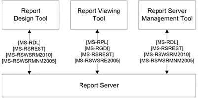
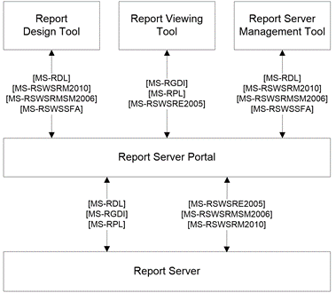

<html dir="LTR" xmlns:mshelp="http://msdn.microsoft.com/mshelp" xmlns:ddue="http://ddue.schemas.microsoft.com/authoring/2003/5" xmlns:xlink="http://www.w3.org/1999/xlink" xmlns:tool="http://www.microsoft.com/tooltip">
    <head>
        <meta http-equiv="Content-Type" content="text/html; CHARSET=utf-8"></meta>
        <meta name="save" content="history"></meta>
        <title>2.1.3 Reporting Services</title>
        <xml>
            <mshelp:toctitle title="2.1.3 Reporting Services"></mshelp:toctitle>
            <mshelp:rltitle title="[MS-SSSO]: Reporting Services"></mshelp:rltitle>
            <mshelp:keyword index="A" term="b8cd0329-a513-42bc-98fa-16e19836954a"></mshelp:keyword>
            <mshelp:attr name="DCSext.ContentType" value="open specification"></mshelp:attr>
            <mshelp:attr name="AssetID" value="b8cd0329-a513-42bc-98fa-16e19836954a"></mshelp:attr>
            <mshelp:attr name="TopicType" value="kbRef"></mshelp:attr>
            <mshelp:attr name="DCSext.Title" value="[MS-SSSO]: Reporting Services" />
        </xml>
    </head>
    <body>
        

            <h1 class="heading">2.1.3 Reporting Services</h1>
        

        

            

                

                

                    

SQL Server Reporting Services (SSRS) <a href="https://go.microsoft.com/fwlink/?LinkId=152499">[MSDN-SSRS]</a> is a
server-based reporting platform that provides comprehensive reporting
functionality for a variety of data sources. It includes a complete set of
tools for creating, managing, and delivering reports and APIs that enable
developers to integrate or extend data and report processing in custom
applications. Reporting Services tools work within the Visual Studio
environment and are fully integrated with Microsoft SQL Server tools and
components.

The <a href="20049766-3c6e-4f20-a20e-64785e88f6f2.md#gt_cbdd3a12-e9ec-43e2-ac97-9c47f171f96a">report
server</a> is available by default with a native portal, called the Report
Portal, or it can be integrated with an external portal. See the following
figures for a view of each architecture.

In Native mode, the report designers, report portals, and any
management tools communicate with the report server by using the protocols and
formats that are specified in <mshelp:link keywords="53287204-7cd0-4bc9-a5cd-d42a5925dca1" tabindex="0">[MS-RDL]</mshelp:link>, <mshelp:link keywords="a7752484-e24a-41f8-8ea2-c0e6568768fd" tabindex="0">[MS-RSREST]</mshelp:link>,
<mshelp:link keywords="0c9864cf-afe9-4789-ae9e-a55df1ff9111" tabindex="0">[MS-RSWSRM2010]</mshelp:link>,
and <mshelp:link keywords="a30e6fc4-36ad-423a-b578-ba50523f5a77" tabindex="0">[MS-RSWSRMNM2005]</mshelp:link>.
The Report Viewer tools use the protocols specified in <mshelp:link keywords="a7752484-e24a-41f8-8ea2-c0e6568768fd" tabindex="0">[MS-RSREST]</mshelp:link>,
<mshelp:link keywords="96c33524-52c1-4358-a23a-6921db74211c" tabindex="0">[MS-RSWSRE2005]</mshelp:link>,
and <mshelp:link keywords="b420a652-10eb-49b2-834c-ebc4d31e8ce5" tabindex="0">[MS-RGDI]</mshelp:link>
or <mshelp:link keywords="9c4ff7ba-f6da-4092-9670-aa0e54e73887" tabindex="0">[MS-RPL]</mshelp:link>
to communicate with the report server.

<b>Figure 4: Reporting Services architecture with native
management tools</b>

When integrated with an external portal, report designers
and any report server management tools communicate with the report server
portal via protocols and formats specified in <mshelp:link keywords="53287204-7cd0-4bc9-a5cd-d42a5925dca1" tabindex="0">[MS-RDL]</mshelp:link>, <mshelp:link keywords="0c9864cf-afe9-4789-ae9e-a55df1ff9111" tabindex="0">[MS-RSWSRM2010]</mshelp:link>,
<mshelp:link keywords="eea1faab-ab5f-4fac-aecd-5c7543a8977c" tabindex="0">[MS-RSWSRMSM2006]</mshelp:link>,
and <mshelp:link keywords="ee081425-607f-4742-8d61-5bf61f0d2a26" tabindex="0">[MS-RSWSSFA]</mshelp:link>.
The Report Viewer Web Part communicates with the report server by using the
protocols and formats that are specified in <mshelp:link keywords="96c33524-52c1-4358-a23a-6921db74211c" tabindex="0">[MS-RSWSRE2005]</mshelp:link>
and <mshelp:link keywords="b420a652-10eb-49b2-834c-ebc4d31e8ce5" tabindex="0">[MS-RGDI]</mshelp:link>
or <mshelp:link keywords="9c4ff7ba-f6da-4092-9670-aa0e54e73887" tabindex="0">[MS-RPL]</mshelp:link>.
The portal redirects all requests to the report server.

<b>Figure 5: Reporting Services architecture when integrated
with an external portal</b>

The report server uses the Tabular Data Stream (TDS)
protocol <mshelp:link keywords="b46a581a-39de-4745-b076-ec4dbb7d13ec" tabindex="0">[MS-TDS]</mshelp:link>
to communicate with the Database Engine.

The Report Definition Language <mshelp:link keywords="53287204-7cd0-4bc9-a5cd-d42a5925dca1" tabindex="0">[MS-RDL]</mshelp:link>
is used as a payload when setting the definition of a report for execution in
the ReportExecution2005 web service <mshelp:link keywords="96c33524-52c1-4358-a23a-6921db74211c" tabindex="0">[MS-RSWSRE2005]</mshelp:link>.
It is also used as a payload when setting or retrieving the definition of a
report for the ReportService2010 web service <mshelp:link keywords="0c9864cf-afe9-4789-ae9e-a55df1ff9111" tabindex="0">[MS-RSWSRM2010]</mshelp:link>,
the ReportService2005 web service <mshelp:link keywords="a30e6fc4-36ad-423a-b578-ba50523f5a77" tabindex="0">[MS-RSWSRMNM2005]</mshelp:link>,
or the ReportService2006 web service <mshelp:link keywords="eea1faab-ab5f-4fac-aecd-5c7543a8977c" tabindex="0">[MS-RSWSRMSM2006]</mshelp:link>.

Remote GDI+ <mshelp:link keywords="b420a652-10eb-49b2-834c-ebc4d31e8ce5" tabindex="0">[MS-RGDI]</mshelp:link>
and Report Page Layout <mshelp:link keywords="9c4ff7ba-f6da-4092-9670-aa0e54e73887" tabindex="0">[MS-RPL]</mshelp:link>
are binary <a href="20049766-3c6e-4f20-a20e-64785e88f6f2.md#gt_f3529cd8-50da-4f36-aa0b-66af455edbb6">stream</a>
formats that are used during the communication between the Report Viewer and
the report server.

                

            

        

    </body>
</html>