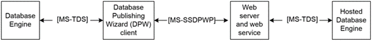

<html dir="LTR" xmlns:mshelp="http://msdn.microsoft.com/mshelp" xmlns:ddue="http://ddue.schemas.microsoft.com/authoring/2003/5" xmlns:xlink="http://www.w3.org/1999/xlink" xmlns:tool="http://www.microsoft.com/tooltip">
    <head>
        <meta http-equiv="Content-Type" content="text/html; CHARSET=utf-8"></meta>
        <meta name="save" content="history"></meta>
        <title>2.1.7 Manageability</title>
        <xml>
            <mshelp:toctitle title="2.1.7 Manageability"></mshelp:toctitle>
            <mshelp:rltitle title="[MS-SSSO]: Manageability"></mshelp:rltitle>
            <mshelp:keyword index="A" term="c98c7a75-ed2a-43e8-b491-08ce4141ed33"></mshelp:keyword>
            <mshelp:attr name="DCSext.ContentType" value="open specification"></mshelp:attr>
            <mshelp:attr name="AssetID" value="c98c7a75-ed2a-43e8-b491-08ce4141ed33"></mshelp:attr>
            <mshelp:attr name="TopicType" value="kbRef"></mshelp:attr>
            <mshelp:attr name="DCSext.Title" value="[MS-SSSO]: Manageability" />
        </xml>
    </head>
    <body>
        

            <h1 class="heading">2.1.7 Manageability</h1>
        

        

            

                

                

                    

Manageability is part of the Database Engine and includes
the Database Publishing Wizard Protocol <mshelp:link keywords="6111fbea-38e6-4a73-a077-f4724cb1baec" tabindex="0">[MS-SSDPWP]</mshelp:link>.
This protocol enables a user to publish an existing database to a remote server
via a web service. This enables database deployment in hosted scenarios without
requiring direct access to the database server, as shown in the following
figure.

<b>Figure 9: Manageability architecture</b>

                

            

        

    </body>
</html>