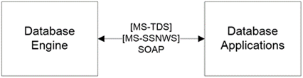

<html dir="LTR" xmlns:mshelp="http://msdn.microsoft.com/mshelp" xmlns:ddue="http://ddue.schemas.microsoft.com/authoring/2003/5" xmlns:xlink="http://www.w3.org/1999/xlink" xmlns:tool="http://www.microsoft.com/tooltip">
    <head>
        <meta http-equiv="Content-Type" content="text/html; CHARSET=utf-8"></meta>
        <meta name="save" content="history"></meta>
        <title>2.1.5 Database Engine</title>
        <xml>
            <mshelp:toctitle title="2.1.5 Database Engine"></mshelp:toctitle>
            <mshelp:rltitle title="[MS-SSSO]: Database Engine"></mshelp:rltitle>
            <mshelp:keyword index="A" term="cebb1dbf-9d7c-4732-bcbf-62ee147c41da"></mshelp:keyword>
            <mshelp:attr name="DCSext.ContentType" value="open specification"></mshelp:attr>
            <mshelp:attr name="AssetID" value="cebb1dbf-9d7c-4732-bcbf-62ee147c41da"></mshelp:attr>
            <mshelp:attr name="TopicType" value="kbRef"></mshelp:attr>
            <mshelp:attr name="DCSext.Title" value="[MS-SSSO]: Database Engine" />
        </xml>
    </head>
    <body>
        

            <h1 class="heading">2.1.5 Database Engine</h1>
        

        

            

                

                

                    

The Database Engine is the core service for storing,
processing, and securing data. The Database Engine provides controlled access
and rapid transaction processing to meet the requirements of data-consuming
applications within an enterprise.

The Database Engine is used to create relational databases
for online transaction processing (OLTP) or online analytical processing data.
This includes creating tables for storing data and database objects such as
indexes, views, and stored procedures for viewing, managing, and securing data.
SQL Server Management Studio can be used to manage the database objects, and
SQL Server Profiler can be used for capturing server events.

The Database Engine communicates with its client access
libraries (such as <a href="20049766-3c6e-4f20-a20e-64785e88f6f2.md#gt_7883fa02-8dc0-4154-894f-fe3a7bff153e">Open
Database Connectivity (ODBC)</a>, <a href="20049766-3c6e-4f20-a20e-64785e88f6f2.md#gt_333f4fb1-4882-48df-bce6-f9961b408f31">OLE DB</a>, or ADO.NET) via the
Tabular Data Stream (TDS) protocol <mshelp:link keywords="b46a581a-39de-4745-b076-ec4dbb7d13ec" tabindex="0">[MS-TDS]</mshelp:link>,
which transports binary XML <mshelp:link keywords="11ab6e8d-2472-44d1-a9e6-bddf000e12f6" tabindex="0">[MS-BINXML]</mshelp:link>
and the system-provided and user-defined SQL Server CLR types, as specified in <mshelp:link keywords="77460aa9-8c2f-4449-a65e-1d649ebd77fa" tabindex="0">[MS-SSCLRT]</mshelp:link>.
The client access libraries are used by the database applications to
communicate with the Database Engine.

<b>Figure 7: Database Engine architecture</b>

                

            

        

    </body>
</html>