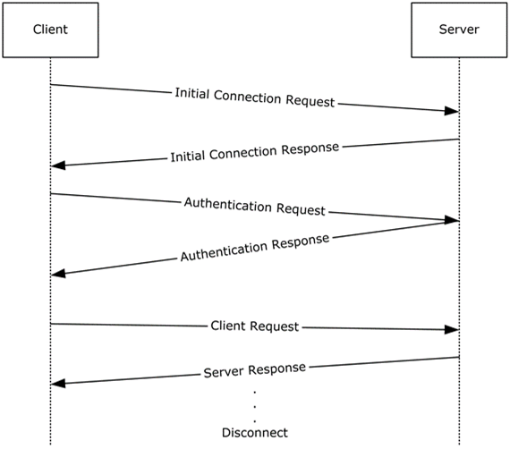

<html dir="LTR" xmlns:mshelp="http://msdn.microsoft.com/mshelp" xmlns:ddue="http://ddue.schemas.microsoft.com/authoring/2003/5" xmlns:xlink="http://www.w3.org/1999/xlink" xmlns:tool="http://www.microsoft.com/tooltip">
    <head>
        <meta http-equiv="Content-Type" content="text/html; CHARSET=utf-8"></meta>
        <meta name="save" content="history"></meta>
        <title>2.4.1.3 Client Connection (TDS, SSTDS, or SSNWS)</title>
        <xml>
            <mshelp:toctitle title="2.4.1.3 Client Connection (TDS, SSTDS, or SSNWS)"></mshelp:toctitle>
            <mshelp:rltitle title="[MS-SSSO]: Client Connection (TDS, SSTDS, or SSNWS)"></mshelp:rltitle>
            <mshelp:keyword index="A" term="e1b6e2ab-e4da-4494-b24a-4c155361dd4b"></mshelp:keyword>
            <mshelp:attr name="DCSext.ContentType" value="open specification"></mshelp:attr>
            <mshelp:attr name="AssetID" value="e1b6e2ab-e4da-4494-b24a-4c155361dd4b"></mshelp:attr>
            <mshelp:attr name="TopicType" value="kbRef"></mshelp:attr>
            <mshelp:attr name="DCSext.Title" value="[MS-SSSO]: Client Connection (TDS, SSTDS, or SSNWS)" />
        </xml>
    </head>
    <body>
        

            <h1 class="heading">2.4.1.3 Client Connection (TDS, SSTDS, or SSNWS)</h1>
        

        

            

                

                

                    

This use case describes how to establish a connection and to
execute commands to exchange data or to produce side effects. The actors are
the database application and Microsoft SQL Server.

<b>Actions</b>

<ol><li>
    A database
application engages in an authentication handshake with a desired
authentication scheme (SQL Server or Windows).

</li><li>
    SQL Server
verifies the database application's credentials and either confirms that the
connection was established or terminates the connection if authentication
fails.

</li><li>
    The database
application sends a command.

</li><li>
    SQL Server
responds with the execution status and, eventually, data if the command
produces a result. (The last two steps might be repeated.)

</li><li>
    The database
application terminates the connection.

</li><li>
    The database
application might have caused side effects by executing commands and/or might have
exchanged data with SQL Server.

</li></ol>
For Tabular Data Stream (TDS) only: If the database
application requires the use of Multiple Active Result Sets (MARS), the Session
Multiplex Protocol (SMP) is used underneath for virtual connection
multiplexing.

For SOAP only: This use case has been deprecated in
Microsoft SQL Server 2008 R2.

<b>Figure 13: Client connection use case</b>

<b>Payloads</b>

Payloads and <a href="20049766-3c6e-4f20-a20e-64785e88f6f2.html#gt_03a9d0ca-2f10-4f3d-b910-052714a96f7d">connection strings</a> are
carried on the protocols, as follows:

<ul><li>
 
Binary XML type values, as specified in <mshelp:link keywords="11ab6e8d-2472-44d1-a9e6-bddf000e12f6" tabindex="0">[MS-BINXML]</mshelp:link>
are transported by the Tabular Data Stream (TDS) protocol, as specified in <mshelp:link keywords="b46a581a-39de-4745-b076-ec4dbb7d13ec" tabindex="0">[MS-TDS]</mshelp:link>.

</li><li>
 
SQL Server CLR types specified in <mshelp:link keywords="77460aa9-8c2f-4449-a65e-1d649ebd77fa" tabindex="0">[MS-SSCLRT]</mshelp:link>
are transported by the TDS protocol.

</li><li>
 
The <b>DataSet DiffGram</b> structure types specified in <mshelp:link keywords="a0102bae-8980-4c2a-9edf-56f215b08308" tabindex="0">[MS-DSDG]</mshelp:link>
and <mshelp:link keywords="021e1033-8322-486d-a4de-56075686a09e" tabindex="0">[MS-DSDIFFGRAM]</mshelp:link>
are carried by a generic (or standard) SOAP protocol.

</li><li>
 
Open Database Connectivity (ODBC) and OLE DB connection string
types specified in <mshelp:link keywords="13b4e848-b36c-4b11-acce-d6bf199d5391" tabindex="0">[MS-ODBCSTR]</mshelp:link>
and <mshelp:link keywords="774039da-09c1-4b24-b53b-8f9ae019830c" tabindex="0">[MS-OLEDBSTR]</mshelp:link>
are carried by a generic SOAP.

</li></ul>
                

            

        

    </body>
</html>