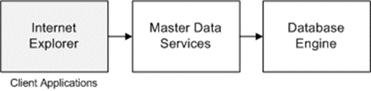

<html dir="LTR" xmlns:mshelp="http://msdn.microsoft.com/mshelp" xmlns:ddue="http://ddue.schemas.microsoft.com/authoring/2003/5" xmlns:xlink="http://www.w3.org/1999/xlink" xmlns:tool="http://www.microsoft.com/tooltip">
    <head>
        <meta http-equiv="Content-Type" content="text/html; CHARSET=utf-8"></meta>
        <meta name="save" content="history"></meta>
        <title>3.2.3 Obtaining Data via MDS</title>
        <xml>
            <mshelp:toctitle title="3.2.3 Obtaining Data via MDS"></mshelp:toctitle>
            <mshelp:rltitle title="[MS-SSSO]: Obtaining Data via MDS"></mshelp:rltitle>
            <mshelp:keyword index="A" term="ee26f9d8-87bf-467f-ac64-93ad5e2b0418"></mshelp:keyword>
            <mshelp:attr name="DCSext.ContentType" value="open specification"></mshelp:attr>
            <mshelp:attr name="AssetID" value="ee26f9d8-87bf-467f-ac64-93ad5e2b0418"></mshelp:attr>
            <mshelp:attr name="TopicType" value="kbRef"></mshelp:attr>
            <mshelp:attr name="DCSext.Title" value="[MS-SSSO]: Obtaining Data via MDS" />
        </xml>
    </head>
    <body>
        

            <h1 class="heading">3.2.3 Obtaining Data via MDS</h1>
        

        

            

                

                

                    

<ol><li>
    Using Internet
Explorer, the user navigates to the MDS portal and clicks an entity to manage.

</li><li>
    MDS requests the
underlying data for the reports from the Database Engine.

</li><li>
    The engine
returns the data that was processed by MDS.

</li><li>
    MDS returns the
data to the MDS portal.

</li><li>
    The MDS portal
renders the data in Internet Explorer.

</li></ol>

<b>Figure 18: User obtaining data via MDS</b>

                

            

        

    </body>
</html>