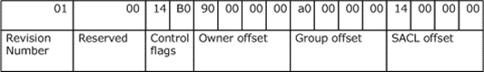
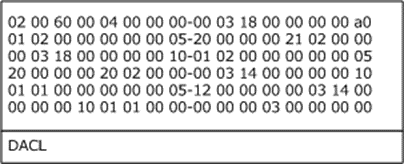
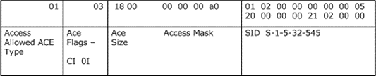
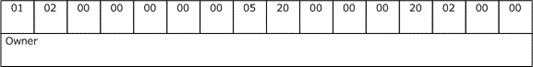
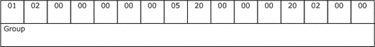

<html dir="LTR" xmlns:mshelp="http://msdn.microsoft.com/mshelp" xmlns:ddue="http://ddue.schemas.microsoft.com/authoring/2003/5" xmlns:xlink="http://www.w3.org/1999/xlink" xmlns:tool="http://www.microsoft.com/tooltip">
    <head>
        <meta http-equiv="Content-Type" content="text/html; CHARSET=utf-8"></meta>
        <meta name="save" content="history"></meta>
        <title>2.5.1.4 SDDL String to Binary Security Descriptor Examples</title>
        <xml>
            <mshelp:toctitle title="2.5.1.4 SDDL String to Binary Security Descriptor Examples"></mshelp:toctitle>
            <mshelp:rltitle title="[MS-DTYP]: SDDL String to Binary Security Descriptor Examples"></mshelp:rltitle>
            <mshelp:keyword index="A" term="2918391b-75b9-4eeb-83f0-7fdc04a5c6c9"></mshelp:keyword>
            <mshelp:attr name="DCSext.ContentType" value="open specification"></mshelp:attr>
            <mshelp:attr name="AssetID" value="2918391b-75b9-4eeb-83f0-7fdc04a5c6c9"></mshelp:attr>
            <mshelp:attr name="TopicType" value="kbRef"></mshelp:attr>
            <mshelp:attr name="DCSext.Title" value="[MS-DTYP]: SDDL String to Binary Security Descriptor Examples" />
        </xml>
    </head>
    <body>
        

            <h1 class="heading">2.5.1.4 SDDL String to Binary Security Descriptor Examples</h1>
        

        

            

                

                

                    

The following SDDL string:
&quot;O:BAG:BAD:P(A;CIOI;GRGX;;;BU)(A;CIOI;GA;;;BA)(A;CIOI;GA;;;SY)(A;CIOI;GA;;;CO)S:P(AU;FA;GR;;;WD)&quot;

yields the following, which is an encoded output of the
security descriptor in self-relative form ordered as <a href="a66edeb1-52a0-4d64-a93b-2f5c833d7d92.html#gt_079478cb-f4c5-4ce5-b72b-2144da5d2ce7">little-endian</a>.

<dl>
<dd>

<pre>  
 00000000  01 00 14 b0 90 00 00 00 a0 00 00 00 14 00 00 00  ................
 00000010  30 00 00 00 02 00 1c 00 01 00 00 00 02 80 14 00  0...............
 00000020  00 00 00 80 01 01 00 00 00 00 00 01 00 00 00 00  ................
 00000030  02 00 60 00 04 00 00 00 00 03 18 00 00 00 00 a0  ..'.............
 00000040  01 02 00 00 00 00 00 05 20 00 00 00 21 02 00 00  ........ ...!...
 00000050  00 03 18 00 00 00 00 10 01 02 00 00 00 00 00 05  ................
 00000060  20 00 00 00 20 02 00 00 00 03 14 00 00 00 00 10   ... ...........
 00000070  01 01 00 00 00 00 00 05 12 00 00 00 00 03 14 00  ................
 00000080  00 00 00 10 01 01 00 00 00 00 00 03 00 00 00 00  ................
 00000090  01 02 00 00 00 00 00 05 20 00 00 00 20 02 00 00  ........ ... ...
 000000a0  01 02 00 00 00 00 00 05 20 00 00 00 20 02 00 00  ........ ... ...
  
</pre>

</dd></dl>

The <a href="7d4dac05-9cef-4563-a058-f108abecce1d.html">SECURITY_DESCRIPTOR</a>
starts with the SD revision number (1 byte long) at address 0x00, followed by
reserved bits and the SD control flags (2 bytes long). As mentioned previously,
this is followed by owner, group, SACL, and DACL offsets.

<dl>
<dd>

<pre> 01 00 14 b0 90 00 00 00 a0 00 00 00 14 00 00 00 
  
  
</pre>

</dd></dl>

<b>Figure 6: Security descriptor field offsets example</b>

<b>Control Flags</b>

Control flags for the DACL are represented as a bitmask, and
the resultant set of flags is computed by a logical OR of the flags. In this
example, the control flag value is set to the following.

<dl>
<dd>

<pre> 1011000000010100
  
  
</pre>

</dd></dl>

This control flag value maps to the meaning that is shown in
the following table.

<table>
 <thead>
  <tr>
   <th>
   
BIT

   </th>
   <th>
   
Meaning

   </th>
  </tr>
 </thead>
 <tr>
  <td>
  
0

  </td>
  <td>
  
OD: Owner defaulted

  </td>
 </tr>
 <tr>
  <td>
  
0

  </td>
  <td>
  
GD: Group defaulted

  </td>
 </tr>
 <tr>
  <td>
  
1

  </td>
  <td>
  
DP: DACL present

  </td>
 </tr>
 <tr>
  <td>
  
0

  </td>
  <td>
  
DD: DACL defaulted

  </td>
 </tr>
 <tr>
  <td>
  
1

  </td>
  <td>
  
SP: SACL present

  </td>
 </tr>
 <tr>
  <td>
  
0

  </td>
  <td>
  
SD: SACL defaulted

  </td>
 </tr>
 <tr>
  <td>
  
0

  </td>
  <td>
  
SS: Server Security

  </td>
 </tr>
 <tr>
  <td>
  
0

  </td>
  <td>
  
DT: DACL Trusted

  </td>
 </tr>
 <tr>
  <td>
  
0

  </td>
  <td>
  
DR: DACL Inheritance Required

  </td>
 </tr>
 <tr>
  <td>
  
0

  </td>
  <td>
  
SR: Inheritance Required

  </td>
 </tr>
 <tr>
  <td>
  
0

  </td>
  <td>
  
DI: DACL auto-inherited

  </td>
 </tr>
 <tr>
  <td>
  
0

  </td>
  <td>
  
SI: SACL auto-inherited

  </td>
 </tr>
 <tr>
  <td>
  
1

  </td>
  <td>
  
PD: DACL-protected

  </td>
 </tr>
 <tr>
  <td>
  
1

  </td>
  <td>
  
PS: SACL-protected

  </td>
 </tr>
 <tr>
  <td>
  
0

  </td>
  <td>
  
RM: Control Valid

  </td>
 </tr>
 <tr>
  <td>
  
1

  </td>
  <td>
  
SR: Self-Relative

  </td>
 </tr>
</table>

<b>SACL</b>

The control flags are followed by the SACL, which in this
example is &quot;S:P(AU;FA;GR;;;WD)&quot;

<b>DACL</b>

The SACL is followed by the SECURITY_DESCRIPTOR DACL, which
in this example is:

<dl>
<dd>

<pre> (A;CIOI;GRGX;;;BU)(A;CIOI;GA;;;BA)(A;CIOI;GA;;;SY)(A;CIOI;GA;;;CO)
  
  
</pre>

</dd></dl>

<b>Note</b>  The string representation for the
DACL (D:) and the DACL control flags are consumed not as part of the DACL
structure in the SD, but instead as the security descriptor control flags. The
same applies for SACL.

<b>Figure 7: Security access control list data example</b>

The ACL can be further dissected into the ACL header and the
individual ACEs. For more information, see section <a href="20233ed8-a6c6-4097-aafa-dd545ed24428.html">2.4.5</a>.

<b>ACL HEADER</b>

<dl>
<dd>

<pre> 02 00 60 00 04 00 00 00
 AclRevision (1 byte): 0x02
 Reserved            : 0x00
 AclSize             : 0x0060
 AceCount            : 0x0004
 Reserved            : 0x0000
  
</pre>

</dd></dl>

<b>ACE Structure</b>

This is followed by the ACES in the ACL. For more
information about the ACE structure, see section <a href="628ebb1d-c509-4ea0-a10f-77ef97ca4586.html">2.4.4.1</a>.

In this example, there are four ACEs for the DACL.

<dl>
<dd>

<pre> (A;CIOI;GRGX;;;BU)(A;CIOI;GA;;;BA)(A;CIOI;GA;;;SY)(A;CIOI;GA;;;CO)
  
</pre>

</dd></dl>

First, look at the first access control entry (ACE) as an
example. &quot;(A;CIOI;GRGX;;;BU)&quot; maps to the following in the binary
structure (in little-endian order).

<dl>
<dd>

<pre>  
 00 03 18 00 00 00 00 a0 01 02 00 00 00 00 00 05-20 00 00 00 21 02 00 00
  
</pre>

</dd></dl>

<b>Figure 8: ACE field offsets</b>

<b>Owner</b>

The <b>owner</b> begins at offset 0x90. In this example,
owner is set to &quot;BA&quot; (Built-in Admin).

<b>Figure 9: ACE owner field offsets example</b>

<b>Group</b>

The <b>group</b> begins at offset 0xA0. In this example,
group is set to &quot;BA&quot; (Built-in Admin).

<b>Figure 10: ACE group field offsets example</b>

                

            

        

    </body>
</html>