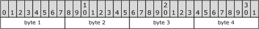

<html dir="LTR" xmlns:mshelp="http://msdn.microsoft.com/mshelp" xmlns:ddue="http://ddue.schemas.microsoft.com/authoring/2003/5" xmlns:xlink="http://www.w3.org/1999/xlink" xmlns:tool="http://www.microsoft.com/tooltip">
    <head>
        <meta http-equiv="Content-Type" content="text/html; CHARSET=utf-8"></meta>
        <meta name="save" content="history"></meta>
        <title>2.1 Common Base Types</title>
        <xml>
            <mshelp:toctitle title="2.1 Common Base Types"></mshelp:toctitle>
            <mshelp:rltitle title="[MS-DTYP]: Common Base Types"></mshelp:rltitle>
            <mshelp:keyword index="A" term="3caa4769-b02f-4cee-a857-8496f4395ec1"></mshelp:keyword>
            <mshelp:attr name="DCSext.ContentType" value="open specification"></mshelp:attr>
            <mshelp:attr name="AssetID" value="3caa4769-b02f-4cee-a857-8496f4395ec1"></mshelp:attr>
            <mshelp:attr name="TopicType" value="kbRef"></mshelp:attr>
            <mshelp:attr name="DCSext.Title" value="[MS-DTYP]: Common Base Types" />
        </xml>
    </head>
    <body>
        

            <h1 class="heading">2.1 Common Base Types</h1>
        

        

            

                

                

                    

This section contains commonly used primitive data types.

The use of the <a href="a66edeb1-52a0-4d64-a93b-2f5c833d7d92.md#gt_73177eec-4092-420f-92c5-60b2478df824">Interface Definition Language
(IDL)</a> implies RPC marshaling unless custom marshaling is specified.

Unless explicitly noted in this document, any integer,
either signed or unsigned, is in memory order before RPC marshalling. It is
implementation dependent<a href="11e1608c-6169-4fbc-9c33-373fc9b224f4.md#Appendix_A_1" aria-label="Product behavior note 1">&lt;1&gt;</a> whether the
memory order is <a href="a66edeb1-52a0-4d64-a93b-2f5c833d7d92.md#gt_079478cb-f4c5-4ce5-b72b-2144da5d2ce7">little-endian</a>
or <a href="a66edeb1-52a0-4d64-a93b-2f5c833d7d92.md#gt_6f6f9e8e-5966-4727-8527-7e02fb864e7e">big-endian</a>.

For packets, the bit numbering convention followed is the
same as that used in RFCs, namely: the high (most significant) bit of the first
byte to hit the wire is in packet bit 0, and the low bit of the last byte to
hit the wire is in packet bit 31 (so that the bits are shown from left-to-right
in the order they naturally appear over the network).

<b>Figure 1: Packet byte/bit order</b>

Unless otherwise specified, the bytes of a multi-byte integer
field are assumed to be transmitted in big-endian order, also referred to as
Network Byte Order. That is, if the packet shown above represented a 32-bit
integer, then Byte 1 would be its high-order byte and Byte 4 its low-order
byte. Certain protocols use little-endian order, as specified in the
corresponding technical documents; for example, <mshelp:link keywords="5606ad47-5ee0-437a-817e-70c366052962" tabindex="0">[MS-SMB2]</mshelp:link>.

                

            

        

    </body>
</html>