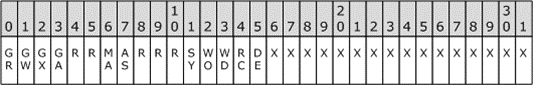

<html dir="LTR" xmlns:mshelp="http://msdn.microsoft.com/mshelp" xmlns:ddue="http://ddue.schemas.microsoft.com/authoring/2003/5" xmlns:xlink="http://www.w3.org/1999/xlink" xmlns:tool="http://www.microsoft.com/tooltip">
    <head>
        <meta http-equiv="Content-Type" content="text/html; CHARSET=utf-8"></meta>
        <meta name="save" content="history"></meta>
        <title>2.4.3 ACCESS_MASK</title>
        <xml>
            <mshelp:toctitle title="2.4.3 ACCESS_MASK"></mshelp:toctitle>
            <mshelp:rltitle title="[MS-DTYP]: ACCESS_MASK"></mshelp:rltitle>
            <mshelp:keyword index="A" term="7a53f60e-e730-4dfe-bbe9-b21b62eb790b"></mshelp:keyword>
            <mshelp:attr name="DCSext.ContentType" value="open specification"></mshelp:attr>
            <mshelp:attr name="AssetID" value="7a53f60e-e730-4dfe-bbe9-b21b62eb790b"></mshelp:attr>
            <mshelp:attr name="TopicType" value="kbRef"></mshelp:attr>
            <mshelp:attr name="DCSext.Title" value="[MS-DTYP]: ACCESS_MASK" />
        </xml>
    </head>
    <body>
        

            <h1 class="heading">2.4.3 ACCESS_MASK</h1>
        

        

            

                

                

                    

An ACCESS_MASK is a 32-bit set of flags that are used to
encode the user rights to an object. An access mask is used both to encode the
rights to an object assigned to a principal and to encode the requested access
when opening an object.

The bits with an X value in the table below are used for
object-specific user rights. A file object would encode, for example, Read
Access and Write Access. A registry key object would encode Create Subkey and
Read Value, for example.

<b>Note</b>  The bits with a value of X are
reserved for use by specific protocols that make use of the ACCESS_MASK data
type. The nature of this usage differs according to each protocol and is implementation-specific.

The bits in positions 0 through 3 in the following table are
generic rights that can be mapped to object-specific user rights by the <a href="a66edeb1-52a0-4d64-a93b-2f5c833d7d92.md#gt_a7d0361f-8608-454d-9a52-67d4d181ae09">resource manager</a> for the
requested object. The mapping of these rights is implementation-specific.

The bits with an R value in the table below are reserved.

The bits in positions 6 and 7 are for maximum allowed and
access system security rights.

The bits in positions 11 through 15 are standard rights that
are common to all objects.

If the <b>GR</b>/<b>GW</b>/<b>GX</b>/<b>GA</b> bits are set
in an <a href="d06e5a81-176e-46c6-9cf7-9137aad4455e.md">ACE</a> structure
that is already attached to an object, requesting access might produce
unintended results. This is because the Access Check algorithm does not map
generic rights to object-specific rights for ACE structures. This mapping is
only made for the requested ACCESS_MASK passed as a parameter to the Access
Check algorithm, as specified in section <a href="4f1bbcbb-814a-4c70-a11e-2a5b8779a6f9.md">2.5.3.2</a>.

<dl>
<dd>

<pre> typedef DWORD ACCESS_MASK;
 typedef ACCESS_MASK* PACCESS_MASK;
</pre>

</dd></dl>

<b>Figure 2: Access mask bitmap table</b>

Where the bits are defined as shown in the following table.

<table>
 <thead>
  <tr>
   <th>
   
Value

   </th>
   <th>
   
Description

   </th>
  </tr>
 </thead>
 <tr>
  <td>
  
<b>GR</b>

  
GENERIC_READ

  
0x80000000L

  </td>
  <td>
  
<b>When
  used in an Access Request operation: </b>When read access to an object is
  requested, this bit is translated to a combination of bits. These are most
  often set in the lower 16 bits of the ACCESS_MASK. (Individual protocol
  specifications MAY specify a different configuration.) The bits that are set
  are implementation dependent. During this translation, the <b>GR</b> bit is
  cleared. The resulting ACCESS_MASK bits are the actual permissions that are
  checked against the ACE structures in the security descriptor that attached
  to the object.

  
<b>When
  used to set the Security Descriptor on an object: </b>When the <b>GR</b> bit
  is set in an ACE that is to be attached to an object, it is translated into a
  combination of bits, which are usually set in the lower 16 bits of the
  ACCESS_MASK. (Individual protocol specifications MAY specify a different
  configuration.) The bits that are set are implementation dependent. During
  this translation, the <b>GR</b> bit is cleared. The resulting ACCESS_MASK
  bits are the actual permissions that are granted by this ACE.

  
 

  </td>
 </tr>
 <tr>
  <td>
  
<b>GW</b>

  
GENERIC_WRITE

  
0x4000000L

  </td>
  <td>
  
<b>When
  used in an Access Request operation: </b>When write access to an object is
  requested, this bit is translated to a combination of bits, which are usually
  set in the lower 16 bits of the ACCESS_MASK. (Individual protocol
  specifications MAY specify a different configuration.) The bits that are set
  are implementation dependent. During this translation, the <b>GW</b> bit is
  cleared. The resulting ACCESS_MASK bits are the actual permissions that are checked
  against the ACE structures in the security descriptor that attached to the
  object.

  
<b>When
  used to set the Security Descriptor on an object: </b>When the <b>GW</b> bit
  is set in an ACE that is to be attached to an object, it is translated into a
  combination of bits, which are usually set in the lower 16 bits of the
  ACCESS_MASK. (Individual protocol specifications MAY specify a different
  configuration.) The bits that are set are implementation dependent. During
  this translation, the <b>GW</b> bit is cleared. The resulting ACCESS_MASK
  bits are the actual permissions that are granted by this ACE.

  
 

  </td>
 </tr>
 <tr>
  <td>
  
<b>GX</b>

  
GENERIC_EXECUTE

  
0x20000000L

  </td>
  <td>
  
<b>When
  used in an Access Request operation: </b>When execute access to an object is
  requested, this bit is translated to a combination of bits, which are usually
  set in the lower 16 bits of the ACCESS_MASK. (Individual protocol
  specifications MAY specify a different configuration.) The bits that are set
  are implementation dependent. During this translation, the <b>GX</b> bit is
  cleared. The resulting ACCESS_MASK bits are the actual permissions that are
  checked against the ACE structures in the security descriptor that attached
  to the object.

  
<b>When
  used to set the Security Descriptor on an object: </b>When the <b>GX</b> bit
  is set in an ACE that is to be attached to an object, it is translated into a
  combination of bits, which are usually set in the lower 16 bits of the
  ACCESS_MASK. (Individual protocol specifications MAY specify a different
  configuration.) The bits that are set are implementation dependent. During
  this translation, the <b>GX</b> bit is cleared. The resulting ACCESS_MASK
  bits are the actual permissions that are granted by this ACE.

  
 

  </td>
 </tr>
 <tr>
  <td>
  
<b>GA</b>

  
GENERIC_ALL

  
0x10000000L

  </td>
  <td>
  
<b>When
  used in an Access Request operation: </b>When all access permissions to an
  object are requested, this bit is translated to a combination of bits, which
  are usually set in the lower 16 bits of the ACCESS_MASK. (Individual protocol
  specifications MAY specify a different configuration.) Objects are free to
  include bits from the upper 16 bits in that translation as required by the
  objects semantics. The bits that are set are implementation dependent. During
  this translation, the <b>GA</b> bit is cleared. The resulting ACCESS_MASK
  bits are the actual permissions that are checked against the ACE structures
  in the security descriptor that attached to the object.

  
<b>When
  used to set the Security Descriptor on an object: </b>When the <b>GA</b> bit
  is set in an ACE that is to be attached to an object, it is translated into a
  combination of bits, which are usually set in the lower 16 bits of the
  ACCESS_MASK. (Individual protocol specifications MAY specify a different
  configuration.) Objects are free to include bits from the upper 16 bits in
  that translation, if required by the objects semantics. The bits that are set
  are implementation dependent. During this translation, the <b>GA</b> bit is
  cleared. The resulting ACCESS_MASK bits are the actual permissions that are
  granted by this ACE.

  
 

  </td>
 </tr>
 <tr>
  <td>
  
MA

  
MAXIMUM_ALLOWED

  
0x02000000L

  </td>
  <td>
  
<b>When
  used in an Access Request operation: </b>When requested, this bit grants the
  requestor the maximum permissions allowed to the object through the Access
  Check Algorithm. This bit can only be requested; it cannot be set in an ACE.

  
<b>When
  used to set the Security Descriptor on an object: </b>Specifying the Maximum
  Allowed bit in the <a href="7d4dac05-9cef-4563-a058-f108abecce1d.md">SECURITY_DESCRIPTOR</a>
  has no meaning. The MA bit SHOULD NOT be set and SHOULD be ignored when part
  of a SECURITY_DESCRIPTOR structure.

  
 

  </td>
 </tr>
 <tr>
  <td>
  
AS

  
ACCESS_SYSTEM_SECURITY

  
0x01000000L

  </td>
  <td>
  
<b>When
  used in an Access Request operation: </b>When requested, this bit grants the
  requestor the right to change the SACL of an object. This bit MUST NOT be set
  in an ACE that is part of a DACL. When set in an ACE that is part of a SACL,
  this bit controls auditing of accesses to the SACL itself. 

  
 

  </td>
 </tr>
 <tr>
  <td>
  
SY

  
SYNCHRONIZE

  
0x00100000L

  </td>
  <td>
  
Specifies access to the object sufficient to
  synchronize or wait on the object.

  </td>
 </tr>
 <tr>
  <td>
  
WO

  
WRITE_OWNER

  
0x00080000L

  </td>
  <td>
  
Specifies access to change the owner of the object as
  listed in the security descriptor.

  </td>
 </tr>
 <tr>
  <td>
  
WD

  
WRITE_DACL

  
0x00040000L

  </td>
  <td>
  
Specifies access to change the discretionary access
  control list of the security descriptor of an object.

  </td>
 </tr>
 <tr>
  <td>
  
RC

  
READ_CONTROL

  
0x00020000L

  </td>
  <td>
  
Specifies access to read the security descriptor of an
  object.

  </td>
 </tr>
 <tr>
  <td>
  
DE

  
DELETE

  
0x00010000L

  </td>
  <td>
  
Specifies access to delete an object.

  </td>
 </tr>
</table>

 

                

            

        

    </body>
</html>