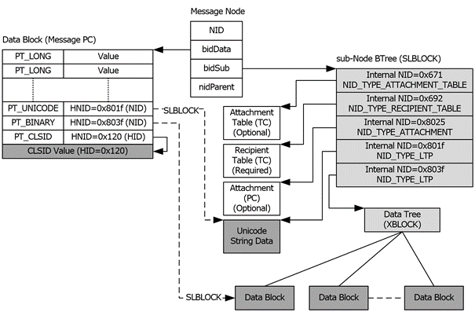

<html dir="LTR" xmlns:mshelp="http://msdn.microsoft.com/mshelp" xmlns:ddue="http://ddue.schemas.microsoft.com/authoring/2003/5" xmlns:xlink="http://www.w3.org/1999/xlink" xmlns:tool="http://www.microsoft.com/tooltip">
    <head>
        <meta http-equiv="Content-Type" content="text/html; CHARSET=utf-8"></meta>
        <meta name="save" content="history"></meta>
        <title>2.4.5 Message Objects</title>
        <xml>
            <mshelp:toctitle title="2.4.5 Message Objects"></mshelp:toctitle>
            <mshelp:rltitle title="[MS-PST]: Message Objects"></mshelp:rltitle>
            <mshelp:keyword index="A" term="1042af37-aaa4-4edc-bffd-90a1ede24188"></mshelp:keyword>
            <mshelp:attr name="DCSext.ContentType" value="open specification"></mshelp:attr>
            <mshelp:attr name="AssetID" value="1042af37-aaa4-4edc-bffd-90a1ede24188"></mshelp:attr>
            <mshelp:attr name="TopicType" value="kbRef"></mshelp:attr>
            <mshelp:attr name="DCSext.Title" value="[MS-PST]: Message Objects" />
        </xml>
    </head>
    <body>
        

            <h1 class="heading">2.4.5 Message Objects</h1>
        

        

            

                

                

                    

A <a href="08220cc9-69b1-4072-a2e7-2a0ff201d505.htm#gt_b6c15d0c-d992-421d-ba96-99d3b63894cf">Message
object</a> is a composite structure, but unlike a <a href="08220cc9-69b1-4072-a2e7-2a0ff201d505.htm#gt_0682daa7-c1b8-419b-8a32-6048833d0b72">Folder object</a>, all the data
of a Message object is contained in a single top-level node (that is, accessed
through a single top-level NID). Both the data block and subnode are used in a
Message object node, where the data block contains a PC structure that contains
the immediate properties of the Message object, and the subnode contains a
number of composite structures that contain information such as the Recipient
List and <a href="08220cc9-69b1-4072-a2e7-2a0ff201d505.htm#gt_6ab4cacc-0e1a-4843-b9e5-4f1fee5a695a">Attachment objects</a>,
if any.

<b>Figure 11: Components of a Message object</b>

The preceding diagram is an illustration of the various
components of a Message object node. The data block contains the Message object
PC, which contains the properties associated with this Message object. The
subnode of the Message object can contain a number of objects, such as: a
Recipient Table TC, an optional Attachment Table TC, optional Attachment object
PCs, as well as variable-size data from the Message object PC that cannot fit
directly into the Message object PC heap. The subnode BTree contains an array
of subnodes that are identified using internal NIDs (that is, unique within the
Message object node only). The contents of each subnode are identified
primarily by the NID_TYPE. The following table lists the NID_TYPEs that can be
found in the subnode of a Message object node.

<table>
 <thead>
  <tr>
   <th>
   
NID_TYPE

   </th>
   <th>
   
Description

   </th>
   <th>
   
Required?

   </th>
  </tr>
 </thead>
 <tr>
  <td>
  
NID_TYPE_RECIPIENT_TABLE

  </td>
  <td>
  
The subnode
  is a Message Recipient Table.

  </td>
  <td>
  
Y

  </td>
 </tr>
 <tr>
  <td>
  
NID_TYPE_ATTACHMENT_TABLE

  </td>
  <td>
  
The
  subnode is an Attachment Table (optional).

  </td>
  <td>
  
N

  </td>
 </tr>
 <tr>
  <td>
  
NID_TYPE_ATTACHMENT

  </td>
  <td>
  
The
  subnode is an Attachment object.

  </td>
  <td>
  
N

  </td>
 </tr>
 <tr>
  <td>
  
NID_TYPE_LTP

  </td>
  <td>
  
The
  subnode contains raw LTP data for the Message PC.

  </td>
  <td>
  
N

  </td>
 </tr>
</table>

 

                

            

        

    </body>
</html>