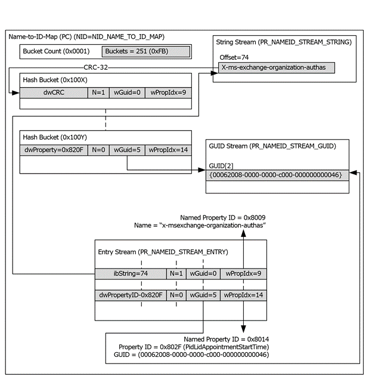

<html dir="LTR" xmlns:mshelp="http://msdn.microsoft.com/mshelp" xmlns:ddue="http://ddue.schemas.microsoft.com/authoring/2003/5" xmlns:xlink="http://www.w3.org/1999/xlink" xmlns:tool="http://www.microsoft.com/tooltip">
    <head>
        <meta http-equiv="Content-Type" content="text/html; CHARSET=utf-8"></meta>
        <meta name="save" content="history"></meta>
        <title>2.4.7.6 Data Organization of the Name-to-ID Map</title>
        <xml>
            <mshelp:toctitle title="2.4.7.6 Data Organization of the Name-to-ID Map"></mshelp:toctitle>
            <mshelp:rltitle title="[MS-PST]: Data Organization of the Name-to-ID Map"></mshelp:rltitle>
            <mshelp:keyword index="A" term="1ba98f4a-2abf-4b49-a7cd-26ae0e177443"></mshelp:keyword>
            <mshelp:attr name="DCSext.ContentType" value="open specification"></mshelp:attr>
            <mshelp:attr name="AssetID" value="1ba98f4a-2abf-4b49-a7cd-26ae0e177443"></mshelp:attr>
            <mshelp:attr name="TopicType" value="kbRef"></mshelp:attr>
            <mshelp:attr name="DCSext.Title" value="[MS-PST]: Data Organization of the Name-to-ID Map" />
        </xml>
    </head>
    <body>
        

            <h1 class="heading">2.4.7.6 Data Organization of the Name-to-ID Map</h1>
        

        

            

                

                

                    

The following diagram depicts how the various elements of
the NPMAP relate to each other, and the two mapping scenarios.

<b>Figure 13: Data organization of the Name-to-ID map</b>

The preceding diagram shows the Name-to-ID map (NPMAP) as a
single Property Context, and all the streams and hash table entities as
individual properties in the PC. 

The top-right case shows the case where the property name is
a (GUID, string) value pair. The <a href="08220cc9-69b1-4072-a2e7-2a0ff201d505.htm#gt_382ac1cd-8ff9-493a-bfec-d9ad08955707">property identifier</a> 0x8009
is mapped to the name &quot;x-ms-exchange-organization-authas&quot;, which is
embedded in the String Stream. The <b>wGuid </b>field is set to 0, indicating
that no GUID is associated with this property name.

The bottom-right case shows the second scenario, where
property identifier 0x8014 associated with well-known property name <b>PidLidAppointmentStartTime</b>.
0x8014 is also associated with GUID {00062008-0000-0000-C000-000000000046},
which represents the PSETID_Common <a href="08220cc9-69b1-4072-a2e7-2a0ff201d505.htm#gt_dc3c2e4a-3b46-4284-973e-cc0e362a3264">property set</a> (<mshelp:link keywords="f6ab1613-aefe-447d-a49c-18217230b148" tabindex="0">[MS-OXPROPS]</mshelp:link>).

The left column depicts the hash table and how two buckets
contain records that refer back to these two <a href="08220cc9-69b1-4072-a2e7-2a0ff201d505.htm#gt_e6245def-e67d-4ab2-8c7d-04863b1c1063">named properties</a>. The CRC32
of the string property name is used in the <b>dwPropertyID</b> field in the
NAMEID record in the hash table.

                

            

        

    </body>
</html>