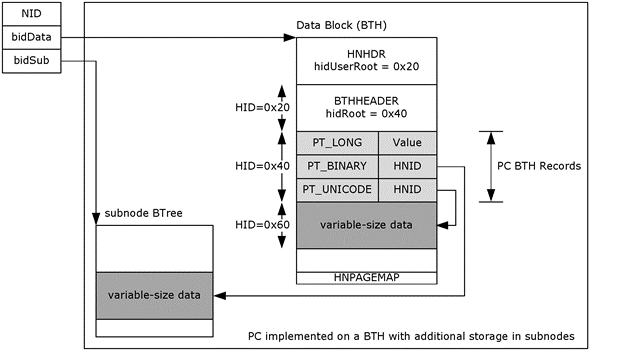

<html dir="LTR" xmlns:mshelp="http://msdn.microsoft.com/mshelp" xmlns:ddue="http://ddue.schemas.microsoft.com/authoring/2003/5" xmlns:xlink="http://www.w3.org/1999/xlink" xmlns:tool="http://www.microsoft.com/tooltip">
    <head>
        <meta http-equiv="Content-Type" content="text/html; CHARSET=utf-8"></meta>
        <meta name="save" content="history"></meta>
        <title>2.3.3.6 Anatomy of a PC</title>
        <xml>
            <mshelp:toctitle title="2.3.3.6 Anatomy of a PC"></mshelp:toctitle>
            <mshelp:rltitle title="[MS-PST]: Anatomy of a PC"></mshelp:rltitle>
            <mshelp:keyword index="A" term="235cb001-ebd6-4124-872a-73b7d2485b8f"></mshelp:keyword>
            <mshelp:attr name="DCSext.ContentType" value="open specification"></mshelp:attr>
            <mshelp:attr name="AssetID" value="235cb001-ebd6-4124-872a-73b7d2485b8f"></mshelp:attr>
            <mshelp:attr name="TopicType" value="kbRef"></mshelp:attr>
            <mshelp:attr name="DCSext.Title" value="[MS-PST]: Anatomy of a PC" />
        </xml>
    </head>
    <body>
        

            <h1 class="heading">2.3.3.6 Anatomy of a PC</h1>
        

        

            

                

                

                    

The following diagram provides a visual representation how
the various storage scenarios play out in a PC.

<b>Figure 6: Data organization of a property context</b>

This example shows a PC that is represented using a single
data block and the subnode. For a small <b>BTH</b>, a subnode is not used. The
data block points to an HN, which in turn contains a <b>BTH</b> that is built
on top of an <b>HN</b> as shown. For a PC, the <b>hidUserRoot</b> of the HN
points to the <b>BTHHEADER</b> (allocated form the heap with <b>HID</b> set to
0x20). The <b>hidRoot</b> of the BTHHEADER points to the array of PC BTH
records, which is also allocated from the heap (with <b>HID</b> set to 0x40).

The property-value pairs in the PC <b>BTH</b> records are
stored using the rules described in the previous sections. For a 32-bit <b>PtypInteger32
</b>(<mshelp:link keywords="1afa0cd9-b1a0-4520-b623-bf15030af5d8" tabindex="0">[MS-OXCDATA]</mshelp:link>
section <mshelp:link keywords="0c77892e-288e-435a-9c49-be1c20c7afdb" tabindex="0">2.11.1</mshelp:link>)
property, the value is stored inline. For variable-size properties such as
strings and binary BLOBs, an <b>HNID</b> is used to reference the data
location. For the <b>PtypString</b> ([MS-OXCDATA] section 2.11.1) case, the
data fits into the available space in the heap, and therefore is stored in the
heap (HNID=0x60). 

In the <b>PtypBinary </b>([MS-OXCDATA] section 2.11.1) case,
because the BLOB is too large to fit within the heap (larger than 3580 bytes),
the subnode is used to store the data. In this case, the value of <b>HNID</b>
is set to the subnode <b>NID</b> that contains the binary data. Note that the
subnode structure in the diagram is significantly simplified for illustrative
purposes.

                

            

        

    </body>
</html>