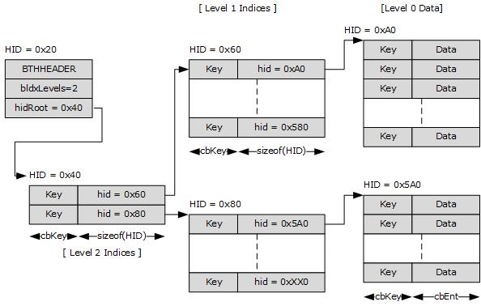

<html dir="LTR" xmlns:mshelp="http://msdn.microsoft.com/mshelp" xmlns:ddue="http://ddue.schemas.microsoft.com/authoring/2003/5" xmlns:xlink="http://www.w3.org/1999/xlink" xmlns:tool="http://www.microsoft.com/tooltip">
    <head>
        <meta http-equiv="Content-Type" content="text/html; CHARSET=utf-8"></meta>
        <meta name="save" content="history"></meta>
        <title>2.3.2 BTree-on-Heap (BTH)</title>
        <xml>
            <mshelp:toctitle title="2.3.2 BTree-on-Heap (BTH)"></mshelp:toctitle>
            <mshelp:rltitle title="[MS-PST]: BTree-on-Heap (BTH)"></mshelp:rltitle>
            <mshelp:keyword index="A" term="2dd1a95a-c8b1-4ac5-87d1-10cb8de64053"></mshelp:keyword>
            <mshelp:attr name="DCSext.ContentType" value="open specification"></mshelp:attr>
            <mshelp:attr name="AssetID" value="2dd1a95a-c8b1-4ac5-87d1-10cb8de64053"></mshelp:attr>
            <mshelp:attr name="TopicType" value="kbRef"></mshelp:attr>
            <mshelp:attr name="DCSext.Title" value="[MS-PST]: BTree-on-Heap (BTH)" />
        </xml>
    </head>
    <body>
        

            <h1 class="heading">2.3.2 BTree-on-Heap (BTH)</h1>
        

        

            

                

                

                    

A <b>BTree-on-Heap</b> implements a classic BTree on a heap
node. A BTH consists of several parts: A header, the BTree records, and
optional BTree data. The following diagram shows a high-level schematic of a
BTH.

<b>Figure 5: Data organization of a BTH</b>

The preceding diagram shows a BTH with two levels of
indices. The top-level index  (Key, HID) value pairs actually point to heap
items that contain the Level 1 Indices, which, in turn, point to heap items
that contain the leaf (Key, data) value pairs. Each of the six boxes in the
diagram actually represents six separate items allocated out of the same HN, as
indicated by their associated HIDs.

                

            

        

    </body>
</html>