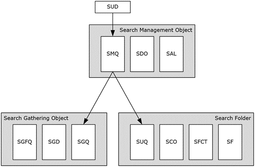

<html dir="LTR" xmlns:mshelp="http://msdn.microsoft.com/mshelp" xmlns:ddue="http://ddue.schemas.microsoft.com/authoring/2003/5" xmlns:xlink="http://www.w3.org/1999/xlink" xmlns:tool="http://www.microsoft.com/tooltip">
    <head>
        <meta http-equiv="Content-Type" content="text/html; CHARSET=utf-8"></meta>
        <meta name="save" content="history"></meta>
        <title>2.4.8 Search</title>
        <xml>
            <mshelp:toctitle title="2.4.8 Search"></mshelp:toctitle>
            <mshelp:rltitle title="[MS-PST]: Search"></mshelp:rltitle>
            <mshelp:keyword index="A" term="3991391e-6cf6-4c97-8b9e-fc25bee7391b"></mshelp:keyword>
            <mshelp:attr name="DCSext.ContentType" value="open specification"></mshelp:attr>
            <mshelp:attr name="AssetID" value="3991391e-6cf6-4c97-8b9e-fc25bee7391b"></mshelp:attr>
            <mshelp:attr name="TopicType" value="kbRef"></mshelp:attr>
            <mshelp:attr name="DCSext.Title" value="[MS-PST]: Search" />
        </xml>
    </head>
    <body>
        

            <h1 class="heading">2.4.8 Search</h1>
        

        

            

                

                

                    

A number of objects exist in the PST to support
search-related features. This section provides high-level information about the
various Search objects that can be found in a PST. The discussion of
search-related objects in this document is strictly limited to the scope of
providing a brief technical overview of each of the objects, and allowing
implementers to perform the necessary update requirements to the search object
when changing the contents of the PST. 

The following are specific non-goals of this section:

<ul><li>
 
Provide technical information such that implementations can
create search <a href="08220cc9-69b1-4072-a2e7-2a0ff201d505.htm#gt_0682daa7-c1b8-419b-8a32-6048833d0b72">Folder objects</a>
and search criteria.

</li><li>
 
Provide technical information such that implementations can
perform search queue processing and content indexing.

</li></ul>
The following diagram depicts the various search objects and
their relationship.

<b>Figure 14: Search-related objects</b>

                

            

        

    </body>
</html>