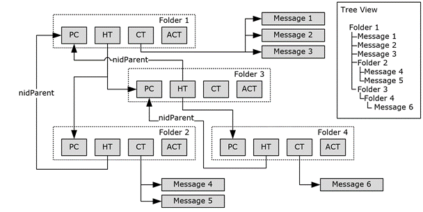

<html dir="LTR" xmlns:mshelp="http://msdn.microsoft.com/mshelp" xmlns:ddue="http://ddue.schemas.microsoft.com/authoring/2003/5" xmlns:xlink="http://www.w3.org/1999/xlink" xmlns:tool="http://www.microsoft.com/tooltip">
    <head>
        <meta http-equiv="Content-Type" content="text/html; CHARSET=utf-8"></meta>
        <meta name="save" content="history"></meta>
        <title>2.4.4.7 Anatomy of a Folder Hierarchy</title>
        <xml>
            <mshelp:toctitle title="2.4.4.7 Anatomy of a Folder Hierarchy"></mshelp:toctitle>
            <mshelp:rltitle title="[MS-PST]: Anatomy of a Folder Hierarchy"></mshelp:rltitle>
            <mshelp:keyword index="A" term="412a79f3-5b12-49b3-848f-da1738233db1"></mshelp:keyword>
            <mshelp:attr name="DCSext.ContentType" value="open specification"></mshelp:attr>
            <mshelp:attr name="AssetID" value="412a79f3-5b12-49b3-848f-da1738233db1"></mshelp:attr>
            <mshelp:attr name="TopicType" value="kbRef"></mshelp:attr>
            <mshelp:attr name="DCSext.Title" value="[MS-PST]: Anatomy of a Folder Hierarchy" />
        </xml>
    </head>
    <body>
        

            <h1 class="heading">2.4.4.7 Anatomy of a Folder Hierarchy</h1>
        

        

            

                

                

                    

The following diagram links all the <a href="08220cc9-69b1-4072-a2e7-2a0ff201d505.htm#gt_0682daa7-c1b8-419b-8a32-6048833d0b72">Folder object</a> concepts
together by illustrating how each element interrelates with each other.

<b>Figure 10: Anatomy of a Folder hierarchy</b>

The preceding example illustrates how the various elements
of a Folder object work together to represent a Folder object hierarchy. The
equivalent &quot;tree view&quot; of the hierarchy is indicated on the right.

At the top of the hierarchy is Folder object 1, which
contains 3 <a href="08220cc9-69b1-4072-a2e7-2a0ff201d505.htm#gt_b6c15d0c-d992-421d-ba96-99d3b63894cf">Message objects</a>
and 2 sub-Folder objects. The PC contains all the properties associated with
Folder object 1, where the hierarchy table (HT) contains information about the
2 sub-Folder objects: Folder object 2 and Folder object 3. The information
about the 3 Message objects in the Folder object, however, is stored in the
contents table (CT). While not shown, the <a href="08220cc9-69b1-4072-a2e7-2a0ff201d505.htm#gt_d7d60068-8690-4d36-8dae-9d7f73dc77b9">FAI contents table</a> contains
<a href="08220cc9-69b1-4072-a2e7-2a0ff201d505.htm#gt_6f222571-3f61-4250-a8a6-d56505335792">FAI</a> Message objects that
pertain to Folder object 1. For more information about FAI Message objects, see
<mshelp:link keywords="7fd7ec40-deec-4c06-9493-1bc06b349682" tabindex="0">[MS-OXCMSG]</mshelp:link>
section 1.3.2. In addition, the <b>RowIndex</b> of Folder object 1's HT
contains the necessary NID mappings that enable navigation from Folder object 1
to Folder objects 2 and 3. The relationship applies recursively to Folder
object 2 and Folder object 3, and eventually, to Folder object 4, as shown in
the preceding diagram.

Note the use of the <b>nidParent</b> field in the hierarchy
table node to point back to the NID of the parent Folder object. Also note that
all arrows eventually point to the Folder object PC node, whose NID can be
replaced with different NID_TYPEs to access the other TCs.

                

            

        

    </body>
</html>