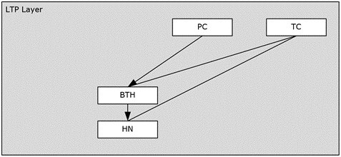

<html dir="LTR" xmlns:mshelp="http://msdn.microsoft.com/mshelp" xmlns:ddue="http://ddue.schemas.microsoft.com/authoring/2003/5" xmlns:xlink="http://www.w3.org/1999/xlink" xmlns:tool="http://www.microsoft.com/tooltip">
    <head>
        <meta http-equiv="Content-Type" content="text/html; CHARSET=utf-8"></meta>
        <meta name="save" content="history"></meta>
        <title>2.6.2 LTP Layer</title>
        <xml>
            <mshelp:toctitle title="2.6.2 LTP Layer"></mshelp:toctitle>
            <mshelp:rltitle title="[MS-PST]: LTP Layer"></mshelp:rltitle>
            <mshelp:keyword index="A" term="4fff5d0a-0c5c-4330-88d5-e659d1e544d1"></mshelp:keyword>
            <mshelp:attr name="DCSext.ContentType" value="open specification"></mshelp:attr>
            <mshelp:attr name="AssetID" value="4fff5d0a-0c5c-4330-88d5-e659d1e544d1"></mshelp:attr>
            <mshelp:attr name="TopicType" value="kbRef"></mshelp:attr>
            <mshelp:attr name="DCSext.Title" value="[MS-PST]: LTP Layer" />
        </xml>
    </head>
    <body>
        

            <h1 class="heading">2.6.2 LTP Layer</h1>
        

        

            

                

                

                    

The LTP layer provides higher-level semantics that abstract
the primitive node-based operations. The following diagram graphically
illustrates the various structures provided by the LTP layer.

<b>Figure 17: LTP layer</b>

The following sections describe the most common operations
performed at the LTP layer, and specific implementation considerations.

                

            

        

    </body>
</html>