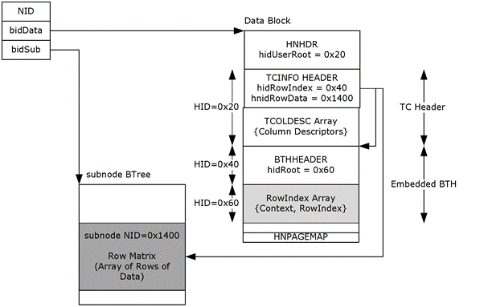

<html dir="LTR" xmlns:mshelp="http://msdn.microsoft.com/mshelp" xmlns:ddue="http://ddue.schemas.microsoft.com/authoring/2003/5" xmlns:xlink="http://www.w3.org/1999/xlink" xmlns:tool="http://www.microsoft.com/tooltip">
    <head>
        <meta http-equiv="Content-Type" content="text/html; CHARSET=utf-8"></meta>
        <meta name="save" content="history"></meta>
        <title>2.3.4 Table Context (TC)</title>
        <xml>
            <mshelp:toctitle title="2.3.4 Table Context (TC)"></mshelp:toctitle>
            <mshelp:rltitle title="[MS-PST]: Table Context (TC)"></mshelp:rltitle>
            <mshelp:keyword index="A" term="5e48be0d-a75a-4918-a277-50408ff96740"></mshelp:keyword>
            <mshelp:attr name="DCSext.ContentType" value="open specification"></mshelp:attr>
            <mshelp:attr name="AssetID" value="5e48be0d-a75a-4918-a277-50408ff96740"></mshelp:attr>
            <mshelp:attr name="TopicType" value="kbRef"></mshelp:attr>
            <mshelp:attr name="DCSext.Title" value="[MS-PST]: Table Context (TC)" />
        </xml>
    </head>
    <body>
        

            <h1 class="heading">2.3.4 Table Context (TC)</h1>
        

        

            

                

                

                    

A Table Context represents a table with rows of columns.
From an implementation perspective, a TC is a complex, composite structure that
is built on top of an HN. The presence of a TC is indicated at both the NDB and
LTP Layers. At the NDB Layer, a TC is indicated through one of the special
NID_TYPEs, and at the LTP Layer, a value of <b>bTypeTC</b> for <b>bClientSig</b>
in the HNHEADER structure is reserved for TCs. The underlying TC data is
separated into 3 entries: a header with Column descriptors, a RowIndex (a
nested BTH), and the actual table data (known as the Row Matrix).

The Row Matrix contains the actual row data for the TC. New
rows are appended to the end of the Row Matrix, which means that the rows are
not sorted in any meaningful manner. To provide a way to efficiently search the
Row Matrix for a particular data row, each TC also contains an embedded BTH,
known as the RowIndex, to provide a 32-bit &quot;primary index&quot; for the
Row Matrix. Each 32-bit value is a key that uniquely identifies a row within
the Row Matrix.

In practice, the Row Matrix is stored in a subnode because
of its typical size, but in rare cases, a TC can fit into a single data block
if it is small enough. To facilitate navigation between rows, each row of data
is of the same size, and the size is stored in the TCINFO header structure
(section <a href="45b3a0c5-d6d6-4e02-aebf-13766ff693f0.htm">2.3.4.1</a>). To
further help with data packing and alignment, the data values are grouped
according to its corresponding data size. DWORD and ULONGLONG values are
grouped first, followed by WORD-sized data, and then byte-sized data. The
TCINFO structure contains an array of offsets that points to the starting
offset of each group of data.

The TC also includes a construct known as a Cell Existence
Bitmap (CEB), which is used to denote whether a particular column in a particular
row actually &quot;exists&quot;. A CEB is present at the end of each row of
data in the Row Matrix that indicates which columns in that row exists and
which columns don't exist. 

The following diagram depicts the various elements of a TC,
and how they relate to each other.

<b>Figure 7: Data organization of a Table Context</b>

The preceding example illustrates a typical TC arrangement,
where the metadata is stored in the main data block (a data tree can be used if
the TC is large), and the RowMatrix is stored in the corresponding subnode.
Note that the numerical values used in the example are for reference purposes
only.

The <b>hidUserRoot</b> of the HNHDR points to the TC header,
which is allocated from the heap with HID=0x20. The TC header contains a TCINFO
structure, followed by an array of column descriptors. The TCINFO structure
contains pointers that point to the RowIndex (<b>hidRowIndex</b>) and The Row
Matrix (hnidRowData). The RowIndex is allocated off the heap, whereas the Row
Matrix is stored in the subnode (in rare cases where the TC is very small, the
Row Matrix can be stored in a heap allocation instead. Note that the subnode
structure in the diagram is significantly simplified for illustrative purposes.

The next sections describe actual data structures associated
with Table Contexts:

                

            

        

    </body>
</html>