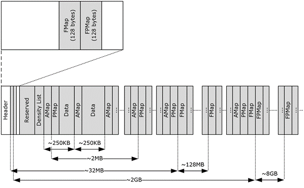

<html dir="LTR" xmlns:mshelp="http://msdn.microsoft.com/mshelp" xmlns:ddue="http://ddue.schemas.microsoft.com/authoring/2003/5" xmlns:xlink="http://www.w3.org/1999/xlink" xmlns:tool="http://www.microsoft.com/tooltip">
    <head>
        <meta http-equiv="Content-Type" content="text/html; CHARSET=utf-8"></meta>
        <meta name="save" content="history"></meta>
        <title>1.3.2 Physical Organization of the PST File Format</title>
        <xml>
            <mshelp:toctitle title="1.3.2 Physical Organization of the PST File Format"></mshelp:toctitle>
            <mshelp:rltitle title="[MS-PST]: Physical Organization of the PST File Format"></mshelp:rltitle>
            <mshelp:keyword index="A" term="6b57253b-0853-47bb-99bb-d4b8f78105f0"></mshelp:keyword>
            <mshelp:attr name="DCSext.ContentType" value="open specification"></mshelp:attr>
            <mshelp:attr name="AssetID" value="6b57253b-0853-47bb-99bb-d4b8f78105f0"></mshelp:attr>
            <mshelp:attr name="TopicType" value="kbRef"></mshelp:attr>
            <mshelp:attr name="DCSext.Title" value="[MS-PST]: Physical Organization of the PST File Format" />
        </xml>
    </head>
    <body>
        

            <h1 class="heading">1.3.2 Physical Organization of the PST File Format</h1>
        

        

            

                

                

                    

This section provides an overview of the physical layout of
the various concepts that were introduced in section <a href="de4157d3-fc53-4aec-81be-d1659c8a2302.htm">1.3.1</a>. The following
diagram illustrates the high-level file organization of a PST.

<b>Figure 3: Physical organization of the PST file format</b>

This file format is organized with a header element followed
by allocation information pages at regular intervals that are interspersed with
extensible data blocks. The header section includes metadata about the PST and
information that points to the data sections that contain the <a href="08220cc9-69b1-4072-a2e7-2a0ff201d505.htm#gt_fda94a53-448d-48d5-9991-176c530ff597">message store</a> and its
contents. The following sections cover each of these elements in further
detail.

                

            

        

    </body>
</html>