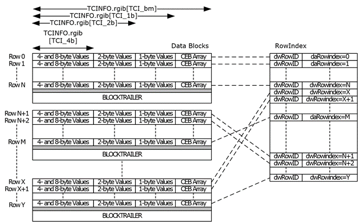

<html dir="LTR" xmlns:mshelp="http://msdn.microsoft.com/mshelp" xmlns:ddue="http://ddue.schemas.microsoft.com/authoring/2003/5" xmlns:xlink="http://www.w3.org/1999/xlink" xmlns:tool="http://www.microsoft.com/tooltip">
    <head>
        <meta http-equiv="Content-Type" content="text/html; CHARSET=utf-8"></meta>
        <meta name="save" content="history"></meta>
        <title>2.3.4.4 Row Matrix</title>
        <xml>
            <mshelp:toctitle title="2.3.4.4 Row Matrix"></mshelp:toctitle>
            <mshelp:rltitle title="[MS-PST]: Row Matrix"></mshelp:rltitle>
            <mshelp:keyword index="A" term="7f5ec68f-d4fd-404f-95c3-fe3495a034ec"></mshelp:keyword>
            <mshelp:attr name="DCSext.ContentType" value="open specification"></mshelp:attr>
            <mshelp:attr name="AssetID" value="7f5ec68f-d4fd-404f-95c3-fe3495a034ec"></mshelp:attr>
            <mshelp:attr name="TopicType" value="kbRef"></mshelp:attr>
            <mshelp:attr name="DCSext.Title" value="[MS-PST]: Row Matrix" />
        </xml>
    </head>
    <body>
        

            <h1 class="heading">2.3.4.4 Row Matrix</h1>
        

        

            

                

                

                    

The Row Matrix contains the actual data for the rows and
columns of the TC. The data is physically arranged in rows; each row contains
the data for each of its columns. Each row of column data in the Row Matrix is
of the same size and is arranged in the same layout, and the size of each row
is specified in the <b>rgib[TCI_bm]</b> value in the TCINFO header structure. 

However, in many cases, the Row Matrix is larger than 8
kilobytes and therefore cannot fit in a single data block, which means that a
data tree is used to store the Row Matrix in separate data blocks. This means
that the row data is partitioned across two or more data blocks and needs
special handling considerations.

The design of a TC dictates that each data block MUST store
an integral number of rows, which means that rows cannot span across two
blocks, and that each block MUST start with a fresh row. This also means that
in order for a client to access a particular row in the Row Matrix, it first
calculates how many rows fit in a block, and calculates the row index within
that block at which the row data is located. The general formulas to calculate
the block index and row index for the Nth row are as follows:

Rows per block = Floor((sizeof(block) –
sizeof(BLOCKTRAILER)) / TCINFO.rgib[TCI_bm])

Block index = N / (rows per block)

Row index = N % (rows per block)

Each block except the last one MUST have a size of 8192
bytes. If not, the file is considered corrupted. The size of a block is
specified in the formula by <i>sizeof(block)</i>.

The following diagram illustrates how the data in the Row
Matrix is organized.

<b>Figure 8: Data organization of the Row Matrix</b>

In addition to showing the data organization of the Row
Matrix, this diagram also illustrates how the rows in the RowIndex relate to
the row data in the Row Matrix. As illustrated by the crossing of dotted lines
between the two structures, the Row Matrix data is unsorted, which makes
searching inefficient. The RowIndex, which is implemented using an embedded BTH
indexed by <b>dwRowID</b>, provides the primary search key to lookup specific
rows in the Row Matrix. 

It is also worth noting that because of the fact that
partial rows are not allowed, there might be unused space at the end of the
data block (shaded in gray in the diagram). Readers MUST ignore any such
&quot;dead space&quot; and MUST NOT interpret its contents. 

                

            

        

    </body>
</html>