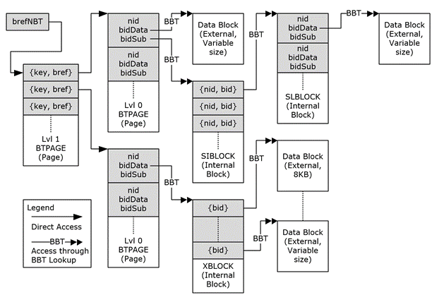

<html dir="LTR" xmlns:mshelp="http://msdn.microsoft.com/mshelp" xmlns:ddue="http://ddue.schemas.microsoft.com/authoring/2003/5" xmlns:xlink="http://www.w3.org/1999/xlink" xmlns:tool="http://www.microsoft.com/tooltip">
    <head>
        <meta http-equiv="Content-Type" content="text/html; CHARSET=utf-8"></meta>
        <meta name="save" content="history"></meta>
        <title>3.1 Sample Node Database (NDB)</title>
        <xml>
            <mshelp:toctitle title="3.1 Sample Node Database (NDB)"></mshelp:toctitle>
            <mshelp:rltitle title="[MS-PST]: Sample Node Database (NDB)"></mshelp:rltitle>
            <mshelp:keyword index="A" term="903241a7-8e4d-4ff6-93e4-78a3d74bd8dc"></mshelp:keyword>
            <mshelp:attr name="DCSext.ContentType" value="open specification"></mshelp:attr>
            <mshelp:attr name="AssetID" value="903241a7-8e4d-4ff6-93e4-78a3d74bd8dc"></mshelp:attr>
            <mshelp:attr name="TopicType" value="kbRef"></mshelp:attr>
            <mshelp:attr name="DCSext.Title" value="[MS-PST]: Sample Node Database (NDB)" />
        </xml>
    </head>
    <body>
        

            <h1 class="heading">3.1 Sample Node Database (NDB)</h1>
        

        

            

                

                

                    

The following is a sample illustration of how various pages
and blocks are used to represent various entities of the NDB Layer.

<b>Figure 20: Application of pages and blocks</b>

The first and second columns of the diagram represent the
NBT, which is accessed through the <b>BREFNBT</b> structure in the ROOT
structure. In this example, the NBT consists of a 2-level BTree that contains a
number of top-level nodes. In the second column, the node on the top contains
both a data BID (<b>bidData</b>) and a subnode BID (<b>bidSub</b>), whereas the
node on the bottom only contains a data BID but no subnode.

In the Legend, that there are two types of arrow notations.
The single arrowhead indicates data that can be directly accessed by means of a
<b>BREF</b> structure (which contains the absolute file offset of the target);
and the double-arrowhead with &quot;BBT&quot; indicates data that needs to be
accessed indirectly using a BBT search to lookup the data block that is
associated with the BID.

The top node's <b>bidData</b> points directly to a data
block, which contains the external, end-user data associated with this node. 

In addition, the top node also contains a subnode, which
points to a 2-level subnode BTree. The Level 1 SIBLOCK fans out to a number of
different Level 0 SLBLOCKs (only one is shown in the diagram for simplicity).
Each SLBLOCK further contains a number of internal subnodes (4th
column). In this example, the internal subnode points to a single data block (5th
column). The subnode can recursively contain any number of levels of subnodes
to create a hierarchical tree of subnodes.

The second top-level node (bottom node in 2nd
column) is an example of a data tree with one XBLOCK, which contains an array
of BIDs that point to several data blocks that contains the end-user data.

                

            

        

    </body>
</html>