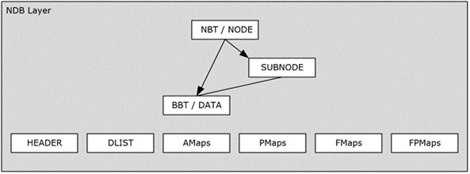

<html dir="LTR" xmlns:mshelp="http://msdn.microsoft.com/mshelp" xmlns:ddue="http://ddue.schemas.microsoft.com/authoring/2003/5" xmlns:xlink="http://www.w3.org/1999/xlink" xmlns:tool="http://www.microsoft.com/tooltip">
    <head>
        <meta http-equiv="Content-Type" content="text/html; CHARSET=utf-8"></meta>
        <meta name="save" content="history"></meta>
        <title>2.6.1 NDB Layer</title>
        <xml>
            <mshelp:toctitle title="2.6.1 NDB Layer"></mshelp:toctitle>
            <mshelp:rltitle title="[MS-PST]: NDB Layer"></mshelp:rltitle>
            <mshelp:keyword index="A" term="9d2083cf-fd37-4a0d-b61a-d2ef10a89a04"></mshelp:keyword>
            <mshelp:attr name="DCSext.ContentType" value="open specification"></mshelp:attr>
            <mshelp:attr name="AssetID" value="9d2083cf-fd37-4a0d-b61a-d2ef10a89a04"></mshelp:attr>
            <mshelp:attr name="TopicType" value="kbRef"></mshelp:attr>
            <mshelp:attr name="DCSext.Title" value="[MS-PST]: NDB Layer" />
        </xml>
    </head>
    <body>
        

            <h1 class="heading">2.6.1 NDB Layer</h1>
        

        

            

                

                

                    

The NDB layer, for the purpose of discussion in this
section, consists of two portions: an infrastructure portion, and the NDB
portion, as shown in the following diagram.

<b>Figure 16: NDB layer</b>

The infrastructure portion contains the various elements in
the PST that maintain the lowest-level information, which includes: the PST
header and the allocation metadata pages (that is, AMaps, PMaps, FMaps, FPMaps,
and the DList). Together these entities form the underlying infrastructure that
represent the metadata and state on which the proper functioning of the PST
relies. The header and the allocation metadata pages are the only entities in
the PST that are ever modified in-place.

The NDB portion is the node database that includes the NBT
and BBT, and all its associated operations. This section covers the various
implementation considerations associated with the NDB Layer. To start, the
following table illustrates the various entities that exist in the NDB layer.

<table>
 <thead>
  <tr>
   <th>
   
Entity

   </th>
   <th>
   
Required?

   </th>
   <th>
   
Instances

   </th>
   <th>
   
Remarks

   </th>
  </tr>
 </thead>
 <tr>
  <td>
  
PST
  HEADER

  </td>
  <td>
  
Y

  </td>
  <td>
  
1

  </td>
  <td>
  
The
  PST header MUST be maintained and up-to-date at all times.

  </td>
 </tr>
 <tr>
  <td>
  
AMap

  </td>
  <td>
  
Y

  </td>
  <td>
  
Many,
  Periodic

  </td>
  <td>
  
Authoritative
  source of all free/allocated space in the PST, MUST be maintained at all
  times.

  </td>
 </tr>
 <tr>
  <td>
  
PMap

  </td>
  <td>
  
Y

  </td>
  <td>
  
Many,
  Periodic

  </td>
  <td>
  
MUST
  exist in correct intervals for backward client compatibility. Implementations
  SHOULD NOT modify PMaps after they are created.<a href="f040f8b2-f023-4ed9-94fd-de487da83ed5.htm#Appendix_A_19" aria-label="Product behavior note 19">&lt;19&gt;</a>

  </td>
 </tr>
 <tr>
  <td>
  
FMap

  </td>
  <td>
  
Y

  </td>
  <td>
  
Many,
  Periodic

  </td>
  <td>
  
MUST
  exist in correct intervals for backward client compatibility. Implementations
  SHOULD NOT modify FMaps after they are created.<a href="f040f8b2-f023-4ed9-94fd-de487da83ed5.htm#Appendix_A_20" aria-label="Product behavior note 20">&lt;20&gt;</a>

  </td>
 </tr>
 <tr>
  <td>
  
FPMap

  </td>
  <td>
  
Y

  </td>
  <td>
  
Many,
  Periodic

  </td>
  <td>
  
MUST
  exist in correct intervals for backward client compatibility. Implementations
  SHOULD NOT modify FPMaps after they are created.<a href="f040f8b2-f023-4ed9-94fd-de487da83ed5.htm#Appendix_A_21" aria-label="Product behavior note 21">&lt;21&gt;</a>

  </td>
 </tr>
</table>

 

                

            

        

    </body>
</html>