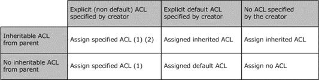

<html dir="LTR" xmlns:mshelp="http://msdn.microsoft.com/mshelp" xmlns:ddue="http://ddue.schemas.microsoft.com/authoring/2003/5" xmlns:xlink="http://www.w3.org/1999/xlink" xmlns:tool="http://www.microsoft.com/tooltip">
    <head>
        <meta http-equiv="Content-Type" content="text/html; CHARSET=utf-8"></meta>
        <meta name="save" content="history"></meta>
        <title>2.5.3.4 Algorithm for Creating a Security Descriptor</title>
        <xml>
            <mshelp:toctitle title="2.5.3.4 Algorithm for Creating a Security Descriptor"></mshelp:toctitle>
            <mshelp:rltitle title="[MS-DTYP]: Algorithm for Creating a Security Descriptor"></mshelp:rltitle>
            <mshelp:keyword index="A" term="0f0c6ffc-f57d-47f8-a6c8-63889e874e24"></mshelp:keyword>
            <mshelp:attr name="DCSext.ContentType" value="open specification"></mshelp:attr>
            <mshelp:attr name="AssetID" value="0f0c6ffc-f57d-47f8-a6c8-63889e874e24"></mshelp:attr>
            <mshelp:attr name="TopicType" value="kbRef"></mshelp:attr>
            <mshelp:attr name="DCSext.Title" value="[MS-DTYP]: Algorithm for Creating a Security Descriptor" />
        </xml>
    </head>
    <body>
        

            <h1 class="heading">2.5.3.4 Algorithm for Creating a Security Descriptor</h1>
        

        

            

                

                

                    

An important element of the overall security model is the
manner in which security descriptors are created for new objects. In the
trivial case, the creator of a new object simply supplies a new security
descriptor for the new object, and the two are associated by the resource
manager or server that owns the object. The trivial case is not the common
case, however, and the security model has specific behavior involved in deriving
the security descriptor for a new object from the security descriptors for
existing objects.

The derivation of a new security descriptor in this security
model is called inheritance, and refers to the concept that the new security
descriptor inherits some or all of its characteristics from the security
descriptor of a parent or container object. Individual <a href="d06e5a81-176e-46c6-9cf7-9137aad4455e.html">ACEs</a> can contain
indicators that specify whether it can be passed on to child objects, this
indicator is called inheritable. Additionally, they can have an indicator as to
whether the ACE was derived from a parent during its creation, this indicator
is called inherited.

In overview, the process is fairly straightforward. During
the creation of a new security descriptor where inheritance is possible, the
parent security descriptor is examined. For each ACE in the parent security
descriptor, the process checks whether it is marked as inheritable. If so, it
is included in the new security descriptor. This is done for both the <b>DACL</b>
and <b>SACL</b> portions of the security descriptor.

The algorithm for computing the system and discretionary <a href="20233ed8-a6c6-4097-aafa-dd545ed24428.html">ACL</a> (<b>SACL</b> and <b>DACL</b>
respectively) in the security descriptor for the new object is governed by the
logic that is illustrated in the following figure.

<b>Figure 11: ACL inheritance logic</b>

<ol><li>
    Any ACEs with
the INHERITED_ACE bit set are NOT copied to the assigned security descriptor.

</li><li>
    If <i>AutoInheritFlags</i>,
as specified in section <a href="98267ad6-66db-4a2c-972e-efb7d4603da1.html">2.5.3.4.1</a>,
is set to automatically inherit ACEs from the parent (DACL_AUTO_INHERIT or
SACL_AUTO_INHERIT), inherited ACEs from the parent are appended after explicit
ACEs from the <i>CreatorDescriptor</i>. For further details, see the parameter
list for CreateSecurityDescriptor (section 2.5.3.4.1).

</li><li>
    The preceding
table describing ACL inheritance logic holds true if the ACL is not protected.
If the ACL is protected, all the ACEs from the Explicit ACL are copied into the
assigned security descriptor, resetting any ACEs with the INHERITED_ACE bit set
as well. The Inheritable ACL is not considered.

</li></ol>
<b>Note</b>  An explicitly specified ACL, whether
a default ACL or not, can be empty or null.<a href="11e1608c-6169-4fbc-9c33-373fc9b224f4.html#Appendix_A_93" aria-label="Product behavior note 93">&lt;93&gt;</a>

The remainder of this section documents the details of the
algorithm outlined above as a set of nested subprocedures.

                

            

        

    </body>
</html>