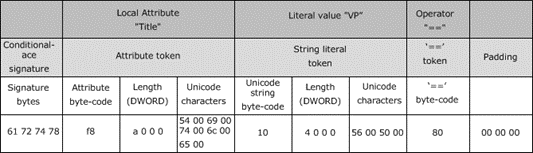
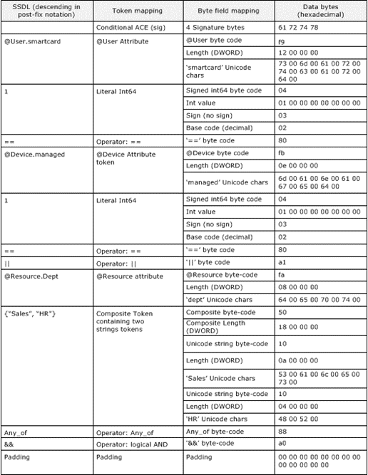
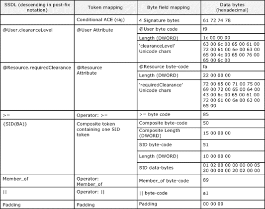

<html dir="LTR" xmlns:mshelp="http://msdn.microsoft.com/mshelp" xmlns:ddue="http://ddue.schemas.microsoft.com/authoring/2003/5" xmlns:xlink="http://www.w3.org/1999/xlink" xmlns:tool="http://www.microsoft.com/tooltip">
    <head>
        <meta http-equiv="Content-Type" content="text/html; CHARSET=utf-8"></meta>
        <meta name="save" content="history"></meta>
        <title>2.4.4.17.9 Examples: Conditional Expression Binary Representation</title>
        <xml>
            <mshelp:toctitle title="2.4.4.17.9 Examples: Conditional Expression Binary Representation"></mshelp:toctitle>
            <mshelp:rltitle title="[MS-DTYP]: Examples: Conditional Expression Binary Representation"></mshelp:rltitle>
            <mshelp:keyword index="A" term="177edae9-0971-400d-8bee-39d0c48c2e8a"></mshelp:keyword>
            <mshelp:attr name="DCSext.ContentType" value="open specification"></mshelp:attr>
            <mshelp:attr name="AssetID" value="177edae9-0971-400d-8bee-39d0c48c2e8a"></mshelp:attr>
            <mshelp:attr name="TopicType" value="kbRef"></mshelp:attr>
            <mshelp:attr name="DCSext.Title" value="[MS-DTYP]: Examples: Conditional Expression Binary Representation" />
        </xml>
    </head>
    <body>
        

            <h1 class="heading">2.4.4.17.9 Examples: Conditional Expression Binary Representation</h1>
        

        

            

                

                

                    

<b>Example 1: Attributes in Simple Form</b>

For the following conditional expression:

<dl>
<dd>

<pre> (Title==&quot;VP&quot;)
</pre>

</dd></dl>

The <b>ApplicationData</b> member of the CALLBACK ACEs
structure will have the following physical packing (numbers are in
hexadecimal):

<b>Figure 3: Components of the Application Data member for the
conditional expression (Title==&quot;VP&quot;)</b>

The following hexadecimal byte dump shows the contents of
the ApplicationData in contiguous memory for the preceding conditional
expression (with three added bytes for padding).

<dl>
<dd>

<pre>  61  72  74  78 f8 0a  00  00    artx....
  00  54  00  69 00 74  00  6c    .T.i.t.l
  00  65  00  10 04 00  00  00    .e......
  56  00  50  00 80 00  00  00    V.P.....
  
</pre>

</dd></dl>

<b>Example 2: @Prefixed Attribute Names and Multiple Terms</b>

For the following conditional expression illustrates
@Prefixed attribute names and use of multiple terms as expressed in SDDL:

<dl>
<dd>

<pre> (@User.smartcard==1 || @Device.managed==1) &amp;&amp; (@Resource.dept Any_of{&quot;Sales&quot;,&quot;HR&quot;})
</pre>

</dd></dl>

SDDL strings encoded into an ApplicationData field MUST be
ordered to maintain SDDL precedence rules as specified in section <a href="d1a8392f-3f54-4fea-8233-44ede9eb198c.html">2.5.1.3</a>. The preceding
conditional expression expressions can be reordered in postfix notation as
follows:

<table>
 <thead>
  <tr>
   <th>
   
@User.smartcard

   </th>
   <th>
   
1

   </th>
   <th>
   
==

   </th>
   <th>
   
@Device.managed

   </th>
   <th>
   
1

   </th>
   <th>
   
==

   </th>
   <th>
   
||

   </th>
   <th>
   
@Resource.dept

   </th>
   <th>
   
{Sales,HR}

   </th>
   <th>
   
Any_of

   </th>
   <th>
   
&amp;&amp;

   </th>
  </tr>
 </thead>
</table>

The following figure shows the mapping from the above
postfix expression to the layout in memory:

<b>Figure 4: Postfix to memory mapping for
&quot;(@User.smartcard == 1 || @Device.managed == 1) &amp;&amp; (@Resource.dept
Any_of {&quot;Sales&quot;,&quot;HR&quot;})&quot;</b>

<b>Example 3: RHS Attribute Variables and SID-based
Operators</b>

The following conditional expression illustrates @Prefixed
attribute names with an attribute variable on the RHS of the operator and the
use of a SID-based operator (Member_Of) as expressed in SDDL:

<dl>
<dd>

<pre> (@User.clearanceLevel&gt;=@Resource.requiredClearance) || (Member_of{SID(BA)})
</pre>

</dd></dl>

SDDL strings encoded into an <b>ApplicationData</b> field
MUST be ordered to maintain SDDL precedence rules as specified in section
2.5.1.3. The preceding conditional expression can be reordered in postfix
notation as follows:

<table>
 <thead>
  <tr>
   <th>
   
@User.clearanceLevel

   </th>
   <th>
   
@Resource.requiredClearance

   </th>
   <th>
   
&gt;=

   </th>
   <th>
   
{SID(BA)}

   </th>
   <th>
   
Member_of

   </th>
   <th>
   
||

   </th>
  </tr>
 </thead>
</table>

The following figure shows the mapping from the preceding
postfix expression to the layout in memory.

<b>Figure 5: Postfix to memory mapping for
(@User.clearanceLevel &gt;= @Resource.requiredClearance) || (Member_of
{SID(BA)})</b>

                

            

        

    </body>
</html>