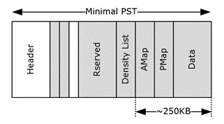

<html dir="LTR" xmlns:mshelp="http://msdn.microsoft.com/mshelp" xmlns:ddue="http://ddue.schemas.microsoft.com/authoring/2003/5" xmlns:xlink="http://www.w3.org/1999/xlink" xmlns:tool="http://www.microsoft.com/tooltip">
    <head>
        <meta http-equiv="Content-Type" content="text/html; CHARSET=utf-8"></meta>
        <meta name="save" content="history"></meta>
        <title>2.7 Minimum PST Requirements</title>
        <xml>
            <mshelp:toctitle title="2.7 Minimum PST Requirements"></mshelp:toctitle>
            <mshelp:rltitle title="[MS-PST]: Minimum PST Requirements"></mshelp:rltitle>
            <mshelp:keyword index="A" term="2b64b768-7a65-40cc-862f-5109aa81c5c5"></mshelp:keyword>
            <mshelp:attr name="DCSext.ContentType" value="open specification"></mshelp:attr>
            <mshelp:attr name="AssetID" value="2b64b768-7a65-40cc-862f-5109aa81c5c5"></mshelp:attr>
            <mshelp:attr name="TopicType" value="kbRef"></mshelp:attr>
            <mshelp:attr name="DCSext.Title" value="[MS-PST]: Minimum PST Requirements" />
        </xml>
    </head>
    <body>
        

            <h1 class="heading">2.7 Minimum PST Requirements</h1>
        

        

            

                

                

                    

This section covers the specific requirement for a PST.
While the previous sections have provided detailed technical requirements of
how to create and maintain a structurally-correct PST file, the following
sections cover the additional requirements on the actual contents of the PST.

The essential elements of a minimal working PST file are
visually represented in the following diagram. 

<b>Figure 19: Minimal PST</b>

                

            

        

    </body>
</html>