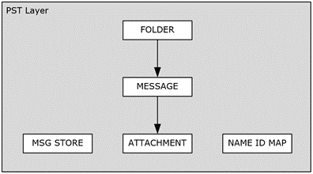

<html dir="LTR" xmlns:mshelp="http://msdn.microsoft.com/mshelp" xmlns:ddue="http://ddue.schemas.microsoft.com/authoring/2003/5" xmlns:xlink="http://www.w3.org/1999/xlink" xmlns:tool="http://www.microsoft.com/tooltip">
    <head>
        <meta http-equiv="Content-Type" content="text/html; CHARSET=utf-8"></meta>
        <meta name="save" content="history"></meta>
        <title>2.6.3 Messaging Layer</title>
        <xml>
            <mshelp:toctitle title="2.6.3 Messaging Layer"></mshelp:toctitle>
            <mshelp:rltitle title="[MS-PST]: Messaging Layer"></mshelp:rltitle>
            <mshelp:keyword index="A" term="4fd478e3-12fa-4fb1-a6be-6a61cf3c47dc"></mshelp:keyword>
            <mshelp:attr name="DCSext.ContentType" value="open specification"></mshelp:attr>
            <mshelp:attr name="AssetID" value="4fd478e3-12fa-4fb1-a6be-6a61cf3c47dc"></mshelp:attr>
            <mshelp:attr name="TopicType" value="kbRef"></mshelp:attr>
            <mshelp:attr name="DCSext.Title" value="[MS-PST]: Messaging Layer" />
        </xml>
    </head>
    <body>
        

            <h1 class="heading">2.6.3 Messaging Layer</h1>
        

        

            

                

                

                    

The Messaging layer provides a Messaging-oriented interface
that consists of concepts and objects that are consistent with structured
storage models such as <a href="08220cc9-69b1-4072-a2e7-2a0ff201d505.htm#gt_0682daa7-c1b8-419b-8a32-6048833d0b72">Folder
objects</a>, <a href="08220cc9-69b1-4072-a2e7-2a0ff201d505.htm#gt_b6c15d0c-d992-421d-ba96-99d3b63894cf">Message objects</a>,
and <a href="08220cc9-69b1-4072-a2e7-2a0ff201d505.htm#gt_6ab4cacc-0e1a-4843-b9e5-4f1fee5a695a">Attachment objects</a>.
The following diagram shows the various structures exposed at the Messaging
layer.

<b>Figure 18: Messaging layer</b>

The following sections describe the most common operations
performed at the Messaging layer, and specific implementation considerations.

                

            

        

    </body>
</html>