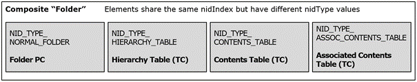

<html dir="LTR" xmlns:mshelp="http://msdn.microsoft.com/mshelp" xmlns:ddue="http://ddue.schemas.microsoft.com/authoring/2003/5" xmlns:xlink="http://www.w3.org/1999/xlink" xmlns:tool="http://www.microsoft.com/tooltip">
    <head>
        <meta http-equiv="Content-Type" content="text/html; CHARSET=utf-8"></meta>
        <meta name="save" content="history"></meta>
        <title>2.4.4 Folders</title>
        <xml>
            <mshelp:toctitle title="2.4.4 Folders"></mshelp:toctitle>
            <mshelp:rltitle title="[MS-PST]: Folders"></mshelp:rltitle>
            <mshelp:keyword index="A" term="dee5b9d0-5513-4c5e-94aa-8bd28a9350b2"></mshelp:keyword>
            <mshelp:attr name="DCSext.ContentType" value="open specification"></mshelp:attr>
            <mshelp:attr name="AssetID" value="dee5b9d0-5513-4c5e-94aa-8bd28a9350b2"></mshelp:attr>
            <mshelp:attr name="TopicType" value="kbRef"></mshelp:attr>
            <mshelp:attr name="DCSext.Title" value="[MS-PST]: Folders" />
        </xml>
    </head>
    <body>
        

            <h1 class="heading">2.4.4 Folders</h1>
        

        

            

                

                

                    

<a href="08220cc9-69b1-4072-a2e7-2a0ff201d505.html#gt_0682daa7-c1b8-419b-8a32-6048833d0b72">Folder
objects</a> are hierarchical containers that are used to create a storage
hierarchy for the <a href="08220cc9-69b1-4072-a2e7-2a0ff201d505.html#gt_fda94a53-448d-48d5-9991-176c530ff597">message store</a>.
In the PST architecture, a single root Folder object exists at the top of the
message store, from which an arbitrarily complex hierarchy of Folder objects
descends to provide structured storage for all the Messaging objects.

At the LTP level, a Folder object is a composite entity that
is represented using four LTP constructs. Specifically, each Folder object
consists of one PC, which contains the properties directly associated with the
Folder object, and three TCs for information about the contents, hierarchy and
other associated information of the Folder object. Some Folder objects MAY have
additional nodes that pertain to Search, which is discussed in section <a href="4431f207-ef3e-4ce1-aa41-d9ac4a44f69f.md">2.4.8.6</a>. 

At the NDB level, the 4 LTP constructs are persisted as 4
separate top-level nodes (that is, 4 different NIDs). For identification
purposes, the <b>nidIndex</b> portion for each of the NIDs is the same to
indicate that these nodes collectively make up a Folder object. However, each
of the 4 NIDs has a different <b>nidType</b> value to differentiate their
respective function. The following diagram indicates the relationships among
these elements.

<b>Figure 9: Components of a Folder object</b>

The following sections explain the structure and function of
each of the 4 composite elements of a Folder object,

                

            

        

    </body>
</html>