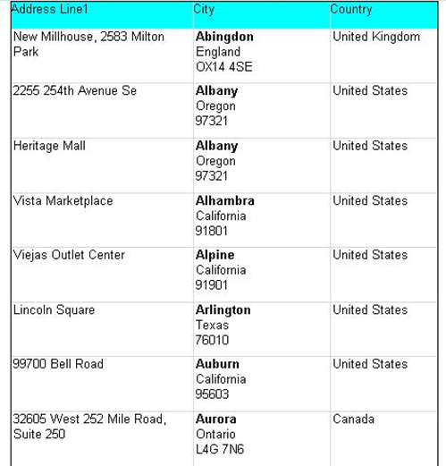

<html dir="LTR" xmlns:mshelp="http://msdn.microsoft.com/mshelp" xmlns:ddue="http://ddue.schemas.microsoft.com/authoring/2003/5" xmlns:xlink="http://www.w3.org/1999/xlink" xmlns:tool="http://www.microsoft.com/tooltip">
    <head>
        <meta http-equiv="Content-Type" content="text/html; CHARSET=utf-8"></meta>
        <meta name="save" content="history"></meta>
        <title>3.8 Tablix 2</title>
        <xml>
            <mshelp:toctitle title="3.8 Tablix 2"></mshelp:toctitle>
            <mshelp:rltitle title="[MS-RDL]: Tablix 2"></mshelp:rltitle>
            <mshelp:keyword index="A" term="0f6784a2-08b0-4412-811d-c5ecdb0c4efe"></mshelp:keyword>
            <mshelp:attr name="DCSext.ContentType" value="open specification"></mshelp:attr>
            <mshelp:attr name="AssetID" value="0f6784a2-08b0-4412-811d-c5ecdb0c4efe"></mshelp:attr>
            <mshelp:attr name="TopicType" value="kbRef"></mshelp:attr>
            <mshelp:attr name="DCSext.Title" value="[MS-RDL]: Tablix 2" />
        </xml>
    </head>
    <body>
        

            <h1 class="heading">3.8 Tablix 2</h1>
        

        

            

                

                

                    

The following is an example RDL definition of a <a href="e42fb86e-799a-4202-8845-ac38831efccb.htm">Tablix</a> element that is
used to lay out data in a straightforward manner. The tablix uses text boxes
within cells to format and display the data. This layout provides similar
functionality to the <a href="660db744-699e-4ca3-a2d6-a5cab4bcf9b0.htm">Table</a>
element in versions of RDL prior to 2008/01. The data is fetched from the
Microsoft Adventure Works example database. The top of the rendered definition
is shown in the following figure.

<b>Figure 18: Tablix example 2</b>

The <b>Tablix</b> element has its <a href="ad4609d4-e4d7-4631-97f9-90064ca7cee8.htm">Tablix.Name</a> attribute set
to &quot;Tablix2&quot;. It is positioned 1 inch from the left edge of its
container.

<dl>
<dd>

<pre>   &lt;Tablix Name=&quot;Tablix2&quot;&gt;
     &lt;Left&gt;1in&lt;/Left&gt;
</pre>

</dd></dl>

The entire tablix is rendered only if the value of the <i>ShowTable</i>
parameter is set to false. If it is rendered, a page break is wanted before the
tablix appears, and after the last row of the rendered tablix, another page
break is wanted.

<dl>
<dd>

<pre>     &lt;Visibility&gt;
       &lt;Hidden&gt;=Parameters!ShowTable.Value=False&lt;/Hidden&gt;
     &lt;/Visibility&gt;
     &lt;PageBreak&gt;
       &lt;BreakLocation&gt;StartAndEnd&lt;/BreakLocation&gt;
     &lt;/PageBreak&gt;
</pre>

</dd></dl>

There are three <a href="b2482b3f-74ab-4ca8-a9e5-c07955011743.htm#gt_80c4e71a-917c-44e5-bfee-5675d96c4219">static columns</a> in this
tablix, so three <a href="33258f80-fa42-4baf-abd5-ded34ffbbc61.htm">TablixCell</a>
elements are required in each row (or fewer if one of the cells spans more than
one column).

<dl>
<dd>

<pre>     &lt;TablixColumnHierarchy&gt;
       &lt;TablixMembers&gt;
         &lt;TablixMember /&gt;
         &lt;TablixMember /&gt;
         &lt;TablixMember /&gt;
       &lt;/TablixMembers&gt;
     &lt;/TablixColumnHierarchy&gt;
</pre>

</dd></dl>

The <a href="08a188d7-05bd-43b8-8d23-11568db8949b.htm">TablixRowHierarchy</a>
element specifies two rows. The first is a <a href="b2482b3f-74ab-4ca8-a9e5-c07955011743.htm#gt_8c613744-ac3d-4e01-be93-21fc08a80512">static row</a> that is to be
kept with the <a href="b2482b3f-74ab-4ca8-a9e5-c07955011743.htm#gt_89a8a264-68b6-4a8f-a5d2-486261f8dd3d">dynamic row</a>
that follows. This row is to behave as a <a href="b2482b3f-74ab-4ca8-a9e5-c07955011743.htm#gt_b44f1311-4a23-47b8-95a3-71a765d42c80">column header</a>. Therefore,
the row has a <a href="21e238be-5596-42ad-8583-0c8ef5fdab50.htm">TablixMember.KeepWithGroup</a>
element that has a value of After and a <a href="7a8100e3-be10-4036-9bbe-5a72682bfc00.htm">TablixMember.RepeatOnNewPage</a>
element that has a value of true.

<dl>
<dd>

<pre>     &lt;TablixRowHierarchy&gt;
       &lt;TablixMembers&gt;
         &lt;TablixMember&gt;
           &lt;KeepWithGroup&gt;After&lt;/KeepWithGroup&gt;
           &lt;RepeatOnNewPage&gt;true&lt;/RepeatOnNewPage&gt;
         &lt;/TablixMember&gt;
</pre>

</dd></dl>

The second row is a <a href="b2482b3f-74ab-4ca8-a9e5-c07955011743.htm#gt_e6e777c9-c361-4606-b473-c8dd8fddf3b8">detail group</a> with a <a href="795f5226-3b10-45cb-b7b5-8b42c5973165.htm">SortExpression</a> that causes
the data in the group to appear in order of city name, A–Z.

<dl>
<dd>

<pre>         &lt;TablixMember&gt;
           &lt;Group Name=&quot;Details&quot; /&gt;
           &lt;SortExpressions&gt;
             &lt;SortExpression&gt;
               &lt;Value&gt;=Fields!City.Value&lt;/Value&gt;
             &lt;/SortExpression&gt;
           &lt;/SortExpressions&gt;
         &lt;/TablixMember&gt;
       &lt;/TablixMembers&gt;
     &lt;/TablixRowHierarchy&gt;
</pre>

</dd></dl>

The three columns defined by the <a href="4f5c9261-6652-41b2-81cc-3f6423ce0dbb.htm">TablixColumnHierarchy</a> are
set up with specific widths.

<dl>
<dd>

<pre>     &lt;TablixBody&gt;
       &lt;TablixColumns&gt;
         &lt;TablixColumn&gt;
           &lt;Width&gt;2in&lt;/Width&gt;
         &lt;/TablixColumn&gt;
         &lt;TablixColumn&gt;
           &lt;Width&gt;1.5in&lt;/Width&gt;
         &lt;/TablixColumn&gt;
         &lt;TablixColumn&gt;
           &lt;Width&gt;3cm&lt;/Width&gt;
         &lt;/TablixColumn&gt;
       &lt;/TablixColumns&gt;
</pre>

</dd></dl>

The first row is set to 0.3 inches high and contains
three cells. Each cell has an aqua background and has a light gray border,
created by setting the properties on the descendant text boxes. The text in
each text box is set as a header to the columns, Address, City, and Country.

<dl>
<dd>

<pre>  
       &lt;TablixRows&gt;
         &lt;TablixRow&gt;
           &lt;Height&gt;0.3in&lt;/Height&gt;
           &lt;TablixCells&gt;
             &lt;TablixCell&gt;
               &lt;CellContents&gt;
                 &lt;Textbox Name=&quot;Heading1&quot;&gt;
                   &lt;KeepTogether&gt;true&lt;/KeepTogether&gt;
                   &lt;Paragraphs&gt;
                     &lt;Paragraph&gt;
                       &lt;TextRuns&gt;
                         &lt;TextRun&gt;
                           &lt;Value&gt;Address&lt;/Value&gt;
                         &lt;/TextRun&gt;
                       &lt;/TextRuns&gt;
                     &lt;/Paragraph&gt;
                   &lt;/Paragraphs&gt;
                   &lt;Style&gt;
                     &lt;Border&gt;
                       &lt;Color&gt;LightGrey&lt;/Color&gt;
                       &lt;Style&gt;Solid&lt;/Style&gt;
                     &lt;/Border&gt;
                     &lt;BackgroundColor&gt;Aqua&lt;/BackgroundColor&gt;
                   &lt;/Style&gt;
                 &lt;/Textbox&gt;
               &lt;/CellContents&gt;
             &lt;/TablixCell&gt;
             &lt;TablixCell&gt;
               &lt;CellContents&gt;
                 &lt;Textbox Name=&quot;Heading2&quot;&gt;
                   &lt;Paragraphs&gt;
                     &lt;Paragraph&gt;
                       &lt;TextRuns&gt;
                         &lt;TextRun&gt;
                           &lt;Value&gt;City&lt;/Value&gt;
                         &lt;/TextRun&gt;
                       &lt;/TextRuns&gt;
                     &lt;/Paragraph&gt;
                   &lt;/Paragraphs&gt;
                   &lt;Style&gt;
                     &lt;Border&gt;
                       &lt;Color&gt;LightGrey&lt;/Color&gt;
                       &lt;Style&gt;Solid&lt;/Style&gt;
                     &lt;/Border&gt;
                     &lt;BackgroundColor&gt;Aqua&lt;/BackgroundColor&gt;
                   &lt;/Style&gt;
                 &lt;/Textbox&gt;
               &lt;/CellContents&gt;
             &lt;/TablixCell&gt;
             &lt;TablixCell&gt;
               &lt;CellContents&gt;
                 &lt;Textbox Name=&quot;Heading3&quot;&gt;
                   &lt;KeepTogether&gt;true&lt;/KeepTogether&gt;
                   &lt;Paragraphs&gt;
                     &lt;Paragraph&gt;
                       &lt;TextRuns&gt;
                         &lt;TextRun&gt;
                           &lt;Value&gt;Country&lt;/Value&gt;
                         &lt;/TextRun&gt;
                       &lt;/TextRuns&gt;
                     &lt;/Paragraph&gt;
                   &lt;/Paragraphs&gt;
                   &lt;Style&gt;
                     &lt;Border&gt;
                       &lt;Color&gt;LightGrey&lt;/Color&gt;
                       &lt;Style&gt;Solid&lt;/Style&gt;
                     &lt;/Border&gt;
                     &lt;BackgroundColor&gt;Aqua&lt;/BackgroundColor&gt;
                   &lt;/Style&gt;
                 &lt;/Textbox&gt;
               &lt;/CellContents&gt;
             &lt;/TablixCell&gt;
           &lt;/TablixCells&gt;
         &lt;/TablixRow&gt;
</pre>

</dd></dl>

The second row is associated with the row hierarchy that is
a detail group; it will therefore be repeated for each row of data. The row is
set to 0.6 inches high, but this will increase if the data needs more
space because the descendant <a href="469d0032-b5ec-43d9-ab36-d3a88b9cc1f6.htm">Textbox</a>
elements have the <a href="685f8cd0-3cb1-4241-81a3-772aaba71fe4.htm">Textbox.CanGrow</a>
element specified with a value of true. As with the headings, each cell will
appear to have a solid, light gray border because each descendant text box has
that border defined.

<dl>
<dd>

<pre>         &lt;TablixRow&gt;
           &lt;Height&gt;0.6in&lt;/Height&gt;
           &lt;TablixCells&gt;
             &lt;TablixCell&gt;
               &lt;CellContents&gt;
                 &lt;Textbox Name=&quot;Address&quot;&gt;
                   &lt;CanGrow&gt;true&lt;/CanGrow&gt;
                   &lt;KeepTogether&gt;true&lt;/KeepTogether&gt;
                   &lt;Paragraphs&gt;
                     &lt;Paragraph&gt;
                       &lt;TextRuns&gt;
                         &lt;TextRun&gt;
                           &lt;Value&gt;=Fields!AddressLine1.Value&lt;/Value&gt;
                         &lt;/TextRun&gt;
                       &lt;/TextRuns&gt;
                     &lt;/Paragraph&gt;
                     &lt;Paragraph&gt;
                       &lt;TextRuns&gt;
                         &lt;TextRun&gt;
                           &lt;Value&gt;=Fields!AddressLine2.Value&lt;/Value&gt;
                         &lt;/TextRun&gt;
                       &lt;/TextRuns&gt;
                     &lt;/Paragraph&gt;
                   &lt;/Paragraphs&gt;
                   &lt;Style&gt;
                     &lt;Border&gt;
                       &lt;Color&gt;LightGrey&lt;/Color&gt;
                       &lt;Style&gt;Solid&lt;/Style&gt;
                     &lt;/Border&gt;
                     &lt;PaddingLeft&gt;2pt&lt;/PaddingLeft&gt;
                   &lt;/Style&gt;
                 &lt;/Textbox&gt;
               &lt;/CellContents&gt;
             &lt;/TablixCell&gt;
             &lt;TablixCell&gt;
               &lt;CellContents&gt;
                 &lt;Textbox Name=&quot;Area&quot;&gt;
                   &lt;CanGrow&gt;true&lt;/CanGrow&gt;
                   &lt;KeepTogether&gt;true&lt;/KeepTogether&gt;
                   &lt;Paragraphs&gt;
                     &lt;Paragraph&gt;
                       &lt;TextRuns&gt;
                         &lt;TextRun&gt;
                           &lt;Value&gt;=Fields!City.Value&lt;/Value&gt;
                           &lt;Style&gt;
                             &lt;FontWeight&gt;Bold&lt;/FontWeight&gt;
                           &lt;/Style&gt;
                         &lt;/TextRun&gt;
                       &lt;/TextRuns&gt;
                     &lt;/Paragraph&gt;
                     &lt;Paragraph&gt;
                       &lt;TextRuns&gt;
                         &lt;TextRun&gt;
                           &lt;Value&gt;=Fields!StateProvince.Value&lt;/Value&gt;
                         &lt;/TextRun&gt;
                       &lt;/TextRuns&gt;
                     &lt;/Paragraph&gt;
                     &lt;Paragraph&gt;
                       &lt;TextRuns&gt;
                         &lt;TextRun&gt;
                           &lt;Value&gt;=Fields!PostalCode.Value&lt;/Value&gt;
                         &lt;/TextRun&gt;
                       &lt;/TextRuns&gt;
                     &lt;/Paragraph&gt;
                   &lt;/Paragraphs&gt;
                   &lt;Style&gt;
                     &lt;Border&gt;
                       &lt;Color&gt;LightGrey&lt;/Color&gt;
                       &lt;Style&gt;Solid&lt;/Style&gt;
                     &lt;/Border&gt;
                     &lt;PaddingLeft&gt;2pt&lt;/PaddingLeft&gt;
                   &lt;/Style&gt;
                 &lt;/Textbox&gt;
               &lt;/CellContents&gt;
             &lt;/TablixCell&gt;
             &lt;TablixCell&gt;
               &lt;CellContents&gt;
                 &lt;Textbox Name=&quot;Country&quot;&gt;
                   &lt;CanGrow&gt;true&lt;/CanGrow&gt;
                   &lt;KeepTogether&gt;true&lt;/KeepTogether&gt;
                   &lt;Paragraphs&gt;
                     &lt;Paragraph&gt;
                       &lt;TextRuns&gt;
                         &lt;TextRun&gt;
                           &lt;Value&gt;=Fields!CountryRegion.Value&lt;/Value&gt;
                         &lt;/TextRun&gt;
                       &lt;/TextRuns&gt;
                     &lt;/Paragraph&gt;
                   &lt;/Paragraphs&gt;
                   &lt;Style&gt;
                     &lt;Border&gt;
                       &lt;Color&gt;LightGrey&lt;/Color&gt;
                       &lt;Style&gt;Solid&lt;/Style&gt;
                     &lt;/Border&gt;
                     &lt;PaddingLeft&gt;2pt&lt;/PaddingLeft&gt;
                   &lt;/Style&gt;
                 &lt;/Textbox&gt;
               &lt;/CellContents&gt;
             &lt;/TablixCell&gt;
           &lt;/TablixCells&gt;
         &lt;/TablixRow&gt;
       &lt;/TablixRows&gt;
     &lt;/TablixBody&gt;
  
</pre>

</dd></dl>

If possible, the entire tablix is to be rendered on a single
page.

<dl>
<dd>

<pre>     &lt;KeepTogether&gt;true&lt;/KeepTogether&gt;
  
</pre>

</dd></dl>

The entire tablix has a tooltip of &quot;Addresses&quot; and
a solid border of the default color around it.

<dl>
<dd>

<pre>     &lt;ToolTip&gt;Addresses&lt;/ToolTip&gt;
     &lt;Style&gt;
       &lt;Border&gt;
         &lt;Style&gt;Solid&lt;/Style&gt;
       &lt;/Border&gt;
     &lt;/Style&gt;
     &lt;DataSetName&gt;AddressDataSet&lt;/DataSetName&gt;
   &lt;/Tablix&gt;
</pre>

</dd></dl>

                

            

        

    </body>
</html>