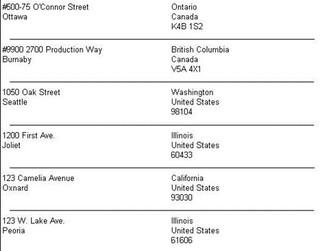

<html dir="LTR" xmlns:mshelp="http://msdn.microsoft.com/mshelp" xmlns:ddue="http://ddue.schemas.microsoft.com/authoring/2003/5" xmlns:xlink="http://www.w3.org/1999/xlink" xmlns:tool="http://www.microsoft.com/tooltip">
    <head>
        <meta http-equiv="Content-Type" content="text/html; CHARSET=utf-8"></meta>
        <meta name="save" content="history"></meta>
        <title>3.7 Tablix 1</title>
        <xml>
            <mshelp:toctitle title="3.7 Tablix 1"></mshelp:toctitle>
            <mshelp:rltitle title="[MS-RDL]: Tablix 1"></mshelp:rltitle>
            <mshelp:keyword index="A" term="13eafa00-c4b4-44d3-8109-dea03ff8414d"></mshelp:keyword>
            <mshelp:attr name="DCSext.ContentType" value="open specification"></mshelp:attr>
            <mshelp:attr name="AssetID" value="13eafa00-c4b4-44d3-8109-dea03ff8414d"></mshelp:attr>
            <mshelp:attr name="TopicType" value="kbRef"></mshelp:attr>
            <mshelp:attr name="DCSext.Title" value="[MS-RDL]: Tablix 1" />
        </xml>
    </head>
    <body>
        

            <h1 class="heading">3.7 Tablix 1</h1>
        

        

            

                

                

                    

The following is an example RDL definition of a <a href="e42fb86e-799a-4202-8845-ac38831efccb.html">Tablix</a> element that is
used in a very simple manner. The <a href="b2482b3f-74ab-4ca8-a9e5-c07955011743.html#gt_f9f5d4be-2a9e-4556-90f6-d4ed1678f0b4">tablix</a> acts as a container
for a <a href="e36a41ea-aeaf-45cc-969e-8ab1e380882c.html">Rectangle</a>; the <a href="b2482b3f-74ab-4ca8-a9e5-c07955011743.html#gt_1b991a2c-d0bf-4433-bc39-587c09d556a8">rectangle</a> contains the <a href="b2482b3f-74ab-4ca8-a9e5-c07955011743.html#gt_11e20fdb-6428-4c32-9e45-91f32a64da7f">report layout</a>. This layout
provides similar functionality to the <a href="ea4c625c-0558-4fb3-b3b8-bde6c160b1e2.html">List</a> element in schema
versions prior to <a href="1e855f94-4617-47e4-b89e-0856c6cb420f.html">RDL 2008/01</a>.
The data is fetched from the Microsoft Adventure Works example database. An
extract of the rendered XML is as follows.

<b>Figure 17: Tablix example 1</b>

The <b>Tablix</b> element has its <a href="ad4609d4-e4d7-4631-97f9-90064ca7cee8.html">Tablix.Name</a> attribute set
to &quot;Tablix1&quot;. It has a single uncomplicated column, needing only the
minimal <a href="4f5c9261-6652-41b2-81cc-3f6423ce0dbb.html">TablixColumnHierarchy</a>.
The <a href="08a188d7-05bd-43b8-8d23-11568db8949b.html">TablixRowHierarchy</a>
is almost as simple, but because the single tablix row is to be repeated for
each row of data, the <a href="1d8a9691-b173-4e24-9ea9-1f486bc824fd.html">TablixMember</a>
is defined with a <a href="dbfff811-1be7-4e8b-a5d2-6cc522317fbe.html">Group</a>.
There is no grouping, filtering, or sorting to be done on the <b>Group</b>,
which defines it as a <a href="b2482b3f-74ab-4ca8-a9e5-c07955011743.html#gt_e6e777c9-c361-4606-b473-c8dd8fddf3b8">detail
group</a>.

<dl>
<dd>

<pre>   &lt;Tablix Name=&quot;Tablix1&quot;&gt;
     &lt;TablixColumnHierarchy&gt;
       &lt;TablixMembers&gt;
         &lt;TablixMember /&gt;
       &lt;/TablixMembers&gt;
     &lt;/TablixColumnHierarchy&gt;
     &lt;TablixRowHierarchy&gt;
       &lt;TablixMembers&gt;
         &lt;TablixMember&gt;
           &lt;Group Name=&quot;Details&quot; /&gt;
         &lt;/TablixMember&gt;
       &lt;/TablixMembers&gt;
     &lt;/TablixRowHierarchy&gt;
</pre>

</dd></dl>

The single column is set to be 5.5 inches wide;
therefore, the tablix is going to be 5.5 inches wide.

<dl>
<dd>

<pre>     &lt;TablixBody&gt;
       &lt;TablixColumns&gt;
         &lt;TablixColumn&gt;
           &lt;Width&gt;5.5in&lt;/Width&gt;
         &lt;/TablixColumn&gt;
       &lt;/TablixColumns&gt;
</pre>

</dd></dl>

The single row specifies a single <a href="33258f80-fa42-4baf-abd5-ded34ffbbc61.html">TablixCell</a>—because there
is only a single column—and this has a <b>Rectangle</b> in it. The rectangle
has various controls in it. For each row of data, the cell is repeated
vertically, each being 0.42 inches high. The rendered height of the tablix
depends on how many rows of data are in the <a href="a14782b0-2e2f-4305-83a3-3de3fd750b6a.html">DataSet</a>.

<dl>
<dd>

<pre>       &lt;TablixRows&gt;
         &lt;TablixRow&gt;
           &lt;Height&gt;0.42in&lt;/Height&gt;
           &lt;TablixCells&gt;
             &lt;TablixCell&gt;
               &lt;CellContents&gt;
                 &lt;Rectangle Name=&quot;Rectangle1&quot;&gt;
                   &lt;ReportItems&gt;
                     &lt;Textbox Name=&quot;Address&quot;&gt;
                       &lt;CanGrow&gt;true&lt;/CanGrow&gt;
                       &lt;KeepTogether&gt;true&lt;/KeepTogether&gt;
                       &lt;Paragraphs&gt;
                         &lt;Paragraph&gt;
                           &lt;TextRuns&gt;
                             &lt;TextRun&gt;
</pre>

</dd></dl>

The value in the text box is a data row value, so it can
change for each rendered row of the tablix.

<dl>
<dd>

<pre>                               &lt;Value&gt;=Fields!AddressLine1.Value&lt;/Value&gt;
                             &lt;/TextRun&gt;
                           &lt;/TextRuns&gt;
                         &lt;/Paragraph&gt;
                         &lt;Paragraph&gt;
                           &lt;TextRuns&gt;
                             &lt;TextRun&gt;
                               &lt;Value&gt;=Fields!City.Value&lt;/Value&gt;
                             &lt;/TextRun&gt;
                           &lt;/TextRuns&gt;
                         &lt;/Paragraph&gt;
                       &lt;/Paragraphs&gt;
                       &lt;Height&gt;0.23958in&lt;/Height&gt;
                       &lt;Width&gt;2.5625in&lt;/Width&gt;
                     &lt;/Textbox&gt;
                     &lt;Textbox Name=&quot;StateProvince&quot;&gt;
                       &lt;CanGrow&gt;true&lt;/CanGrow&gt;
                       &lt;KeepTogether&gt;true&lt;/KeepTogether&gt;
                       &lt;Paragraphs&gt;
                         &lt;Paragraph&gt;
                           &lt;TextRuns&gt;
                             &lt;TextRun&gt;
                               &lt;Value&gt;=Fields!StateProvince.Value&lt;/Value&gt;
                             &lt;/TextRun&gt;
                           &lt;/TextRuns&gt;
                         &lt;/Paragraph&gt;
                         &lt;Paragraph&gt;
                           &lt;TextRuns&gt;
                             &lt;TextRun&gt;
                               &lt;Value&gt;=Fields!CountryRegion.Value&lt;/Value&gt;
                             &lt;/TextRun&gt;
                           &lt;/TextRuns&gt;
                         &lt;/Paragraph&gt;
                         &lt;Paragraph&gt;
                           &lt;TextRuns&gt;
                             &lt;TextRun&gt;
                               &lt;Value&gt;=Fields!PostalCode.Value&lt;/Value&gt;
                             &lt;/TextRun&gt;
                           &lt;/TextRuns&gt;
                         &lt;/Paragraph&gt;
                       &lt;/Paragraphs&gt;
                       &lt;Left&gt;3in&lt;/Left&gt;
                       &lt;Height&gt;0.22in&lt;/Height&gt;
                       &lt;Width&gt;2.6in&lt;/Width&gt;
                       &lt;ZIndex&gt;1&lt;/ZIndex&gt;
                     &lt;/Textbox&gt;
                     &lt;Line Name=&quot;Line1&quot;&gt;
                       &lt;Top&gt;0.35in&lt;/Top&gt;
                       &lt;Left&gt;0.15in&lt;/Left&gt;
                       &lt;Height&gt;0in&lt;/Height&gt;
                       &lt;Width&gt;5.2in&lt;/Width&gt;
                       &lt;ZIndex&gt;2&lt;/ZIndex&gt;
                       &lt;Style&gt;
                         &lt;Border&gt;
                           &lt;Style&gt;Solid&lt;/Style&gt;
                         &lt;/Border&gt;
                       &lt;/Style&gt;
                     &lt;/Line&gt;
                   &lt;/ReportItems&gt;
                   &lt;KeepTogether&gt;true&lt;/KeepTogether&gt;
                 &lt;/Rectangle&gt;
               &lt;/CellContents&gt;
             &lt;/TablixCell&gt;
           &lt;/TablixCells&gt;
         &lt;/TablixRow&gt;
       &lt;/TablixRows&gt;
     &lt;/TablixBody&gt;
</pre>

</dd></dl>

If there is more than one <b>DataSet</b> in the report, the <a href="303f6cb3-cb22-43c4-9861-0c40082219f9.html">Tablix.DataSetName</a> element
is required to be defined; otherwise it would default to the single <b>DataSet</b>
available.

<dl>
<dd>

<pre>     &lt;DataSetName&gt;AddressDataSet&lt;/DataSetName&gt;
   &lt;/Tablix&gt;
</pre>

</dd></dl>

                

            

        

    </body>
</html>