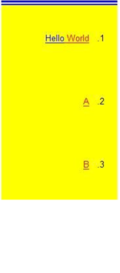

<html dir="LTR" xmlns:mshelp="http://msdn.microsoft.com/mshelp" xmlns:ddue="http://ddue.schemas.microsoft.com/authoring/2003/5" xmlns:xlink="http://www.w3.org/1999/xlink" xmlns:tool="http://www.microsoft.com/tooltip">
    <head>
        <meta http-equiv="Content-Type" content="text/html; CHARSET=utf-8"></meta>
        <meta name="save" content="history"></meta>
        <title>3.12 TextBox</title>
        <xml>
            <mshelp:toctitle title="3.12 TextBox"></mshelp:toctitle>
            <mshelp:rltitle title="[MS-RDL]: TextBox"></mshelp:rltitle>
            <mshelp:keyword index="A" term="2a976003-c0e4-4f9e-99d4-a01b6d68977f"></mshelp:keyword>
            <mshelp:attr name="DCSext.ContentType" value="open specification"></mshelp:attr>
            <mshelp:attr name="AssetID" value="2a976003-c0e4-4f9e-99d4-a01b6d68977f"></mshelp:attr>
            <mshelp:attr name="TopicType" value="kbRef"></mshelp:attr>
            <mshelp:attr name="DCSext.Title" value="[MS-RDL]: TextBox" />
        </xml>
    </head>
    <body>
        

            <h1 class="heading">3.12 TextBox</h1>
        

        

            

                

                

                    

The following is an example <a href="b2482b3f-74ab-4ca8-a9e5-c07955011743.html#gt_861707bc-950b-45dc-8ec3-a8afaf2c8545">text box</a> that was created
by using the <a href="469d0032-b5ec-43d9-ab36-d3a88b9cc1f6.html">Textbox</a>
element.

<b>Figure 20: Text box example</b>

The <a href="0896fc9e-7234-4d75-ac22-cd77791acadd.html">Name</a>
attribute of the <b>Textbox</b> element is set to &quot;Textbox1&quot;.
&quot;Textbox1&quot; has its <a href="685f8cd0-3cb1-4241-81a3-772aaba71fe4.html">Textbox.CanGrow</a>
element set to true. This means that, although the <a href="024befa4-ac53-4b48-8ad8-ad39a6cdcb60.html">Textbox.Height</a> element is
set to only 0.72917 inches, extra spacing or padding introduced by other
elements within &quot;Textbox1&quot; can make &quot;Textbox1&quot; grow
vertically beyond 0.72917 inches. &quot;Textbox1&quot; contains four <a href="c813d832-e92f-40e9-aadf-77ec1845efbb.html">Paragraph</a> elements within
its <a href="ae693479-2639-48fe-b974-ac95d49ac7bd.html">Paragraphs</a>
collection.

<dl>
<dd>

<pre> &lt;Textbox Name=&quot;Textbox1&quot;&gt;
   &lt;CanGrow&gt;true&lt;/CanGrow&gt;
   &lt;KeepTogether&gt;true&lt;/KeepTogether&gt;
   &lt;Paragraphs&gt;
</pre>

</dd></dl>

The first <b>Paragraph</b> in the <b>Paragraphs</b>
collection for &quot;Textbox1&quot; contains two <a href="90623d67-443b-4480-9869-e03277a6223a.html">TextRun</a> elements, which
correspond separately to the words &quot;Hello&quot; and &quot;World&quot;. The
<b>TextRun</b> element that has <a href="99982bda-2dd1-4626-b8ef-da888d95f4ff.html">TextRun.Value</a> set to
&quot;Hello&quot; has <a href="7911c883-f314-41d9-9136-02e8a26279ad.html">Style.Color</a>
set to &quot;Blue&quot;. The <b>TextRun</b> element that has <b>TextRun.Value</b>
set to &quot;World&quot; has <b>Style.Color</b> set to &quot;Red&quot;.

<dl>
<dd>

<pre>    &lt;Paragraph&gt;
       &lt;TextRuns&gt;
         &lt;TextRun&gt;
           &lt;Value&gt;Hello&lt;/Value&gt;
           &lt;Style&gt;
             &lt;Color&gt;Blue&lt;/Color&gt;
           &lt;/Style&gt;
         &lt;/TextRun&gt;
         &lt;TextRun&gt;
           &lt;Value&gt; World&lt;/Value&gt;
           &lt;Style&gt;
             &lt;Color&gt;Red&lt;/Color&gt;
           &lt;/Style&gt;
         &lt;/TextRun&gt;
       &lt;/TextRuns&gt;
       &lt;ListStyle&gt;Numbered&lt;/ListStyle&gt;
       &lt;ListLevel&gt;1&lt;/ListLevel&gt;
</pre>

</dd></dl>

Because <a href="c4b918c6-e1f6-4fa4-b814-e9039cbe1a5b.html">Style.LineHeight</a>
is set to &quot;1in&quot;, each <b>Paragraph</b> within &quot;Textbox1&quot;
takes up at least one inch of vertical space. Because <b>Textbox.CanGrow</b> is
set to true, &quot;Textbox1&quot; actually is much larger in height than its
specified <b>Textbox.Height</b> value of 0.72971 inches.

<dl>
<dd>

<pre>       &lt;Style&gt;
         &lt;LineHeight&gt;1in&lt;/LineHeight&gt;
       &lt;/Style&gt;
     &lt;/Paragraph&gt;
     &lt;Paragraph&gt;
       &lt;TextRuns&gt;
         &lt;TextRun&gt;
           &lt;Value&gt;A&lt;/Value&gt;
           &lt;Style&gt;
             &lt;Color&gt;Red&lt;/Color&gt;
           &lt;/Style&gt;
         &lt;/TextRun&gt;
       &lt;/TextRuns&gt;
       &lt;ListStyle&gt;Numbered&lt;/ListStyle&gt;
       &lt;ListLevel&gt;1&lt;/ListLevel&gt;
       &lt;Style&gt;
         &lt;LineHeight&gt;1in&lt;/LineHeight&gt;
       &lt;/Style&gt;
     &lt;/Paragraph&gt;
     &lt;Paragraph&gt;
       &lt;TextRuns&gt;
         &lt;TextRun&gt;
           &lt;Value&gt;B&lt;/Value&gt;
           &lt;Style&gt;
             &lt;Color&gt;Red&lt;/Color&gt;
           &lt;/Style&gt;
         &lt;/TextRun&gt;
       &lt;/TextRuns&gt;
       &lt;ListStyle&gt;Numbered&lt;/ListStyle&gt;
       &lt;ListLevel&gt;1&lt;/ListLevel&gt;
       &lt;Style&gt;
         &lt;LineHeight&gt;1in&lt;/LineHeight&gt;
       &lt;/Style&gt;
     &lt;/Paragraph&gt;
     &lt;Paragraph&gt;
       &lt;TextRuns&gt;
         &lt;TextRun&gt;
           &lt;Value&gt;C&lt;/Value&gt;
           &lt;Style&gt;
             &lt;Color&gt;Red&lt;/Color&gt;
           &lt;/Style&gt;
         &lt;/TextRun&gt;
       &lt;/TextRuns&gt;
       &lt;ListStyle&gt;Numbered&lt;/ListStyle&gt;
       &lt;ListLevel&gt;1&lt;/ListLevel&gt;
       &lt;Style&gt;
         &lt;LineHeight&gt;1in&lt;/LineHeight&gt;
       &lt;/Style&gt;
     &lt;/Paragraph&gt;
     &lt;Paragraph&gt;
       &lt;TextRuns&gt;
         &lt;TextRun&gt;
           &lt;Value /&gt;
           &lt;Style&gt;
             &lt;Color&gt;Red&lt;/Color&gt;
           &lt;/Style&gt;
         &lt;/TextRun&gt;
       &lt;/TextRuns&gt;
       &lt;ListLevel&gt;1&lt;/ListLevel&gt;
       &lt;Style /&gt;
     &lt;/Paragraph&gt;
   &lt;/Paragraphs&gt;
   &lt;rd:DefaultName&gt;Textbox1&lt;/rd:DefaultName&gt;
   &lt;Top&gt;0.85292in&lt;/Top&gt;
   &lt;Left&gt;2.19667in&lt;/Left&gt;
   &lt;Height&gt;0.72917in&lt;/Height&gt;
   &lt;Width&gt;1.84375in&lt;/Width&gt;
</pre>

</dd></dl>

&quot;Textbox1&quot; has a <a href="1b6c9e18-f240-44a2-acdf-10ea70045d3c.html">Style.TopBorder</a> element
with <a href="ddc532a7-275a-422a-8a67-f9aecd2d0873.html">Border.Style</a> set
to &quot;Blue&quot;, <b>Border.Style</b> set to &quot;Double&quot;, and <a href="c7978ca5-19ec-4c2a-9060-33d0c1c4e3fa.html">Border.Width</a> set to
&quot;5pt&quot;. Because these properties are set only for <b>Style.TopBorder</b>,
and no other <a href="ea446209-9c6a-46ce-b472-fae8b8350b37.html">Style</a>
border elements or a generic <a href="847db862-6fda-40c4-b133-45989ecb09bd.html">Style.Border</a>
element, the left, right, and bottom sides of &quot;Textbox1&quot; are not
affected. This is shown in the figure at the beginning of this section.
Additionally, &quot;Textbox1&quot; has <a href="4c0efe27-0fb0-43ca-a3c1-d37cd7fb4c72.html">Style.Direction</a> set to
&quot;RTL&quot;, which is why the numbering in the list within
&quot;Textbox1&quot; occurs to the right of the actual text.

<dl>
<dd>

<pre>   &lt;Style&gt;
     &lt;Border&gt;
       &lt;Style&gt;None&lt;/Style&gt;
     &lt;/Border&gt;
     &lt;TopBorder&gt;
       &lt;Color&gt;Blue&lt;/Color&gt;
       &lt;Style&gt;Double&lt;/Style&gt;
       &lt;Width&gt;5pt&lt;/Width&gt;
     &lt;/TopBorder&gt;
     &lt;BackgroundColor&gt;Yellow&lt;/BackgroundColor&gt;
     &lt;TextAlign&gt;Center&lt;/TextAlign&gt;
     &lt;PaddingLeft&gt;2pt&lt;/PaddingLeft&gt;
     &lt;PaddingRight&gt;2pt&lt;/PaddingRight&gt;
     &lt;PaddingTop&gt;2pt&lt;/PaddingTop&gt;
     &lt;PaddingBottom&gt;2pt&lt;/PaddingBottom&gt;
     &lt;Direction&gt;RTL&lt;/Direction&gt;
   &lt;/Style&gt;
 &lt;/Textbox&gt;
</pre>

</dd></dl>

                

            

        

    </body>
</html>