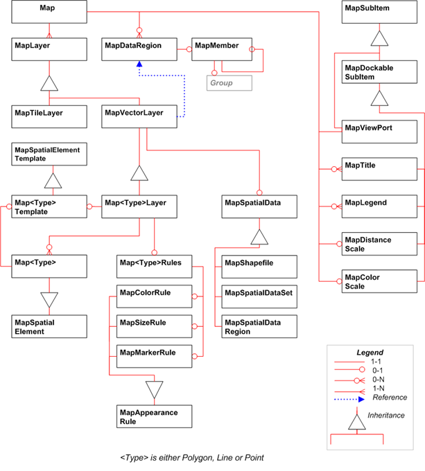

<html dir="LTR" xmlns:mshelp="http://msdn.microsoft.com/mshelp" xmlns:ddue="http://ddue.schemas.microsoft.com/authoring/2003/5" xmlns:xlink="http://www.w3.org/1999/xlink" xmlns:tool="http://www.microsoft.com/tooltip">
    <head>
        <meta http-equiv="Content-Type" content="text/html; CHARSET=utf-8"></meta>
        <meta name="save" content="history"></meta>
        <title>1.3.4 Report Definition Overview Diagrams</title>
        <xml>
            <mshelp:toctitle title="1.3.4 Report Definition Overview Diagrams"></mshelp:toctitle>
            <mshelp:rltitle title="[MS-RDL]: Report Definition Overview Diagrams"></mshelp:rltitle>
            <mshelp:keyword index="A" term="40ee4bb9-ccf1-412b-8856-b1c32e803f45"></mshelp:keyword>
            <mshelp:attr name="DCSext.ContentType" value="open specification"></mshelp:attr>
            <mshelp:attr name="AssetID" value="40ee4bb9-ccf1-412b-8856-b1c32e803f45"></mshelp:attr>
            <mshelp:attr name="TopicType" value="kbRef"></mshelp:attr>
            <mshelp:attr name="DCSext.Title" value="[MS-RDL]: Report Definition Overview Diagrams" />
        </xml>
    </head>
    <body>
        

            <h1 class="heading">1.3.4 Report Definition Overview Diagrams</h1>
        

        

            

                

                

                    

This section contains diagrams that illustrate the schema of
the 2010/01 version of Report Definition Language (section <a href="3428e690-a348-4ec7-8a6a-8efb42d2cdee.htm">5.4</a>).

Note that for simplicity, certain related types are
represented in the diagrams as abstract base types. For example, the abstract
base type <b>ReportItem</b> does not appear in RDL. Only concrete derived types
(such as <b>Textbox</b>) appear in RDL. The following are the abstract base
types that are shown in the diagrams: <b>ReportItem</b>, <b>DataRegion</b>, <b>Gauge</b>,
<b>GaugeScale</b>, and <b>GaugePointer</b>.

<b>Figure 1: Report layout</b>

<b>Figure 2: Report data</b>

<b>Figure 3: Report items</b>

<b>Figure 4: Tablix</b>

<b>Figure 5: Chart</b>

<b>Figure 6: Custom report item</b>

<b>Figure 7: Gauge panel</b>

<b>Figure 8: Map structures</b>

                

            

        

    </body>
</html>