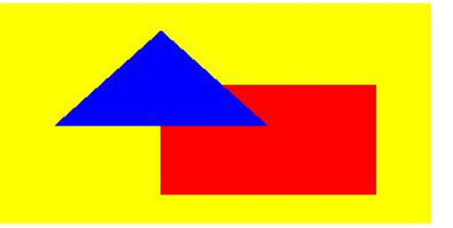
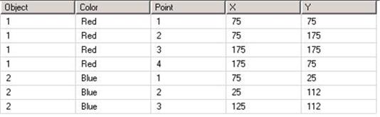

<html dir="LTR" xmlns:mshelp="http://msdn.microsoft.com/mshelp" xmlns:ddue="http://ddue.schemas.microsoft.com/authoring/2003/5" xmlns:xlink="http://www.w3.org/1999/xlink" xmlns:tool="http://www.microsoft.com/tooltip">
    <head>
        <meta http-equiv="Content-Type" content="text/html; CHARSET=utf-8"></meta>
        <meta name="save" content="history"></meta>
        <title>3.6 CustomReportItem</title>
        <xml>
            <mshelp:toctitle title="3.6 CustomReportItem"></mshelp:toctitle>
            <mshelp:rltitle title="[MS-RDL]: CustomReportItem"></mshelp:rltitle>
            <mshelp:keyword index="A" term="4e0b4925-8cc0-417f-9491-58dac3686ec3"></mshelp:keyword>
            <mshelp:attr name="DCSext.ContentType" value="open specification"></mshelp:attr>
            <mshelp:attr name="AssetID" value="4e0b4925-8cc0-417f-9491-58dac3686ec3"></mshelp:attr>
            <mshelp:attr name="TopicType" value="kbRef"></mshelp:attr>
            <mshelp:attr name="DCSext.Title" value="[MS-RDL]: CustomReportItem" />
        </xml>
    </head>
    <body>
        

            <h1 class="heading">3.6 CustomReportItem</h1>
        

        

            

                

                

                    

The following is an example RDL definition of a <a href="6bb7b35c-e517-4444-a96b-9f2ccdd1a642.md">CustomReportItem</a> for
Schema version <a href="1e855f94-4617-47e4-b89e-0856c6cb420f.md">RDL 2008/01</a>
of the element, with its data. The example is based on the Microsoft Polygons
example available at <a href="https://go.microsoft.com/fwlink/?LinkId=147725">[MSDN-RDLDT]</a>.
The rendered snippet is pictured in the following figure.

<b>Figure 15: A data source is defined as embedded XML.</b>

<dl>
<dd>

<pre> &lt;DataSources&gt;
   &lt;DataSource Name=&quot;PolygonsData&quot;&gt;
     &lt;ConnectionProperties&gt;
       &lt;DataProvider&gt;XML&lt;/DataProvider&gt;
       &lt;ConnectString /&gt;
     &lt;/ConnectionProperties&gt;
   &lt;/DataSource&gt;
 &lt;/DataSources&gt;
</pre>

</dd></dl>

A single <a href="a14782b0-2e2f-4305-83a3-3de3fd750b6a.md">DataSet</a>
element is defined with five <a href="b37f01de-0f2f-42f0-90e2-ad8bed343954.md">Fields</a>
elements, named in both the <a href="1d2b1998-e078-435f-8c03-a3d894a9843e.md">Query</a>
and the <a href="6bbaafec-020b-406c-b4e7-5e4318b616cb.md">Report</a> as
&quot;Object&quot;, &quot;Color&quot;, &quot;Point&quot;, &quot;X&quot;, and
&quot;Y&quot;.

<dl>
<dd>

<pre> &lt;DataSets&gt;
   &lt;DataSet Name=&quot;DataSet1&quot;&gt;
     &lt;Fields&gt;
       &lt;Field Name=&quot;Object&quot;&gt;
         &lt;DataField&gt;Object&lt;/DataField&gt;
       &lt;/Field&gt;
       &lt;Field Name=&quot;Color&quot;&gt;
         &lt;DataField&gt;Color&lt;/DataField&gt;
       &lt;/Field&gt;
       &lt;Field Name=&quot;Point&quot;&gt;
         &lt;DataField&gt;Point&lt;/DataField&gt;
       &lt;/Field&gt;
       &lt;Field Name=&quot;X&quot;&gt;
         &lt;DataField&gt;X&lt;/DataField&gt;
       &lt;/Field&gt;
       &lt;Field Name=&quot;Y&quot;&gt;
         &lt;DataField&gt;Y&lt;/DataField&gt;
       &lt;/Field&gt;
     &lt;/Fields&gt;
     &lt;Query&gt;
       &lt;DataSourceName&gt;PolygonsData&lt;/DataSourceName&gt;
</pre>

</dd></dl>

The <a href="6dca77c1-abc1-4984-b8a6-ba656f31394d.md">Query.CommandText</a>
element contains the XML. Note that the XML brackets (&quot;&lt;&quot; and
&quot;&gt;&quot;) have had to be replaced with encoded versions
(&quot;&amp;lt;&quot; and &quot;&amp;gt;&quot;) to avoid confusing an RDL
reader. The following table illustrates the data.

<b>Figure 16: Query.CommandText data table example</b>

<dl>
<dd>

<pre>       &lt;CommandText&gt;
 &amp;lt;Query&amp;gt;
   &amp;lt;XmlData&amp;gt;
     &amp;lt;Rows&amp;gt;
       &amp;lt;Row&amp;gt;
         &amp;lt;Object&amp;gt;1&amp;lt;/Object&amp;gt;&amp;lt;Color&amp;gt;Red&amp;lt;/Color&amp;gt;
         &amp;lt;Point&amp;gt;1&amp;lt;/Point&amp;gt;&amp;lt;X&amp;gt;75&amp;lt;/X&amp;gt;&amp;lt;Y&amp;gt;75&amp;lt;/Y&amp;gt;
       &amp;lt;/Row&amp;gt;
       &amp;lt;Row&amp;gt;
         &amp;lt;Object&amp;gt;1&amp;lt;/Object&amp;gt;&amp;lt;Color&amp;gt;Red&amp;lt;/Color&amp;gt;
         &amp;lt;Point&amp;gt;2&amp;lt;/Point&amp;gt;&amp;lt;X&amp;gt;75&amp;lt;/X&amp;gt;&amp;lt;Y&amp;gt;175&amp;lt;/Y&amp;gt;
       &amp;lt;/Row&amp;gt;
       &amp;lt;Row&amp;gt;
         &amp;lt;Object&amp;gt;1&amp;lt;/Object&amp;gt;&amp;lt;Color&amp;gt;Red&amp;lt;/Color&amp;gt;
         &amp;lt;Point&amp;gt;3&amp;lt;/Point&amp;gt;&amp;lt;X&amp;gt;175&amp;lt;/X&amp;gt;&amp;lt;Y&amp;gt;175&amp;lt;/Y&amp;gt;
       &amp;lt;/Row&amp;gt;
       &amp;lt;Row&amp;gt;
         &amp;lt;Object&amp;gt;1&amp;lt;/Object&amp;gt;&amp;lt;Color&amp;gt;Red&amp;lt;/Color&amp;gt;
         &amp;lt;Point&amp;gt;4&amp;lt;/Point&amp;gt;&amp;lt;X&amp;gt;175&amp;lt;/X&amp;gt;&amp;lt;Y&amp;gt;75&amp;lt;/Y&amp;gt;
       &amp;lt;/Row&amp;gt;
       &amp;lt;Row&amp;gt;
         &amp;lt;Object&amp;gt;2&amp;lt;/Object&amp;gt;&amp;lt;Color&amp;gt;Blue&amp;lt;/Color&amp;gt;
         &amp;lt;Point&amp;gt;1&amp;lt;/Point&amp;gt;&amp;lt;X&amp;gt;75&amp;lt;/X&amp;gt;&amp;lt;Y&amp;gt;25&amp;lt;/Y&amp;gt;
       &amp;lt;/Row&amp;gt;
       &amp;lt;Row&amp;gt;
         &amp;lt;Object&amp;gt;2&amp;lt;/Object&amp;gt;&amp;lt;Color&amp;gt;Blue&amp;lt;/Color&amp;gt;
         &amp;lt;Point&amp;gt;2&amp;lt;/Point&amp;gt;&amp;lt;X&amp;gt;25&amp;lt;/X&amp;gt;&amp;lt;Y&amp;gt;112&amp;lt;/Y&amp;gt;
       &amp;lt;/Row&amp;gt;
       &amp;lt;Row&amp;gt;
         &amp;lt;Object&amp;gt;2&amp;lt;/Object&amp;gt;&amp;lt;Color&amp;gt;Blue&amp;lt;/Color&amp;gt;
         &amp;lt;Point&amp;gt;3&amp;lt;/Point&amp;gt;&amp;lt;X&amp;gt;125&amp;lt;/X&amp;gt;&amp;lt;Y&amp;gt;112&amp;lt;/Y&amp;gt;
       &amp;lt;/Row&amp;gt;
     &amp;lt;/Rows&amp;gt;
   &amp;lt;/XmlData&amp;gt;  
 &amp;lt;ElementPath&amp;gt;Rows/Row{Object(Integer),Color(String),Point(Integer),X(Integer),Y(Integer)}&amp;lt;/ElementPath&amp;gt;
 &amp;lt;/Query&amp;gt;
       &lt;/CommandText&gt;
     &lt;/Query&gt;
   &lt;/DataSet&gt;
 &lt;/DataSets&gt;
</pre>

</dd></dl>

The <b>CustomReportItem</b> element has its <a href="1d0c35b5-8b1b-477d-9e95-e391a8d7976c.md">CustomReportItem.Name</a>
attribute set to &quot;customReportItem1&quot;. It is set to 0.125  inches
from the top of its containing object (either the <a href="6bf4e125-fdfd-4d04-88aa-c4395ba8a252.md">Body</a> or a report item)
and, because no <a href="f4e579b5-a9ad-4dc8-a75a-1c0e212544ec.md">CustomReportItem.Left</a>
element is defined, the position of its left is the position of the left of its
containing object. The custom report item will be 2 inches high and
10 centimeters wide.

<dl>
<dd>

<pre> &lt;CustomReportItem Name=&quot;customReportItem1&quot;&gt;
  
   &lt;Top&gt;0.125in&lt;/Top&gt;
   &lt;Height&gt;2in&lt;/Height&gt;
   &lt;Width&gt;10cm&lt;/Width&gt;
</pre>

</dd></dl>

The <a href="d958207b-0d3b-4c17-8203-04207c3fa5cd.md">CustomReportItem.Type</a>
of the element is set to a name recognizable by the rendering engine, so that
custom code to render this item can be utilized. The <a href="ca190454-b5be-4b54-a387-bdef51f65ce3.md">CustomData.DataSetName</a>
element points to the prepared data.

<dl>
<dd>

<pre>   &lt;Type&gt;Polygons&lt;/Type&gt;
   &lt;CustomData&gt;
     &lt;DataSetName&gt;DataSet1&lt;/DataSetName&gt;
</pre>

</dd></dl>

A <a href="63745f18-88b8-4a32-82e9-f223c7d0874b.md">CustomData.DataColumnHierarchy</a>
element is required to be defined, although this example only has one column
hierarchy, which covers all rows.

<dl>
<dd>

<pre>     &lt;DataColumnHierarchy&gt;
       &lt;DataMembers&gt;
         &lt;DataMember /&gt;
       &lt;/DataMembers&gt;
     &lt;/DataColumnHierarchy&gt;
</pre>

</dd></dl>

The <a href="809153e0-642a-45a2-b3ae-5c17c5cd03d1.md">DataRowHierarchy</a>
element is also mandatory and in this case uses a two-level hierarchy to
separate the two objects, so that the lower hierarchy is processed for each
object in turn.

<dl>
<dd>

<pre>     &lt;DataRowHierarchy&gt;
       &lt;DataMembers&gt;
</pre>

</dd></dl>

The outer <a href="f2f4d9bc-64dc-47dd-9515-c3f4e610af44.md">DataMember</a>
element is specified with a <a href="dbfff811-1be7-4e8b-a5d2-6cc522317fbe.md">Group</a>
that is named &quot;Object&quot;, which groups on the value of the Object
field. The <b>DataMember</b> has two <a href="7e808da9-19cc-4342-b8ef-469864f766ae.md">CustomProperty</a> elements
defined. The name of these custom properties is only relevant to the custom
code, which looks for and matches &quot;poly:Color&quot; and
&quot;poly:Hyperlink&quot;. The value of the first <a href="b2482b3f-74ab-4ca8-a9e5-c07955011743.md#gt_a47ec326-b945-4f6c-9762-c6731b46dd95">custom property</a> is set to
the value of the Color field from the data set; the value of the second custom
property is set to a URL that is intended to be set as the <a href="0c9b8d37-de61-420e-a652-26d3db8bc586.md">Action</a> of an <a href="63e1e5ab-7c49-4f62-8dbd-62d85de2b153.md">Image</a> that the custom code
will create.

<dl>
<dd>

<pre>         &lt;DataMember&gt;
           &lt;Group Name=&quot;Object&quot;&gt;
             &lt;GroupExpressions&gt;
               &lt;GroupExpression&gt;=Fields!Object.Value&lt;/GroupExpression&gt;
             &lt;/GroupExpressions&gt;
           &lt;/Group&gt;
           &lt;CustomProperties&gt;
             &lt;CustomProperty&gt;
               &lt;Name&gt;poly:Color&lt;/Name&gt;
               &lt;Value&gt;=Fields!Color.Value&lt;/Value&gt;
             &lt;/CustomProperty&gt;
             &lt;CustomProperty&gt;
               &lt;Name&gt;poly:Hyperlink&lt;/Name&gt;
               &lt;Value&gt;http://microsoft.com&lt;/Value&gt;
             &lt;/CustomProperty&gt;
           &lt;/CustomProperties&gt;
</pre>

</dd></dl>

Within the outer DataMember element, an inner <a href="e5cec511-d255-4e1c-8deb-a23c214ca8b9.md">DataMembers</a> collection is
specified. A single <b>DataMember</b> descendant is specified.

<dl>
<dd>

<pre>           &lt;DataMembers&gt;
             &lt;DataMember&gt;
</pre>

</dd></dl>

A Group element is specified so that a sort can be defined.
Since the data is known to be good, no grouping expression is specified. The
data is sorted on the value of the Point field.

<dl>
<dd>

<pre>               &lt;Group Name=&quot;Point&quot; /&gt;
               &lt;SortExpressions&gt;
                 &lt;SortExpression&gt;
                   &lt;Value&gt;=Fields!Point.Value&lt;/Value&gt;
                 &lt;/SortExpression&gt;
               &lt;/SortExpressions&gt;
             &lt;/DataMember&gt;
           &lt;/DataMembers&gt;
         &lt;/DataMember&gt;
       &lt;/DataMembers&gt;
     &lt;/DataRowHierarchy&gt;
</pre>

</dd></dl>

There is only one leaf <b>DataMember</b> in the <b>DataRowHierarchy</b>,
so there is only one <a href="e594b317-1358-4af1-b555-a153daf8fc72.md">DataRow</a>
element specified. The row has two cells in it, specifying X and Y data based
on the value of the X and Y fields.

<dl>
<dd>

<pre>     &lt;DataRows&gt;
       &lt;DataRow&gt;
         &lt;DataCell&gt;
           &lt;DataValue&gt;
             &lt;Name&gt;X&lt;/Name&gt;
             &lt;Value&gt;=Fields!X.Value&lt;/Value&gt;
           &lt;/DataValue&gt;
           &lt;DataValue&gt;
             &lt;Name&gt;Y&lt;/Name&gt;
             &lt;Value&gt;=Fields!Y.Value&lt;/Value&gt;
           &lt;/DataValue&gt;
         &lt;/DataCell&gt;
       &lt;/DataRow&gt;
     &lt;/DataRows&gt;
   &lt;/CustomData&gt;
</pre>

</dd></dl>

Further values are specified for the custom code by using a <a href="93994776-7d8e-4cf2-932f-9c085f3deaf8.md">CustomProperties</a> element
to define four name/value pairs. Again, the value of the <a href="68adcb7d-7839-4179-91c6-d03e063c44ad.md">Name</a> element is required
to be matched in code and has no relevance to any namespace. The value of each <a href="22b9fa19-c8e8-4d33-a893-263401ef42fb.md">Value</a> element could be
expressed as a literal or as an expression.

<dl>
<dd>

<pre>   &lt;CustomProperties&gt;
     &lt;CustomProperty&gt;
       &lt;Name&gt;poly:MaxX&lt;/Name&gt;
       &lt;Value&gt;200&lt;/Value&gt;
     &lt;/CustomProperty&gt;
     &lt;CustomProperty&gt;
       &lt;Name&gt;poly:MinX&lt;/Name&gt;
       &lt;Value&gt;0&lt;/Value&gt;
     &lt;/CustomProperty&gt;
     &lt;CustomProperty&gt;
       &lt;Name&gt;poly:MaxY&lt;/Name&gt;
       &lt;Value&gt;200&lt;/Value&gt;
     &lt;/CustomProperty&gt;
     &lt;CustomProperty&gt;
       &lt;Name&gt;poly:MinY&lt;/Name&gt;
       &lt;Value&gt;0&lt;/Value&gt;
     &lt;/CustomProperty&gt;
   &lt;/CustomProperties&gt;
</pre>

</dd></dl>

A <a href="ea446209-9c6a-46ce-b472-fae8b8350b37.md">Style</a>
element specifies a background color that the custom code can use. It also
specifies a default foreground color for the custom code to use. The empty <a href="39ecf39b-787f-4c80-94a9-a0eed30385be.md">Border</a> element has no
effect.

<dl>
<dd>

<pre>   &lt;Style&gt;
     &lt;Border /&gt;
     &lt;BackgroundColor&gt;Yellow&lt;/BackgroundColor&gt;
     &lt;Color&gt;Red&lt;/Color&gt;
   &lt;/Style&gt;
  
 &lt;/CustomReportItem&gt;
</pre>

</dd></dl>

                

            

        

    </body>
</html>