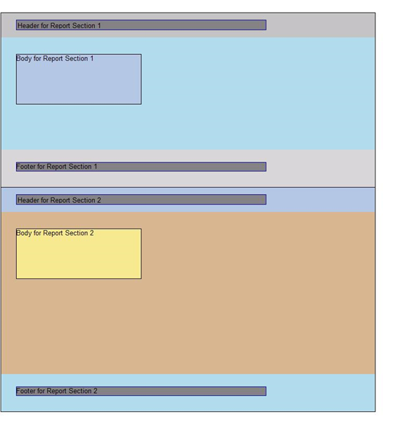

<html dir="LTR" xmlns:mshelp="http://msdn.microsoft.com/mshelp" xmlns:ddue="http://ddue.schemas.microsoft.com/authoring/2003/5" xmlns:xlink="http://www.w3.org/1999/xlink" xmlns:tool="http://www.microsoft.com/tooltip">
    <head>
        <meta http-equiv="Content-Type" content="text/html; CHARSET=utf-8"></meta>
        <meta name="save" content="history"></meta>
        <title>3.2 Report in RDL schema 2010/01</title>
        <xml>
            <mshelp:toctitle title="3.2 Report in RDL schema 2010/01"></mshelp:toctitle>
            <mshelp:rltitle title="[MS-RDL]: Report in RDL schema 2010/01"></mshelp:rltitle>
            <mshelp:keyword index="A" term="5ef82cad-c86d-4516-aa15-9a7be179209d"></mshelp:keyword>
            <mshelp:attr name="DCSext.ContentType" value="open specification"></mshelp:attr>
            <mshelp:attr name="AssetID" value="5ef82cad-c86d-4516-aa15-9a7be179209d"></mshelp:attr>
            <mshelp:attr name="TopicType" value="kbRef"></mshelp:attr>
            <mshelp:attr name="DCSext.Title" value="[MS-RDL]: Report in RDL schema 2010/01" />
        </xml>
    </head>
    <body>
        

            <h1 class="heading">3.2 Report in RDL schema 2010/01</h1>
        

        

            

                

                

                    

The following is an example of the RDL for a report in
Schema version <a href="3428e690-a348-4ec7-8a6a-8efb42d2cdee.md">RDL 2010/01</a>.
It shows the usage of the various properties of a <a href="6bbaafec-020b-406c-b4e7-5e4318b616cb.md">Report</a> element. The
example uses elements for describing the data: <a href="9c54b70c-c593-422b-aa16-33cb335927a1.md">DataSources</a> and <a href="04877363-bae8-48ab-9de0-409b2ac6d914.md">DataSets</a>; elements for
describing the structure and layout for two <a href="96c3d25f-d8ce-4fe4-ab03-592edaa4a1da.md">ReportSection</a> elements: <a href="b5e525d5-00d6-4e1a-8813-55f327da6b4c.md">Page</a>, including <a href="14a6255f-c4ba-4e2a-ab0f-1af47735910a.md">Page.PageHeader</a> and <a href="13d2727a-4342-4f62-9a53-432f55a9f3e9.md">Page.PageFooter</a>, and <a href="6bf4e125-fdfd-4d04-88aa-c4395ba8a252.md">Body</a>; and elements for
describing the <a href="615fae60-39c0-4770-8735-bdcf6d368031.md">ReportParameters</a>
and <a href="b457a0de-eba4-4d97-a742-ea0e67051372.md">Variables</a> for the
report.

The following figure shows an example rendering of this
report.

<b>Figure 10: RDL schema 2010/01 report rendering</b>

<dl>
<dd>

<pre> 1 &lt;?xml version=&quot;1.0&quot; encoding=&quot;utf-8&quot;?&gt;
 2 &lt;Report 
 xmlns=&quot;http://schemas.microsoft.com/sqlserver/reporting/2010/01/reportdefinition&quot;&gt;
 3  &lt;AutoRefresh&gt;3600&lt;/AutoRefresh&gt;
 4  &lt;DataSources&gt;
 5    &lt;DataSource Name=&quot;DataSource1&quot;&gt;
 6      &lt;ConnectionProperties&gt;
 7        &lt;DataProvider&gt;SQL&lt;/DataProvider&gt;
 8        &lt;ConnectString&gt;data source=DataServer; initial 
             catalog=northwind;&lt;/ConnectString&gt;
 9      &lt;/ConnectionProperties&gt;
 10    &lt;/DataSource&gt;
 11  &lt;/DataSources&gt;
 12  &lt;DataSets&gt;
 13    &lt;DataSet Name=&quot;DataSet1&quot;&gt;
 14      &lt;Fields&gt;
 15        &lt;Field Name=&quot;ProductID&quot;&gt;
 16          &lt;DataField&gt;ProductID&lt;/DataField&gt;
 17        &lt;/Field&gt;
 18        &lt;Field Name=&quot;ProductName&quot;&gt;
 19          &lt;DataField&gt;ProductName&lt;/DataField&gt;
 20        &lt;/Field&gt;
 21        &lt;Field Name=&quot;SupplierID&quot;&gt;
 22          &lt;DataField&gt;SupplierID&lt;/DataField&gt;
 23        &lt;/Field&gt;
 24        &lt;Field Name=&quot;CategoryID&quot;&gt;
 25          &lt;DataField&gt;CategoryID&lt;/DataField&gt;
 26        &lt;/Field&gt;
 27        &lt;Field Name=&quot;QuantityPerUnit&quot;&gt;
 28          &lt;DataField&gt;QuantityPerUnit&lt;/DataField&gt;
 29        &lt;/Field&gt;
 30        &lt;Field Name=&quot;UnitPrice&quot;&gt;
 31          &lt;DataField&gt;UnitPrice&lt;/DataField&gt;
 32        &lt;/Field&gt;
 33        &lt;Field Name=&quot;UnitsInStock&quot;&gt;
 34          &lt;DataField&gt;UnitsInStock&lt;/DataField&gt;
 35        &lt;/Field&gt;
 36        &lt;Field Name=&quot;UnitsOnOrder&quot;&gt;
 37          &lt;DataField&gt;UnitsOnOrder&lt;/DataField&gt;
 38        &lt;/Field&gt;
 39        &lt;Field Name=&quot;ReorderLevel&quot;&gt;
 40          &lt;DataField&gt;ReorderLevel&lt;/DataField&gt;
 41        &lt;/Field&gt;
 42        &lt;Field Name=&quot;Discontinued&quot;&gt;
 43          &lt;DataField&gt;Discontinued&lt;/DataField&gt;
 44        &lt;/Field&gt;
 45      &lt;/Fields&gt;
 46      &lt;Query&gt;
 47        &lt;DataSourceName&gt;DataSource1&lt;/DataSourceName&gt;
 48        &lt;CommandText&gt;Select * From Products&lt;/CommandText&gt;
 49      &lt;/Query&gt;
 50    &lt;/DataSet&gt;
 51  &lt;/DataSets&gt;
 52  &lt;ReportSections&gt;
 53    &lt;ReportSection&gt;
 54      &lt;Body&gt;
 55        &lt;ReportItems&gt;
 56          &lt;Textbox Name=&quot;BodyTextbox1&quot;&gt;
 57            &lt;CanGrow&gt;true&lt;/CanGrow&gt;
 58            &lt;KeepTogether&gt;true&lt;/KeepTogether&gt;
 59            &lt;Paragraphs&gt;
 60              &lt;Paragraph&gt;
 61                &lt;TextRuns&gt;
 62                  &lt;TextRun&gt;
 63                    &lt;Value&gt;Body for Report Section 1&lt;/Value&gt;
 64                  &lt;/TextRun&gt;
 65                &lt;/TextRuns&gt;
 66              &lt;/Paragraph&gt;
 67            &lt;/Paragraphs&gt;
 68            &lt;Top&gt;0.33333in&lt;/Top&gt;
 69            &lt;Left&gt;0.3125in&lt;/Left&gt;
 70            &lt;Height&gt;1in&lt;/Height&gt;
 71            &lt;Width&gt;2.5in&lt;/Width&gt;
 72            &lt;Style&gt;
 73              &lt;Border&gt;
 74                &lt;Color&gt;Black&lt;/Color&gt;
 75                &lt;Style&gt;Solid&lt;/Style&gt;
 76                &lt;Width&gt;1pt&lt;/Width&gt;
 77              &lt;/Border&gt;
 78              &lt;BackgroundColor&gt;LightSteelBlue&lt;/BackgroundColor&gt;
 79            &lt;/Style&gt;
 80          &lt;/Textbox&gt;
 81        &lt;/ReportItems&gt;
 82        &lt;Height&gt;2.5in&lt;/Height&gt;
 83        &lt;Style&gt;
 84          &lt;BackgroundColor&gt;LightBlue&lt;/BackgroundColor&gt;
 85        &lt;/Style&gt;
 86      &lt;/Body&gt;
 87      &lt;Width&gt;6.5in&lt;/Width&gt;
 88      &lt;Page&gt;
 89        &lt;PageHeader&gt;
 90          &lt;Height&gt;0.5in&lt;/Height&gt;
 91          &lt;PrintOnFirstPage&gt;true&lt;/PrintOnFirstPage&gt;
 92          &lt;PrintOnLastPage&gt;true&lt;/PrintOnLastPage&gt;
 93          &lt;PrintBetweenSections&gt;true&lt;/PrintBetweenSections&gt;
 94          &lt;ReportItems&gt;
 95            &lt;Textbox Name=&quot;HeaderTextbox1&quot;&gt;
 96              &lt;Paragraphs&gt;
 97                &lt;Paragraph&gt;
 98                  &lt;TextRuns&gt;
 99                    &lt;TextRun&gt;
 100                      &lt;Value&gt;Header for Report Section 1&lt;/Value&gt;
 101                    &lt;/TextRun&gt;
 102                  &lt;/TextRuns&gt;
 103                &lt;/Paragraph&gt;
 104              &lt;/Paragraphs&gt;
 105              &lt;Top&gt;0.14583in&lt;/Top&gt;
 106              &lt;Left&gt;0.3125in&lt;/Left&gt;
 107              &lt;Height&gt;0.19792in&lt;/Height&gt;
 108              &lt;Width&gt;5in&lt;/Width&gt;
 109              &lt;Style&gt;
 110                &lt;Border&gt;
 111                  &lt;Color&gt;DarkBlue&lt;/Color&gt;
 112                  &lt;Style&gt;Solid&lt;/Style&gt;
 113                  &lt;Width&gt;1pt&lt;/Width&gt;
 114                &lt;/Border&gt;
 115                &lt;BackgroundColor&gt;Gray&lt;/BackgroundColor&gt;
 116                &lt;PaddingLeft&gt;2pt&lt;/PaddingLeft&gt;
 117                &lt;PaddingRight&gt;2pt&lt;/PaddingRight&gt;
 118                &lt;PaddingTop&gt;2pt&lt;/PaddingTop&gt;
 119                &lt;PaddingBottom&gt;2pt&lt;/PaddingBottom&gt;
 120              &lt;/Style&gt;
 121            &lt;/Textbox&gt;
 122          &lt;/ReportItems&gt;
 123          &lt;Style&gt;
 124            &lt;BackgroundColor&gt;Silver&lt;/BackgroundColor&gt;
 125          &lt;/Style&gt;
 126        &lt;/PageHeader&gt;
 127        &lt;PageFooter&gt;
 128          &lt;Height&gt;0.75in&lt;/Height&gt;
 129          &lt;PrintOnFirstPage&gt;true&lt;/PrintOnFirstPage&gt;
 130          &lt;PrintOnLastPage&gt;true&lt;/PrintOnLastPage&gt;
 131          &lt;PrintBetweenSections&gt;true&lt;/PrintBetweenSections&gt;
 132          &lt;ReportItems&gt;
 133            &lt;Textbox Name=&quot;FooterTextbox1&quot;&gt;
 134              &lt;CanGrow&gt;true&lt;/CanGrow&gt;
 135              &lt;KeepTogether&gt;true&lt;/KeepTogether&gt;
 136              &lt;Paragraphs&gt;
 137                &lt;Paragraph&gt;
 138                  &lt;TextRuns&gt;
 139                    &lt;TextRun&gt;
 140                      &lt;Value&gt;Footer for Report Section 1&lt;/Value&gt;
 141                    &lt;/TextRun&gt;
 142                  &lt;/TextRuns&gt;
 143                &lt;/Paragraph&gt;
 144              &lt;/Paragraphs&gt;
 145              &lt;Top&gt;0.25in&lt;/Top&gt;
 146              &lt;Left&gt;0.3125in&lt;/Left&gt;
 147              &lt;Height&gt;0.17708in&lt;/Height&gt;
 148              &lt;Width&gt;5in&lt;/Width&gt;
 149              &lt;Style&gt;
 150                &lt;Border&gt;
 151                  &lt;Color&gt;DarkBlue&lt;/Color&gt;
 152                  &lt;Style&gt;Solid&lt;/Style&gt;
 153                  &lt;Width&gt;1pt&lt;/Width&gt;
 154                &lt;/Border&gt;
 155                &lt;BackgroundColor&gt;Gray&lt;/BackgroundColor&gt;
 156              &lt;/Style&gt;
 157            &lt;/Textbox&gt;
 158          &lt;/ReportItems&gt;
 159          &lt;Style&gt;
 160            &lt;BackgroundColor&gt;LightGrey&lt;/BackgroundColor&gt;
 161          &lt;/Style&gt;
 162        &lt;/PageFooter&gt;
 163        &lt;PageWidth&gt;8.5in&lt;/PageWidth&gt;
 164        &lt;PageHeight&gt;5in&lt;/PageHeight&gt;
 165        &lt;InteractiveWidth&gt;8.5in&lt;/InteractiveWidth&gt;
 166        &lt;LeftMargin&gt;0.5in&lt;/LeftMargin&gt;
 167        &lt;RightMargin&gt;0.5in&lt;/RightMargin&gt;
 168        &lt;TopMargin&gt;0.25in&lt;/TopMargin&gt;
 169        &lt;BottomMargin&gt;0.25in&lt;/BottomMargin&gt;
 170        &lt;Style&gt;        
 171          &lt;Border&gt;
 172            &lt;Color&gt;Black&lt;/Color&gt;
 173            &lt;Style&gt;Solid&lt;/Style&gt;
 174            &lt;Width&gt;1pt&lt;/Width&gt;
 175          &lt;/Border&gt;
 176        &lt;/Style&gt;
 177      &lt;/Page&gt;
 178    &lt;/ReportSection&gt;
 179    &lt;ReportSection&gt;
 180      &lt;Body&gt;
 181        &lt;ReportItems&gt;
 182          &lt;Textbox Name=&quot;BodyTextbox2&quot;&gt;
 183            &lt;CanGrow&gt;true&lt;/CanGrow&gt;
 184            &lt;KeepTogether&gt;true&lt;/KeepTogether&gt;
 185            &lt;Paragraphs&gt;
 186              &lt;Paragraph&gt;
 187                &lt;TextRuns&gt;
 188                  &lt;TextRun&gt;
 189                    &lt;Value&gt;Body for Report Section 2&lt;/Value&gt;
 190                  &lt;/TextRun&gt;
 191                &lt;/TextRuns&gt;
 192              &lt;/Paragraph&gt;
 193            &lt;/Paragraphs&gt;
 194            &lt;Top&gt;0.33333in&lt;/Top&gt;
 195            &lt;Left&gt;0.3125in&lt;/Left&gt;
 196            &lt;Height&gt;1in&lt;/Height&gt;
 197            &lt;Width&gt;2.5in&lt;/Width&gt;
 198            &lt;Style&gt;
 199              &lt;Border&gt;
 200                &lt;Color&gt;Black&lt;/Color&gt;
 201                &lt;Style&gt;Solid&lt;/Style&gt;
 202                &lt;Width&gt;1pt&lt;/Width&gt;
 203              &lt;/Border&gt;
 204              &lt;BackgroundColor&gt;Khaki&lt;/BackgroundColor&gt;
 205            &lt;/Style&gt;
 206          &lt;/Textbox&gt;
 207        &lt;/ReportItems&gt;
 208        &lt;Height&gt;3in&lt;/Height&gt;
 209        &lt;Style&gt;
 210          &lt;BackgroundColor&gt;Tan&lt;/BackgroundColor&gt;
 211        &lt;/Style&gt;
 212      &lt;/Body&gt;
 213      &lt;Width&gt;6.5in&lt;/Width&gt;
 214      &lt;Page&gt;
 215        &lt;PageHeader&gt;
 216          &lt;Height&gt;0.5in&lt;/Height&gt;
 217          &lt;PrintOnFirstPage&gt;true&lt;/PrintOnFirstPage&gt;
 218          &lt;PrintOnLastPage&gt;true&lt;/PrintOnLastPage&gt;
 219          &lt;PrintBetweenSections&gt;true&lt;/PrintBetweenSections&gt;
 220          &lt;ReportItems&gt;
 221            &lt;Textbox Name=&quot;HeaderTextbox2&quot;&gt;
 222              &lt;Paragraphs&gt;
 223                &lt;Paragraph&gt;
 224                  &lt;TextRuns&gt;
 225                    &lt;TextRun&gt;
 226                      &lt;Value&gt;Header for Report Section 2&lt;/Value&gt;
 227                    &lt;/TextRun&gt;
 228                  &lt;/TextRuns&gt;
 229                &lt;/Paragraph&gt;
 230              &lt;/Paragraphs&gt;
 231              &lt;Top&gt;0.14583in&lt;/Top&gt;
 232              &lt;Left&gt;0.3125in&lt;/Left&gt;
 233              &lt;Height&gt;0.19792in&lt;/Height&gt;
 234              &lt;Width&gt;5in&lt;/Width&gt;
 235              &lt;Style&gt;
 236                &lt;Border&gt;
 237                  &lt;Color&gt;DarkBlue&lt;/Color&gt;
 238                  &lt;Style&gt;Solid&lt;/Style&gt;
 239                  &lt;Width&gt;1pt&lt;/Width&gt;
 240                &lt;/Border&gt;
 241                &lt;BackgroundColor&gt;Gray&lt;/BackgroundColor&gt;
 242                &lt;PaddingLeft&gt;2pt&lt;/PaddingLeft&gt;
 243                &lt;PaddingRight&gt;2pt&lt;/PaddingRight&gt;
 244                &lt;PaddingTop&gt;2pt&lt;/PaddingTop&gt;
 245                &lt;PaddingBottom&gt;2pt&lt;/PaddingBottom&gt;
 246              &lt;/Style&gt;
 247            &lt;/Textbox&gt;
 248          &lt;/ReportItems&gt;
 249          &lt;Style&gt;
 250            &lt;BackgroundColor&gt;LightSteelBlue&lt;/BackgroundColor&gt;
 251          &lt;/Style&gt;
 252        &lt;/PageHeader&gt;
 253        &lt;PageFooter&gt;
 254          &lt;Height&gt;0.75in&lt;/Height&gt;
 255          &lt;PrintOnFirstPage&gt;true&lt;/PrintOnFirstPage&gt;
 256          &lt;PrintOnLastPage&gt;true&lt;/PrintOnLastPage&gt;
 257          &lt;PrintBetweenSections&gt;true&lt;/PrintBetweenSections&gt;
 258          &lt;ReportItems&gt;
 259            &lt;Textbox Name=&quot;FooterTextbox2&quot;&gt;
 260              &lt;CanGrow&gt;true&lt;/CanGrow&gt;
 261              &lt;KeepTogether&gt;true&lt;/KeepTogether&gt;
 262              &lt;Paragraphs&gt;
 263                &lt;Paragraph&gt;
 264                  &lt;TextRuns&gt;
 265                    &lt;TextRun&gt;
 266                      &lt;Value&gt;Footer for Report Section 2&lt;/Value&gt;
 267                    &lt;/TextRun&gt;
 268                  &lt;/TextRuns&gt;
 269                &lt;/Paragraph&gt;
 270              &lt;/Paragraphs&gt;
 271              &lt;Top&gt;0.25in&lt;/Top&gt;
 272              &lt;Left&gt;0.3125in&lt;/Left&gt;
 273              &lt;Height&gt;0.17708in&lt;/Height&gt;
 274              &lt;Width&gt;5in&lt;/Width&gt;
 275              &lt;Style&gt;
 276                &lt;Border&gt;
 277                  &lt;Color&gt;DarkBlue&lt;/Color&gt;
 278                  &lt;Style&gt;Solid&lt;/Style&gt;
 279                  &lt;Width&gt;1pt&lt;/Width&gt;
 280                &lt;/Border&gt;
 281                &lt;BackgroundColor&gt;Gray&lt;/BackgroundColor&gt;
 282              &lt;/Style&gt;
 283            &lt;/Textbox&gt;
 284          &lt;/ReportItems&gt;
 285          &lt;Style&gt;
 286            &lt;BackgroundColor&gt;LightBlue&lt;/BackgroundColor&gt;
 287          &lt;/Style&gt;
 288        &lt;/PageFooter&gt;
 289        &lt;PageWidth&gt;8.5in&lt;/PageWidth&gt;
 290        &lt;PageHeight&gt;5in&lt;/PageHeight&gt;
 291        &lt;InteractiveWidth&gt;8.5in&lt;/InteractiveWidth&gt;
 292        &lt;LeftMargin&gt;0.5in&lt;/LeftMargin&gt;
 293        &lt;RightMargin&gt;0.5in&lt;/RightMargin&gt;
 294        &lt;TopMargin&gt;0.25in&lt;/TopMargin&gt;
 295        &lt;BottomMargin&gt;0.25in&lt;/BottomMargin&gt;
 296        &lt;Style&gt;        
 297          &lt;Border&gt;
 298            &lt;Color&gt;Black&lt;/Color&gt;
 299            &lt;Style&gt;Solid&lt;/Style&gt;
 300            &lt;Width&gt;1pt&lt;/Width&gt;
 301          &lt;/Border&gt;
 302        &lt;/Style&gt;
 303      &lt;/Page&gt;
 304    &lt;/ReportSection&gt;
 305  &lt;/ReportSections&gt;
 306  &lt;Language&gt;=User!Language&lt;/Language&gt;
 307  &lt;Variables&gt;
 308    &lt;Variable Name=&quot;ReportVariable1&quot;&gt;
 309      &lt;Value&gt;=1&lt;/Value&gt;
 310    &lt;/Variable&gt;
 311  &lt;/Variables&gt;
 312  &lt;ConsumeContainerWhitespace&gt;true&lt;/ConsumeContainerWhitespace&gt;
 313  &lt;ReportParameters&gt;
 314    &lt;ReportParameter Name=&quot;Product&quot;&gt;
 315      &lt;DataType&gt;String&lt;/DataType&gt;
 316      &lt;DefaultValue&gt;
 317        &lt;DataSetReference&gt;
 318          &lt;DataSetName&gt;DataSet1&lt;/DataSetName&gt;
 319          &lt;ValueField&gt;ProductID&lt;/ValueField&gt;
 320        &lt;/DataSetReference&gt;
 321      &lt;/DefaultValue&gt;
 322      &lt;Prompt&gt;Product&lt;/Prompt&gt;
 323      &lt;ValidValues&gt;
 324        &lt;DataSetReference&gt;
 325          &lt;DataSetName&gt;DataSet1&lt;/DataSetName&gt;
 326          &lt;ValueField&gt;ProductID&lt;/ValueField&gt;
 327          &lt;LabelField&gt;ProductName&lt;/LabelField&gt;
 328        &lt;/DataSetReference&gt;
 329      &lt;/ValidValues&gt;
 330      &lt;MultiValue&gt;true&lt;/MultiValue&gt;
 331    &lt;/ReportParameter&gt;
 332    &lt;ReportParameter Name=&quot;Quantity&quot;&gt;
 333      &lt;DataType&gt;Integer&lt;/DataType&gt;
 334      &lt;DefaultValue&gt;
 335        &lt;Values&gt;
 336          &lt;Value DataType=&quot;Integer&quot;&gt;0&lt;/Value&gt;
 337        &lt;/Values&gt;
 338      &lt;/DefaultValue&gt;
 339      &lt;Prompt&gt;Quantity&lt;/Prompt&gt;
 340      &lt;ValidValues&gt;
 341        &lt;ParameterValues&gt;
 342          &lt;ParameterValue&gt;
 343            &lt;Value DataType=&quot;Integer&quot;&gt;0&lt;/Value&gt;
 344            &lt;Label&gt;0&lt;/Label&gt;
 345          &lt;/ParameterValue&gt;
 346          &lt;ParameterValue&gt;
 347            &lt;Value DataType=&quot;Integer&quot;&gt;10&lt;/Value&gt;
 348            &lt;Label&gt;10&lt;/Label&gt;
 349          &lt;/ParameterValue&gt;
 350          &lt;ParameterValue&gt;
 351            &lt;Value DataType=&quot;Integer&quot;&gt;50&lt;/Value&gt;
 352            &lt;Label&gt;50&lt;/Label&gt;
 353          &lt;/ParameterValue&gt;
 354        &lt;/ParameterValues&gt;
 355      &lt;/ValidValues&gt;
 356    &lt;/ReportParameter&gt;
 357  &lt;/ReportParameters&gt;
 358&lt;/Report&gt;
</pre>

</dd></dl>

                

            

        

    </body>
</html>