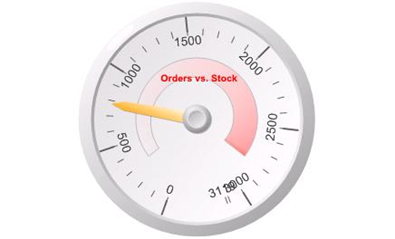

<html dir="LTR" xmlns:mshelp="http://msdn.microsoft.com/mshelp" xmlns:ddue="http://ddue.schemas.microsoft.com/authoring/2003/5" xmlns:xlink="http://www.w3.org/1999/xlink" xmlns:tool="http://www.microsoft.com/tooltip">
    <head>
        <meta http-equiv="Content-Type" content="text/html; CHARSET=utf-8"></meta>
        <meta name="save" content="history"></meta>
        <title>3.13 GaugePanel</title>
        <xml>
            <mshelp:toctitle title="3.13 GaugePanel"></mshelp:toctitle>
            <mshelp:rltitle title="[MS-RDL]: GaugePanel"></mshelp:rltitle>
            <mshelp:keyword index="A" term="7392a8f6-3490-432a-b493-d11c4093ffa4"></mshelp:keyword>
            <mshelp:attr name="DCSext.ContentType" value="open specification"></mshelp:attr>
            <mshelp:attr name="AssetID" value="7392a8f6-3490-432a-b493-d11c4093ffa4"></mshelp:attr>
            <mshelp:attr name="TopicType" value="kbRef"></mshelp:attr>
            <mshelp:attr name="DCSext.Title" value="[MS-RDL]: GaugePanel" />
        </xml>
    </head>
    <body>
        

            <h1 class="heading">3.13 GaugePanel</h1>
        

        

            

                

                

                    

The following is an example RDL definition of a <a href="f01744d3-79fa-4f30-94bf-a1ffa6bde2ac.md">GaugePanel</a> element that is
used to create the <a href="b2482b3f-74ab-4ca8-a9e5-c07955011743.md#gt_8beb719e-adf3-461d-a3d4-d52ef83336ca">gauge
panel</a> shown in the following figure. The <b>GaugePanel</b> element has its <a href="cdbc4c61-2726-46ef-afb1-825a1d2ee6ea.md">Name</a> attribute set to
&quot;GaugePanel3&quot;. &quot;GaugePanel3&quot; has the <a href="5a83c0d3-6283-49cb-9bb1-5f03927a3377.md">GaugePanel.DataSetName</a>
element set to &quot;DataSet1&quot;. The <a href="a14782b0-2e2f-4305-83a3-3de3fd750b6a.md">DataSet</a> named
&quot;DataSet1&quot; exposes two <a href="b37f01de-0f2f-42f0-90e2-ad8bed343954.md">Fields</a> named
&quot;UnitsInStock&quot; and &quot;UnitsOnOrder&quot; for
&quot;GaugePanel3&quot; to use.

<b>Figure 21: Gauge panel with single radial gauge</b>

The gauge panel contains a single <a href="dd0287b9-ba20-413b-b1de-69db6653b0b9.md">RadialGauges</a> collection.
This <b>RadialGauges</b> collection contains only one <a href="2e113607-ee33-4abd-9ae3-6607c10d3c8a.md">RadialGauge</a> element. This <b>RadialGauge</b>
element has its <b>Name</b> attribute set to &quot;RadialGauge1&quot;.

<dl>
<dd>

<pre>   &lt;GaugePanel Name=&quot;GaugePanel3&quot;&gt;
     &lt;RadialGauges&gt;
       &lt;RadialGauge Name=&quot;RadialGauge1&quot;&gt;
</pre>

</dd></dl>

&quot;RadialGauge1&quot; contains only one <a href="86468d9f-c561-4b50-a689-5dfccfde8495.md">RadialScale</a> element within
its <a href="af4cdb4a-eebd-4fb3-8702-24378b30570c.md">RadialGauge.GaugeScales</a>
collection. This <b>RadialScale</b> element has its <b>Name</b> attribute set
to &quot;RadialScale1&quot;.

<dl>
<dd>

<pre>         &lt;GaugeScales&gt;
           &lt;RadialScale Name=&quot;RadialScale1&quot;&gt;
             &lt;GaugePointers&gt;
</pre>

</dd></dl>

&quot;RadialScale1&quot; contains only one <a href="1446314e-813e-42f0-9a28-f1b96fd3a0da.md">RadialPointer</a> element
within its <a href="3385b9cc-1bc0-45df-8005-f0d08c34abec.md">RadialScale.GaugePointers</a>
collection. This <b>RadialPointer</b> element has its <b>Name</b> attribute set
to &quot;RadialPointer1&quot;. &quot;RadialPointer1&quot; has <a href="67d04aa3-416c-460b-b1bc-fa70221c0cf2.md">RadialPointer.GaugeInputValue</a>
set to &quot;Sum(Fields!UnitsOnOrder.Value)&quot;, which means that the pointer
will point at the value that is equal to the cumulative sum of all values for
the &quot;UnitsOnOrder&quot; <a href="940b8522-5d1f-4a2a-ab79-087ef6a69881.md">Field</a>,
which evaluates to a value between 500 and 1000.

<dl>
<dd>

<pre>               &lt;RadialPointer Name=&quot;RadialPointer1&quot;&gt;
                 &lt;PointerCap&gt;
                   &lt;Style&gt;
                   &lt;BackgroundColor&gt;White&lt;/BackgroundColor&gt;
                   &lt;BackgroundGradientType&gt;DiagonalLeft&lt;/BackgroundGradientType&gt;
                   &lt;BackgroundGradientEndColor&gt;DimGray&lt;/BackgroundGradientEndColor&gt;
                   &lt;BackgroundHatchType&gt;None&lt;/BackgroundHatchType&gt;
                   &lt;/Style&gt;
                   &lt;CapImage&gt;
                     &lt;OffsetX&gt;0pt&lt;/OffsetX&gt;
                     &lt;OffsetY&gt;0pt&lt;/OffsetY&gt;
                     &lt;Source&gt;External&lt;/Source&gt;
                     &lt;Value /&gt;
                   &lt;/CapImage&gt;
                   &lt;OnTop&gt;true&lt;/OnTop&gt;
                   &lt;CapStyle&gt;RoundedWithWideIndentation&lt;/CapStyle&gt;
                   &lt;Width&gt;33&lt;/Width&gt;
                 &lt;/PointerCap&gt;
                 &lt;NeedleStyle&gt;Tapered&lt;/NeedleStyle&gt;
                 &lt;Style&gt;
                   &lt;Border&gt;
                     &lt;Style&gt;None&lt;/Style&gt;
                   &lt;/Border&gt;
                   &lt;BackgroundColor&gt;White&lt;/BackgroundColor&gt;
                   &lt;BackgroundGradientType&gt;DiagonalLeft&lt;/BackgroundGradientType&gt;
                   BackgroundGradientEndColor&gt;Orange&lt;/BackgroundGradientEndColor&gt;
                   &lt;BackgroundHatchType&gt;None&lt;/BackgroundHatchType&gt;
                   &lt;ShadowOffset&gt;1pt&lt;/ShadowOffset&gt;
                 &lt;/Style&gt;
                 &lt;GaugeInputValue&gt;
                   &lt;Value&gt;=Sum(Fields!UnitsOnOrder.Value)&lt;/Value&gt;
                   &lt;Multiplier&gt;1&lt;/Multiplier&gt;
                 &lt;/GaugeInputValue&gt;
                 &lt;PointerImage&gt;
                   &lt;OffsetX&gt;0pt&lt;/OffsetX&gt;
                   &lt;OffsetY&gt;0pt&lt;/OffsetY&gt;
                   &lt;Source&gt;External&lt;/Source&gt;
                   &lt;Value /&gt;
                 &lt;/PointerImage&gt;
                 &lt;MarkerLength&gt;25&lt;/MarkerLength&gt;
                 &lt;MarkerStyle&gt;Wedge&lt;/MarkerStyle&gt;
                 &lt;Placement&gt;Inside&lt;/Placement&gt;
                 &lt;Width&gt;15&lt;/Width&gt;
               &lt;/RadialPointer&gt;
             &lt;/GaugePointers&gt;
</pre>

</dd></dl>

&quot;RadialScale1&quot; contains only one <a href="56ed5aad-f1b1-4463-a987-8f02cea49950.md">ScaleRange</a> element within
its <a href="7d058525-b290-415e-8635-97e1ca2cbe32.md">ScaleRanges</a>
collection. This <b>ScaleRange</b> element has its <b>Name</b> attribute set to
&quot;RadialRange1&quot;. &quot;RadialRange1&quot; has ScaleRange's <a href="76ff4ed7-21cf-4043-ad2c-169c06688703.md">Style.BackgroundGradientEndColor</a>
set to &quot;Salmon&quot; and ScaleRange's <a href="776c8d66-653c-47fa-bb3d-7d41d6bd7155.md">Style.BackgroundGradientType</a>
set to &quot;DiagonalLeft&quot;. These settings affect the viewing layout of
&quot;RadialRange1&quot;, as seen in the previous figure. The width of &quot;RadialRange1&quot;
varies from 15 percent of the radius of &quot;RadialScale1&quot; at the
beginning of the range to 30 percent of the radius of
&quot;RadialScale1&quot; at the end of the range. The actual values for
&quot;RadialRange1&quot; go from 10 percent to 90 percent of the
cumulative sum of all values for the &quot;UnitsInStock&quot; field.

<dl>
<dd>

<pre>             &lt;ScaleRanges&gt;
               &lt;ScaleRange Name=&quot;RadialRange1&quot;&gt;
                 &lt;Style&gt;
                   &lt;Border&gt;
                     &lt;Color&gt;Silver&lt;/Color&gt;
                     &lt;Style&gt;Solid&lt;/Style&gt;
                   &lt;/Border&gt;
                   &lt;BackgroundColor&gt;#00ffffff&lt;/BackgroundColor&gt;
                   &lt;BackgroundGradientType&gt;DiagonalLeft&lt;/BackgroundGradientType&gt;
                   &lt;BackgroundGradientEndColor&gt;Salmon&lt;/BackgroundGradientEndColor&gt;
                   &lt;BackgroundHatchType&gt;None&lt;/BackgroundHatchType&gt;
                   &lt;ShadowOffset&gt;0pt&lt;/ShadowOffset&gt;
                 &lt;/Style&gt;
                 &lt;DistanceFromScale&gt;30&lt;/DistanceFromScale&gt;
                 &lt;StartValue&gt;
                   &lt;Value&gt;=0.1*Sum(Fields!UnitsInStock.Value)&lt;/Value&gt;
                   &lt;Multiplier&gt;1&lt;/Multiplier&gt;
                 &lt;/StartValue&gt;
                 &lt;EndValue&gt;
                   &lt;Value&gt;=0.9*Sum(Fields!UnitsInStock.Value)&lt;/Value&gt;
                   &lt;Multiplier&gt;1&lt;/Multiplier&gt;
                 &lt;/EndValue&gt;
                 &lt;StartWidth&gt;15&lt;/StartWidth&gt;
                 &lt;EndWidth&gt;30&lt;/EndWidth&gt;
                 &lt;Placement&gt;Inside&lt;/Placement&gt;
               &lt;/ScaleRange&gt;
             &lt;/ScaleRanges&gt;
             &lt;Style&gt;
               &lt;Border&gt;
                 &lt;Style&gt;None&lt;/Style&gt;
               &lt;/Border&gt;
               &lt;BackgroundColor&gt;CornflowerBlue&lt;/BackgroundColor&gt;
               &lt;BackgroundGradientType&gt;None&lt;/BackgroundGradientType&gt;
               &lt;BackgroundGradientEndColor&gt;White&lt;/BackgroundGradientEndColor&gt;
               &lt;BackgroundHatchType&gt;None&lt;/BackgroundHatchType&gt;
               &lt;ShadowOffset&gt;0pt&lt;/ShadowOffset&gt;
             &lt;/Style&gt;
             &lt;Interval&gt;NaN&lt;/Interval&gt;
             &lt;IntervalOffset&gt;NaN&lt;/IntervalOffset&gt;
</pre>

</dd></dl>

&quot;RadialScale1&quot; has <a href="ecb875d8-630b-46fb-b060-b35188c1fed9.md">RadialScale.MinimumValue</a>
set to 0 and <a href="04ce094c-b4a6-40ee-88a5-6f5f940f4fa8.md">RadialScale.MaximumValue</a>
set to &quot;=Sum(Fields!UnitsInStock.Value)&quot;. This means that the scale
that is represented by &quot;RadialScale1&quot; can go from 0 to the cumulative
total of all product units that are in stock as recorded by
&quot;DataSet1&quot;. This cumulative total is slightly greater than 3000.

<dl>
<dd>

<pre>             &lt;MaximumValue&gt;
               &lt;Value&gt;=Sum(Fields!UnitsInStock.Value)&lt;/Value&gt;
               &lt;Multiplier&gt;1&lt;/Multiplier&gt;
             &lt;/MaximumValue&gt;
             &lt;MinimumValue&gt;
               &lt;Value&gt;0&lt;/Value&gt;
               &lt;Multiplier&gt;1&lt;/Multiplier&gt;
             &lt;/MinimumValue&gt;
</pre>

</dd></dl>

The <a href="502acb3d-cd0c-4b64-907f-a4e9e5e1d130.md">RadialScale.GaugeMajorTickMarks</a>
has <a href="a505239b-92dc-4d41-8884-c5fe58ca9099.md">TickMarkStyle.Placement</a>
set to &quot;Outside&quot; and no <a href="e1fc6f67-8bc5-403c-86b6-e53926a8b2bb.md">TickMarkStyle.Shape</a> set.
Therefore, the major tick marks, with their intervals defaulted to 500, are
placed outside of &quot;RadialScale1&quot; and contain a slim (because <a href="755ae3ba-94cf-4f66-8f7b-4c6a121534c5.md">TickMarkStyle.Width</a> is set
to only 2) rectangular shape.

<dl>
<dd>

<pre>             &lt;GaugeMajorTickMarks&gt;
               &lt;Interval&gt;NaN&lt;/Interval&gt;
               &lt;IntervalOffset&gt;NaN&lt;/IntervalOffset&gt;
               &lt;Style&gt;
                 &lt;Border&gt;
                   &lt;Color&gt;DimGray&lt;/Color&gt;
                   &lt;Style&gt;None&lt;/Style&gt;
                 &lt;/Border&gt;
                 &lt;BackgroundColor&gt;DimGray&lt;/BackgroundColor&gt;
               &lt;/Style&gt;
               &lt;Placement&gt;Outside&lt;/Placement&gt;
               &lt;TickMarkImage&gt;
                 &lt;Source&gt;External&lt;/Source&gt;
                 &lt;Value /&gt;
               &lt;/TickMarkImage&gt;
               &lt;Length&gt;18&lt;/Length&gt;
               &lt;Width&gt;2&lt;/Width&gt;
             &lt;/GaugeMajorTickMarks&gt;
</pre>

</dd></dl>

The <a href="81b6de5b-0e0f-4272-9b9c-e1c73896a603.md">RadialScale.GaugeMinorTickMarks</a>
has <b>TickMarkStyle.Placement</b> set to &quot;Cross&quot; and no <b>TickMarkStyle.Shape</b>
set. Therefore, the minor tick marks, with their intervals defaulted to 100,
are placed directly across &quot;RadialScale1&quot; and contain a slim (because
<b>TickMarkStyle.Width</b> is set to only 1) rectangular shape.

<dl>
<dd>

<pre>             &lt;GaugeMinorTickMarks&gt;
               &lt;Interval&gt;NaN&lt;/Interval&gt;
               &lt;IntervalOffset&gt;NaN&lt;/IntervalOffset&gt;
               &lt;Style&gt;
                 &lt;Border&gt;
                   &lt;Color&gt;DimGray&lt;/Color&gt;
                   &lt;Style&gt;None&lt;/Style&gt;
                 &lt;/Border&gt;
                 &lt;BackgroundColor&gt;DimGray&lt;/BackgroundColor&gt;
               &lt;/Style&gt;
               &lt;Placement&gt;Cross&lt;/Placement&gt;
               &lt;TickMarkImage&gt;
                 &lt;Source&gt;External&lt;/Source&gt;
                 &lt;Value /&gt;
               &lt;/TickMarkImage&gt;
               &lt;Length&gt;8&lt;/Length&gt;
               &lt;Width&gt;1&lt;/Width&gt;
             &lt;/GaugeMinorTickMarks&gt;
             &lt;MaximumPin&gt;
               &lt;PinLabel&gt;
                 &lt;Style&gt;
                   &lt;FontSize&gt;12pt&lt;/FontSize&gt;
                 &lt;/Style&gt;
                 &lt;DistanceFromScale&gt;0&lt;/DistanceFromScale&gt;
               &lt;/PinLabel&gt;
               &lt;Style&gt;
                 &lt;Border&gt;
                   &lt;Color&gt;DimGray&lt;/Color&gt;
                   &lt;Style&gt;Solid&lt;/Style&gt;
                 &lt;/Border&gt;
                 &lt;BackgroundColor&gt;WhiteSmoke&lt;/BackgroundColor&gt;
               &lt;/Style&gt;
               &lt;Placement&gt;Cross&lt;/Placement&gt;
               &lt;TickMarkImage&gt;
                 &lt;Source&gt;External&lt;/Source&gt;
                 &lt;Value /&gt;
               &lt;/TickMarkImage&gt;
               &lt;Length&gt;6&lt;/Length&gt;
               &lt;Width&gt;6&lt;/Width&gt;
               &lt;Shape&gt;Circle&lt;/Shape&gt;
               &lt;Hidden&gt;true&lt;/Hidden&gt;
             &lt;/MaximumPin&gt;
             &lt;MinimumPin&gt;
               &lt;PinLabel&gt;
                 &lt;Style&gt;
                   &lt;FontSize&gt;12pt&lt;/FontSize&gt;
                 &lt;/Style&gt;
                 &lt;DistanceFromScale&gt;0&lt;/DistanceFromScale&gt;
               &lt;/PinLabel&gt;
               &lt;Style&gt;
                 &lt;Border&gt;
                   &lt;Color&gt;DimGray&lt;/Color&gt;
                   &lt;Style&gt;Solid&lt;/Style&gt;
                 &lt;/Border&gt;
                 &lt;BackgroundColor&gt;WhiteSmoke&lt;/BackgroundColor&gt;
               &lt;/Style&gt;
               &lt;Placement&gt;Cross&lt;/Placement&gt;
               &lt;TickMarkImage&gt;
                 &lt;Source&gt;External&lt;/Source&gt;
                 &lt;Value /&gt;
               &lt;/TickMarkImage&gt;
               &lt;Length&gt;6&lt;/Length&gt;
               &lt;Width&gt;6&lt;/Width&gt;
               &lt;Shape&gt;Circle&lt;/Shape&gt;
               &lt;Hidden&gt;true&lt;/Hidden&gt;
             &lt;/MinimumPin&gt;
             &lt;ScaleLabels&gt;
               &lt;Style&gt;
                 &lt;FontSize&gt;14pt&lt;/FontSize&gt;
                 &lt;Color&gt;#404040&lt;/Color&gt;
               &lt;/Style&gt;
               &lt;Interval&gt;NaN&lt;/Interval&gt;
               &lt;IntervalOffset&gt;NaN&lt;/IntervalOffset&gt;
               &lt;DistanceFromScale&gt;0&lt;/DistanceFromScale&gt;
               &lt;RotateLabels&gt;true&lt;/RotateLabels&gt;
               &lt;ShowEndLabels&gt;true&lt;/ShowEndLabels&gt;
               &lt;UseFontPercent&gt;true&lt;/UseFontPercent&gt;
             &lt;/ScaleLabels&gt;
             &lt;Width&gt;0&lt;/Width&gt;
           &lt;/RadialScale&gt;
         &lt;/GaugeScales&gt;
</pre>

</dd></dl>

&quot;RadialGauge1&quot; contains a <a href="9d7d9679-97e8-4e8c-89fc-9e985a85549b.md">RadialGauge.BackFrame</a>
element. For the <a href="ed20ba13-2b2e-422d-a581-b78f5ee14314.md">BackFrame</a>,
<a href="3277ef25-46c8-4e96-b6b2-f59d0bb091c5.md">BackFrame.FrameShape</a> is
set to &quot;CustomCircular2&quot;, which defines the frame shape of
&quot;RadialGauge1&quot;, as shown in the figure.

<dl>
<dd>

<pre>         &lt;BackFrame&gt;
           &lt;Style&gt;
             &lt;Border&gt;
               &lt;Style&gt;None&lt;/Style&gt;
             &lt;/Border&gt;
             &lt;BackgroundColor&gt;WhiteSmoke&lt;/BackgroundColor&gt;
             &lt;BackgroundGradientType&gt;DiagonalLeft&lt;/BackgroundGradientType&gt;
             &lt;BackgroundGradientEndColor&gt;Gainsboro&lt;/BackgroundGradientEndColor&gt;
             &lt;BackgroundHatchType&gt;None&lt;/BackgroundHatchType&gt;
             &lt;ShadowOffset&gt;0pt&lt;/ShadowOffset&gt;
           &lt;/Style&gt;
           &lt;FrameStyle&gt;Edged&lt;/FrameStyle&gt;
           &lt;FrameShape&gt;CustomCircular2&lt;/FrameShape&gt;
           &lt;FrameBackground&gt;
             &lt;Style&gt;
               &lt;BackgroundColor&gt;WhiteSmoke&lt;/BackgroundColor&gt;
               &lt;BackgroundGradientType&gt;DiagonalLeft&lt;/BackgroundGradientType&gt;
               &lt;BackgroundGradientEndColor&gt;Gray&lt;/BackgroundGradientEndColor&gt;
               &lt;BackgroundHatchType&gt;None&lt;/BackgroundHatchType&gt;
             &lt;/Style&gt;
           &lt;/FrameBackground&gt;
           &lt;FrameImage&gt;
             &lt;Source&gt;External&lt;/Source&gt;
             &lt;Value /&gt;
           &lt;/FrameImage&gt;
         &lt;/BackFrame&gt;
         &lt;ClipContent&gt;true&lt;/ClipContent&gt;
         &lt;TopImage&gt;
           &lt;Source&gt;External&lt;/Source&gt;
           &lt;Value /&gt;
         &lt;/TopImage&gt;
         &lt;AspectRatio&gt;1&lt;/AspectRatio&gt;
         &lt;Height&gt;100&lt;/Height&gt;
         &lt;Width&gt;100&lt;/Width&gt;
       &lt;/RadialGauge&gt;
     &lt;/RadialGauges&gt;
</pre>

</dd></dl>

&quot;GaugePanel3&quot; also contains one <a href="3d97eae8-d903-471f-b151-9cc2bdbe91af.md">GaugeLabel</a> element within
its <a href="1d876044-b790-4413-a225-e60f7d727465.md">GaugeLabels</a>
collection. This <b>GaugeLabel</b> element has its <b>Name</b> attribute set to
&quot;GaugeLabel1&quot;. &quot;GaugeLabel1&quot; has <a href="2c4cbb46-1c8f-429e-a09b-77bb74c04b16.md">GaugeLabel.Text</a> set to
&quot;Orders vs. Stock&quot;, <a href="7911c883-f314-41d9-9136-02e8a26279ad.md">Style.Color</a> set to
&quot;Red&quot;, and <a href="7e471552-9317-46e2-8d35-6566d1e69321.md">Style.FontWeight</a>
set to &quot;Bold&quot;, the results of which can be seen in the figure.

<dl>
<dd>

<pre>     &lt;GaugeLabels&gt;
       &lt;GaugeLabel Name=&quot;GaugeLabel1&quot;&gt;
         &lt;Text&gt;Orders vs. Stock&lt;/Text&gt;
         &lt;TextShadowOffset&gt;0pt&lt;/TextShadowOffset&gt;
         &lt;Style&gt;
           &lt;Border&gt;
             &lt;Style&gt;None&lt;/Style&gt;
           &lt;/Border&gt;
           &lt;BackgroundColor&gt;#00ffffff&lt;/BackgroundColor&gt;
           &lt;BackgroundGradientType&gt;None&lt;/BackgroundGradientType&gt;
           &lt;BackgroundGradientEndColor&gt;#00ffffff&lt;/BackgroundGradientEndColor&gt;
           &lt;FontWeight&gt;Bold&lt;/FontWeight&gt;
           &lt;Color&gt;Red&lt;/Color&gt;
           &lt;ShadowOffset&gt;0pt&lt;/ShadowOffset&gt;
         &lt;/Style&gt;
         &lt;Top&gt;30.418249130249&lt;/Top&gt;
         &lt;Left&gt;40.2298812866211&lt;/Left&gt;
         &lt;Height&gt;9&lt;/Height&gt;
         &lt;Width&gt;21&lt;/Width&gt;
       &lt;/GaugeLabel&gt;
     &lt;/GaugeLabels&gt;
     &lt;AutoLayout&gt;true&lt;/AutoLayout&gt;
     &lt;BackFrame&gt;
       &lt;Style&gt;
         &lt;Border&gt;
           &lt;Style&gt;None&lt;/Style&gt;
         &lt;/Border&gt;
         &lt;BackgroundColor&gt;Gainsboro&lt;/BackgroundColor&gt;
         &lt;BackgroundGradientType&gt;DiagonalLeft&lt;/BackgroundGradientType&gt;
         &lt;BackgroundGradientEndColor&gt;Gray&lt;/BackgroundGradientEndColor&gt;
         &lt;BackgroundHatchType&gt;None&lt;/BackgroundHatchType&gt;
         &lt;ShadowOffset&gt;0pt&lt;/ShadowOffset&gt;
       &lt;/Style&gt;
       &lt;FrameBackground&gt;
         &lt;Style&gt;
           &lt;BackgroundColor&gt;Silver&lt;/BackgroundColor&gt;
 &lt;BackgroundGradientType&gt;DiagonalLeft&lt;/BackgroundGradientType&gt;
 &lt;BackgroundGradientEndColor&gt;Gray&lt;/BackgroundGradientEndColor&gt;
           &lt;BackgroundHatchType&gt;None&lt;/BackgroundHatchType&gt;
         &lt;/Style&gt;
       &lt;/FrameBackground&gt;
       &lt;FrameImage&gt;
         &lt;Source&gt;External&lt;/Source&gt;
         &lt;Value /&gt;
       &lt;/FrameImage&gt;
     &lt;/BackFrame&gt;
     &lt;TopImage&gt;
       &lt;Source&gt;External&lt;/Source&gt;
       &lt;Value /&gt;
     &lt;/TopImage&gt;
     &lt;DataSetName&gt;DataSet1&lt;/DataSetName&gt;
     &lt;Top&gt;0.47792in&lt;/Top&gt;
     &lt;Left&gt;0.62375in&lt;/Left&gt;
     &lt;Height&gt;2.75in&lt;/Height&gt;
     &lt;Width&gt;4.54167in&lt;/Width&gt;
     &lt;Style&gt;
       &lt;Border&gt;
         &lt;Style&gt;None&lt;/Style&gt;
       &lt;/Border&gt;
       &lt;BackgroundColor&gt;White&lt;/BackgroundColor&gt;
     &lt;/Style&gt;
   &lt;/GaugePanel&gt;
</pre>

</dd></dl>

                

            

        

    </body>
</html>