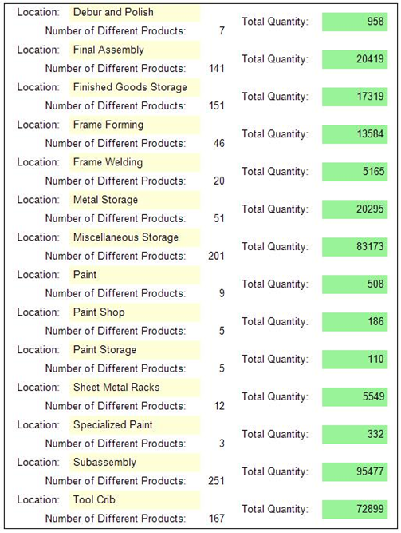

<html dir="LTR" xmlns:mshelp="http://msdn.microsoft.com/mshelp" xmlns:ddue="http://ddue.schemas.microsoft.com/authoring/2003/5" xmlns:xlink="http://www.w3.org/1999/xlink" xmlns:tool="http://www.microsoft.com/tooltip">
    <head>
        <meta http-equiv="Content-Type" content="text/html; CHARSET=utf-8"></meta>
        <meta name="save" content="history"></meta>
        <title>3.15 List</title>
        <xml>
            <mshelp:toctitle title="3.15 List"></mshelp:toctitle>
            <mshelp:rltitle title="[MS-RDL]: List"></mshelp:rltitle>
            <mshelp:keyword index="A" term="782104e0-a96b-445b-a4df-51c9de15d702"></mshelp:keyword>
            <mshelp:attr name="DCSext.ContentType" value="open specification"></mshelp:attr>
            <mshelp:attr name="AssetID" value="782104e0-a96b-445b-a4df-51c9de15d702"></mshelp:attr>
            <mshelp:attr name="TopicType" value="kbRef"></mshelp:attr>
            <mshelp:attr name="DCSext.Title" value="[MS-RDL]: List" />
        </xml>
    </head>
    <body>
        

            <h1 class="heading">3.15 List</h1>
        

        

            

                

                

                    

<b><i>Applies to </i></b><a href="a7e2ad00-07c8-4f6d-80ab-3ad55df7b233.md"><b><i>RDL 2003/10</i></b></a><b>
<i>and </i></b><a href="3ebe2912-4958-4832-b391-cad1f5e13338.md"><b><i>RDL 2005/01</i></b></a>

The following example of a <a href="ea4c625c-0558-4fb3-b3b8-bde6c160b1e2.md">List</a> element is an extract
from an RDL specification of a report. This example is from a report for the
AdventureWorks database. It shows a count of how many distinct products there
are and the total quantity of products in inventory at different locations within
the company in a list. This example illustrates the use of a <a href="b2482b3f-74ab-4ca8-a9e5-c07955011743.md#gt_94193dac-492c-41e6-892e-f827c3f5439f">list data region</a> and how to
group details by company location.

The following figure shows the <b>List</b> example. An
instance of the list consists of the label &quot;Location:&quot; followed by
the name of the location, the label &quot;Number of Different Products:&quot;
followed by a count of the number of different products at that location, and
the label &quot;Total Quantity:&quot; followed by the sum total number of
products at that location. These six items appear as <a href="469d0032-b5ec-43d9-ab36-d3a88b9cc1f6.md">Textbox</a> report items
placed in free form within the boundaries of a list instance; that is, they are
not aligned in any particular rows and columns. They can be placed anywhere
within the list instance boundary. The background colors of two of the <b>Textbox</b>
report items are set to LemonChiffon and LightGreen.

<b>Figure 23: Example of a list with grouping</b>

The following is the extract from the RDL report file that
produces the preceding list. The <b>List</b> element has its <a href="a9bc0afb-5fb6-4771-9efa-4e57330d0cda.md">Name</a> attribute set to
&quot;list1&quot;. There is a <a href="1bf282fa-97a7-4dc0-b8af-171f4e777f73.md">Sorting</a> element that
specifies that this group is sorted by the <a href="940b8522-5d1f-4a2a-ab79-087ef6a69881.md">Field</a> &quot;Name&quot; in
ascending order. As shown in the preceding figure, the locations listed are
Debur and Polish, Final Assembly, Finished Goods Storage, and so on, which are
sorted in alphabetical (ascending) order. The <a href="228554ca-4a90-4c65-be71-74977a6574e8.md">Left</a> element specifies
that the list is 0.125 inches from the left edge of the body of the
report. The list is bound to the data in the <a href="a14782b0-2e2f-4305-83a3-3de3fd750b6a.md">DataSet</a>
&quot;DataSet1&quot; by the <a href="5917d87a-9810-4b46-93fb-08a88d475d13.md">List.DataSetName</a>
element.

<dl>
<dd>

<pre>  
 &lt;List Name=&quot;list1&quot;&gt;
   &lt;Sorting&gt;
     &lt;SortBy&gt;
       &lt;SortExpression&gt;=Fields!Name.Value&lt;/SortExpression&gt;
       &lt;Direction&gt;Ascending&lt;/Direction&gt;
     &lt;/SortBy&gt;
   &lt;/Sorting&gt;
   &lt;Left&gt;0.125in&lt;/Left&gt;
   &lt;DataSetName&gt;DataSet1&lt;/DataSetName&gt;
</pre>

</dd></dl>

The <a href="c5fef915-e842-43b4-91f9-56af4eb15be0.md">ReportItems</a>
element specifies the six text boxes that comprise a single instance of list
data. The text boxes that have the <a href="0896fc9e-7234-4d75-ac22-cd77791acadd.md">Name</a> attribute values
&quot;textbox3&quot;, &quot;textbox4&quot;, and &quot;textbox5&quot; are the
labels before the data. The text box that has the <b>Name</b> attribute value
&quot;Name&quot; is the name of the location in the company, and its <a href="83b607b8-b34e-4119-a26c-81e7c11e26c2.md">Style.BackgroundColor</a>
element is specified as LemonChiffon. The text box that has the <b>Name</b>
attribute value &quot;textbox2&quot; is the total quantity of products in this
location in the company, and its <b>Style.BackgroundColor</b> element is
specified as LightGreen. Note that its <a href="2c55aa61-e69e-41fe-9f23-9440eea9ed65.md">Value</a> element is an
expression that uses the <a href="c00b6434-9f4a-434b-91b9-44eba2d2cdb5.md">Sum</a>
aggregate function. The text box that has the <b>Name</b> attribute value
&quot;textbox1&quot; is the count of distinct products in this location in the
company. Note that its <b>Value</b> element is an expression that uses the <a href="a8485d06-edc3-4b09-8d58-e81b38ff142b.md">Count</a> aggregate function.

<dl>
<dd>

<pre>   &lt;ReportItems&gt;
     &lt;Textbox Name=&quot;textbox1&quot;&gt;
       &lt;Top&gt;0.25in&lt;/Top&gt;
       &lt;Width&gt;0.5in&lt;/Width&gt;
       &lt;Style&gt;
         &lt;TextAlign&gt;Right&lt;/TextAlign&gt;
         &lt;PaddingLeft&gt;2pt&lt;/PaddingLeft&gt;
         &lt;PaddingRight&gt;2pt&lt;/PaddingRight&gt;
         &lt;PaddingTop&gt;2pt&lt;/PaddingTop&gt;
         &lt;PaddingBottom&gt;2pt&lt;/PaddingBottom&gt;
       &lt;/Style&gt;
       &lt;ZIndex&gt;5&lt;/ZIndex&gt;
       &lt;CanGrow&gt;true&lt;/CanGrow&gt;
       &lt;Left&gt;2.5in&lt;/Left&gt;
       &lt;Value&gt;=Count(Fields!ProductID.Value)&lt;/Value&gt;
     &lt;/Textbox&gt;
     &lt;Textbox Name=&quot;textbox5&quot;&gt;
       &lt;rd:DefaultName&gt;textbox5&lt;/rd:DefaultName&gt;
       &lt;Top&gt;0.125in&lt;/Top&gt;
       &lt;Width&gt;1.125in&lt;/Width&gt;
       &lt;Style&gt;
         &lt;PaddingLeft&gt;2pt&lt;/PaddingLeft&gt;
         &lt;PaddingRight&gt;2pt&lt;/PaddingRight&gt;
         &lt;PaddingTop&gt;2pt&lt;/PaddingTop&gt;
         &lt;PaddingBottom&gt;2pt&lt;/PaddingBottom&gt;
       &lt;/Style&gt;
       &lt;ZIndex&gt;4&lt;/ZIndex&gt;
       &lt;CanGrow&gt;true&lt;/CanGrow&gt;
       &lt;Left&gt;3.125in&lt;/Left&gt;
       &lt;Height&gt;0.25in&lt;/Height&gt;
       &lt;Value&gt;Total Quantity:&lt;/Value&gt;
     &lt;/Textbox&gt;
     &lt;Textbox Name=&quot;textbox4&quot;&gt;
       &lt;rd:DefaultName&gt;textbox4&lt;/rd:DefaultName&gt;
       &lt;Top&gt;0.25in&lt;/Top&gt;
       &lt;Width&gt;2in&lt;/Width&gt;
       &lt;Style&gt;
         &lt;TextAlign&gt;Left&lt;/TextAlign&gt;
         &lt;PaddingLeft&gt;2pt&lt;/PaddingLeft&gt;
         &lt;PaddingRight&gt;2pt&lt;/PaddingRight&gt;
         &lt;PaddingTop&gt;2pt&lt;/PaddingTop&gt;
         &lt;PaddingBottom&gt;2pt&lt;/PaddingBottom&gt;
       &lt;/Style&gt;
       &lt;ZIndex&gt;3&lt;/ZIndex&gt;
       &lt;CanGrow&gt;true&lt;/CanGrow&gt;
       &lt;Left&gt;0.5in&lt;/Left&gt;
       &lt;Value&gt;Number of Different Products:&lt;/Value&gt;
     &lt;/Textbox&gt;
     &lt;Textbox Name=&quot;textbox3&quot;&gt;
       &lt;rd:DefaultName&gt;textbox3&lt;/rd:DefaultName&gt;
       &lt;Width&gt;0.75in&lt;/Width&gt;
       &lt;Style&gt;
         &lt;PaddingLeft&gt;2pt&lt;/PaddingLeft&gt;
         &lt;PaddingRight&gt;2pt&lt;/PaddingRight&gt;
         &lt;PaddingTop&gt;2pt&lt;/PaddingTop&gt;
         &lt;PaddingBottom&gt;2pt&lt;/PaddingBottom&gt;
       &lt;/Style&gt;
       &lt;ZIndex&gt;2&lt;/ZIndex&gt;
       &lt;CanGrow&gt;true&lt;/CanGrow&gt;
       &lt;Left&gt;0.125in&lt;/Left&gt;
       &lt;Height&gt;0.25in&lt;/Height&gt;
       &lt;Value&gt;Location:&lt;/Value&gt;
     &lt;/Textbox&gt;
     &lt;Textbox Name=&quot;textbox2&quot;&gt;
       &lt;Top&gt;0.125in&lt;/Top&gt;
       &lt;Width&gt;0.875in&lt;/Width&gt;
       &lt;Style&gt;
         &lt;BackgroundColor&gt;LightGreen&lt;/BackgroundColor&gt;
         &lt;TextAlign&gt;Right&lt;/TextAlign&gt;
         &lt;PaddingLeft&gt;2pt&lt;/PaddingLeft&gt;
         &lt;PaddingRight&gt;2pt&lt;/PaddingRight&gt;
         &lt;PaddingTop&gt;2pt&lt;/PaddingTop&gt;
         &lt;PaddingBottom&gt;2pt&lt;/PaddingBottom&gt;
       &lt;/Style&gt;
       &lt;ZIndex&gt;1&lt;/ZIndex&gt;
       &lt;CanGrow&gt;true&lt;/CanGrow&gt;
       &lt;Left&gt;4.25in&lt;/Left&gt;
       &lt;Height&gt;0.25in&lt;/Height&gt;
       &lt;Value&gt;=Sum(Fields!Quantity.Value)&lt;/Value&gt;
     &lt;/Textbox&gt;
     &lt;Textbox Name=&quot;Name&quot;&gt;
       &lt;rd:DefaultName&gt;Name&lt;/rd:DefaultName&gt;
       &lt;Width&gt;1.75in&lt;/Width&gt;
       &lt;Style&gt;
         &lt;BackgroundColor&gt;LemonChiffon&lt;/BackgroundColor&gt;
         &lt;TextAlign&gt;Left&lt;/TextAlign&gt;
         &lt;PaddingLeft&gt;2pt&lt;/PaddingLeft&gt;
         &lt;PaddingRight&gt;2pt&lt;/PaddingRight&gt;
         &lt;PaddingTop&gt;2pt&lt;/PaddingTop&gt;
         &lt;PaddingBottom&gt;2pt&lt;/PaddingBottom&gt;
       &lt;/Style&gt;
       &lt;CanGrow&gt;true&lt;/CanGrow&gt;
       &lt;Left&gt;0.875in&lt;/Left&gt;
       &lt;Height&gt;0.25in&lt;/Height&gt;
       &lt;Value&gt;=Fields!Name.Value&lt;/Value&gt;
     &lt;/Textbox&gt;
   &lt;/ReportItems&gt;
</pre>

</dd></dl>

The next elements specify that the <b>List</b> is
0.25 inches below the top of its container, which is the report body, and
that <b>List</b> is 5.25 inches wide. The <b>Style</b> element specifies
that the entire list is surrounded with a solid border in the default Black
color.

<dl>
<dd>

<pre>   &lt;Top&gt;0.25in&lt;/Top&gt;
   &lt;Width&gt;5.25in&lt;/Width&gt;
   &lt;Style&gt;
     &lt;BorderStyle&gt;
       &lt;Default&gt;Solid&lt;/Default&gt;
     &lt;/BorderStyle&gt;
   &lt;/Style&gt; 
</pre>

</dd></dl>

The following <a href="7d574154-eefe-4fc1-8b78-3a18b9350e87.md">Grouping</a> element specifies
that the details of the list are grouped by the field named
&quot;LocationID&quot;. This field is a numerical value that uniquely
identifies each location name. Finally, the <a href="82c49e0d-19a6-43a3-801f-33206b741efc.md">Height</a> element specifies
that each detail instance of the list is 0.5 inches tall.

<dl>
<dd>

<pre>   &lt;Grouping Name=&quot;list1_Details_Group&quot;&gt;
     &lt;GroupExpressions&gt;
       &lt;GroupExpression&gt;=Fields!LocationID.Value&lt;/GroupExpression&gt;
     &lt;/GroupExpressions&gt;
   &lt;/Grouping&gt;
   &lt;Height&gt;0.5in&lt;/Height&gt;
 &lt;/List&gt;
</pre>

</dd></dl>

                

            

        

    </body>
</html>