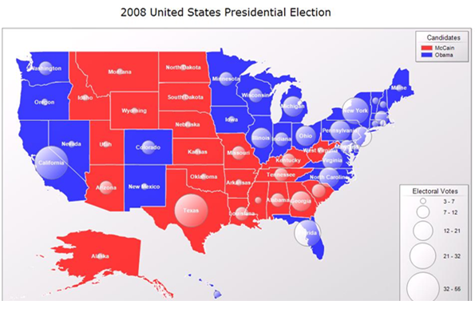

<html dir="LTR" xmlns:mshelp="http://msdn.microsoft.com/mshelp" xmlns:ddue="http://ddue.schemas.microsoft.com/authoring/2003/5" xmlns:xlink="http://www.w3.org/1999/xlink" xmlns:tool="http://www.microsoft.com/tooltip">
    <head>
        <meta http-equiv="Content-Type" content="text/html; CHARSET=utf-8"></meta>
        <meta name="save" content="history"></meta>
        <title>3.17 Map</title>
        <xml>
            <mshelp:toctitle title="3.17 Map"></mshelp:toctitle>
            <mshelp:rltitle title="[MS-RDL]: Map"></mshelp:rltitle>
            <mshelp:keyword index="A" term="7f229b36-1236-4c0b-81e3-7d4e50d99764"></mshelp:keyword>
            <mshelp:attr name="DCSext.ContentType" value="open specification"></mshelp:attr>
            <mshelp:attr name="AssetID" value="7f229b36-1236-4c0b-81e3-7d4e50d99764"></mshelp:attr>
            <mshelp:attr name="TopicType" value="kbRef"></mshelp:attr>
            <mshelp:attr name="DCSext.Title" value="[MS-RDL]: Map" />
        </xml>
    </head>
    <body>
        

            <h1 class="heading">3.17 Map</h1>
        

        

            

                

                

                    

The following example report is a <a href="b2482b3f-74ab-4ca8-a9e5-c07955011743.html#gt_173464f7-c0e8-4181-941a-f7df6725be5a">map</a> that shows the results
for the 2008 United States presidential election. The states are
colored based on the winning candidate. This map also shows a bubble for each
state. The bubble size is based on the number of electoral votes for each
state.

<b>Figure 25: Map example</b>

The data source that is used in this report is
&quot;ElectionMap&quot;. Two datasets, &quot;Spatial&quot; and
&quot;Analytics&quot;, are defined in the report. The map report item contains
one <a href="f54fa273-d9b2-4e49-a896-6001bcda016b.html">MapPolygonLayer</a>
that shows the map of the states.

The <a href="93e9fe27-62df-49a6-922e-37d605819dcf.html">MapSpatialDataSet</a>
element within the layer describes how the spatial data is retrieved from the
&quot;Spatial&quot; dataset. The <a href="c32c8de6-9fd4-4d79-93af-7fd143c8c553.html">MapSpatialDataSet.DataSetName</a>
element specifies the name of the dataset to be bound to. The <a href="7bc48694-b798-4db1-97d3-ee1cd3a2710b.html">MapSpatialDataSet.SpatialField</a>
element specifies the name of the field to use as the source for the spatial
data. The <a href="ce4b7c72-0a17-48e8-a974-0d4757b5d186.html">MapFieldNames</a>
element specifies the name of the non-spatial fields to associate with the
spatial elements. (Typically, these fields are used to join the spatial
elements to the analytical dataset.)

The <a href="8854608c-596e-4826-982d-286b5bc63b0c.html">MapDataRegion</a>
element named &quot;Map1_PolygonLayer1_DataRegion&quot; specifies the source
for analytical data. In this case, the source is the &quot;Analytics&quot;
dataset. The <a href="42cabccb-71c3-4639-806a-e721211ce1a9.html">MapMember</a>
element specifies how the rows in the dataset are grouped. In this case, the
data is grouped by state by the group expression =Fields!State.Value.

After the spatial data and the analytical data are defined,
the <a href="0ff06d88-9945-4bb9-87a3-35f1540c7fca.html">MapBindingFieldPairs</a>
element specifies how these data are joined together. Each <a href="64af7990-ffa0-4603-97d5-0bacc4e18b0d.html">MapBindingFieldPair</a>
element specifies a FieldName from the spatial data and a BindingExpression
from the analytical data. If all the pairs match, the spatial element is bound
to the analytical data.

Next is the role of the rules by which to visualize the
analytical data. The <a href="b2482b3f-74ab-4ca8-a9e5-c07955011743.html#gt_c2e17144-2268-49d2-ba7c-493771d529b1">polygon
layer</a> contains a <a href="77b58882-2976-42cd-9e7a-aca2c6ee0139.html">MapPolygonRules</a>
element that has a <a href="1c6ca85d-f3d6-403c-9232-7d0183108a92.html">MapColorRangeRule</a>.
This rule specifies the range of color to use to colorize the shapes, and a <a href="fdaa1968-b0a0-4f18-b583-8691d13f1ed0.html">DataValue</a> element to
choose which field to visualize (in this case, =Fields!Winner.Value).

To display the bubble for the number of electoral votes, a <a href="029529b0-a93e-4c23-a5b3-a567b40706ae.html">MapPolygonLayer.MapCenterPointRules</a>
element is defined in the layer together with the <a href="88220e4e-cd18-460e-b729-a8f10c2ee40b.html">MapSizeRule</a> element. The <b>MapSizeRule</b>
element controls the size of the bubbles based on the expression
=Sum(Fields!ID_EV.Value).

<dl>
<dd>

<pre> &lt;?xml version=&quot;1.0&quot; encoding=&quot;utf-8&quot;?&gt;
 &lt;Report xmlns:rd=&quot;http://schemas.microsoft.com/SQLServer/reporting/reportdesigner&quot;
 xmlns=&quot;http://schemas.microsoft.com/sqlserver/reporting/2010/01/reportdefinition&quot;&gt;
   &lt;DataSources&gt;
     &lt;DataSource Name=&quot;ElectionMap&quot;&gt;
       &lt;ConnectionProperties&gt;
         &lt;DataProvider&gt;SQL&lt;/DataProvider&gt;
         &lt;ConnectString&gt;Data Source=.\map7;Initial Catalog=Election&lt;/ConnectString&gt;
         &lt;IntegratedSecurity&gt;true&lt;/IntegratedSecurity&gt;
       &lt;/ConnectionProperties&gt;
       &lt;rd:DataSourceID&gt;b1cba34d-af07-4e11-9d13-8df5f2fd0325&lt;/rd:DataSourceID&gt;
       &lt;rd:SecurityType&gt;Windows&lt;/rd:SecurityType&gt;
     &lt;/DataSource&gt;
   &lt;/DataSources&gt;
   &lt;DataSets&gt;
     &lt;DataSet Name=&quot;Analytics&quot;&gt;
       &lt;Fields&gt;
         &lt;Field Name=&quot;State&quot;&gt;
           &lt;DataField&gt;State&lt;/DataField&gt;
           &lt;rd:TypeName&gt;System.String&lt;/rd:TypeName&gt;
         &lt;/Field&gt;
         &lt;Field Name=&quot;ID_EV&quot;&gt;
           &lt;DataField&gt;#EV&lt;/DataField&gt;
           &lt;rd:TypeName&gt;System.Double&lt;/rd:TypeName&gt;
         &lt;/Field&gt;
         &lt;Field Name=&quot;Date&quot;&gt;
           &lt;DataField&gt;Date&lt;/DataField&gt;
           &lt;rd:TypeName&gt;System.DateTime&lt;/rd:TypeName&gt;
         &lt;/Field&gt;
         &lt;Field Name=&quot;BO&quot;&gt;
           &lt;DataField&gt;BO&lt;/DataField&gt;
           &lt;rd:TypeName&gt;System.Double&lt;/rd:TypeName&gt;
         &lt;/Field&gt;
         &lt;Field Name=&quot;JM&quot;&gt;
           &lt;DataField&gt;JM&lt;/DataField&gt;
           &lt;rd:TypeName&gt;System.Double&lt;/rd:TypeName&gt;
         &lt;/Field&gt;
         &lt;Field Name=&quot;Balance&quot;&gt;
           &lt;DataField&gt;Balance&lt;/DataField&gt;
           &lt;rd:TypeName&gt;System.Int32&lt;/rd:TypeName&gt;
         &lt;/Field&gt;
         &lt;Field Name=&quot;Winner&quot;&gt;
           &lt;DataField&gt;Winner&lt;/DataField&gt;
           &lt;rd:TypeName&gt;System.String&lt;/rd:TypeName&gt;
         &lt;/Field&gt;
       &lt;/Fields&gt;
       &lt;Query&gt;
         &lt;DataSourceName&gt;ElectionMap&lt;/DataSourceName&gt;
         &lt;CommandText&gt;SELECT
   Election.[State]
   ,Election.#EV
   ,Election.[Date]
   ,Election.BO
   ,Election.JM
   ,Election.Balance
   ,Election.Winner
 FROM
   Election&lt;/CommandText&gt;
         &lt;rd:RQDDesignerState&gt;
           &lt;QueryDefinition 
 xmlns=&quot;http://schemas.microsoft.com/ReportingServices/QueryDefinition/Relational&quot;&gt;
             &lt;SelectedColumns&gt;
               &lt;ColumnExpression ColumnOwner=&quot;Election&quot; ColumnName=&quot;State&quot; /&gt;
               &lt;ColumnExpression ColumnOwner=&quot;Election&quot; ColumnName=&quot;#EV&quot; /&gt;
               &lt;ColumnExpression ColumnOwner=&quot;Election&quot; ColumnName=&quot;Date&quot; /&gt;
               &lt;ColumnExpression ColumnOwner=&quot;Election&quot; ColumnName=&quot;BO&quot; /&gt;
               &lt;ColumnExpression ColumnOwner=&quot;Election&quot; ColumnName=&quot;JM&quot; /&gt;
               &lt;ColumnExpression ColumnOwner=&quot;Election&quot; ColumnName=&quot;Balance&quot; /&gt;
               &lt;ColumnExpression ColumnOwner=&quot;Election&quot; ColumnName=&quot;Winner&quot; /&gt;
             &lt;/SelectedColumns&gt;
           &lt;/QueryDefinition&gt;
         &lt;/rd:RQDDesignerState&gt;
       &lt;/Query&gt;
     &lt;/DataSet&gt;
     &lt;DataSet Name=&quot;Spatial&quot;&gt;
       &lt;Fields&gt;
         &lt;Field Name=&quot;Name&quot;&gt;
           &lt;DataField&gt;Name&lt;/DataField&gt;
           &lt;rd:TypeName&gt;System.String&lt;/rd:TypeName&gt;
         &lt;/Field&gt;
         &lt;Field Name=&quot;SpatialData&quot;&gt;
           &lt;DataField&gt;SpatialData&lt;/DataField&gt;
           &lt;rd:TypeName&gt;Microsoft.SqlServer.Types.SqlGeometry, 
 Microsoft.SqlServer.Types, Version=10.0.0.0, Culture=neutral, 
 PublicKeyToken=89845dcd8080cc91&lt;/rd:TypeName&gt;
         &lt;/Field&gt;
       &lt;/Fields&gt;
       &lt;Query&gt;
         &lt;DataSourceName&gt;ElectionMap&lt;/DataSourceName&gt;
         &lt;CommandText&gt;SELECT
   USA.Name
   ,USA.SpatialData
 FROM
   USA&lt;/CommandText&gt;
         &lt;rd:RQDDesignerState&gt;
           &lt;QueryDefinition 
 xmlns=&quot;http://schemas.microsoft.com/ReportingServices/QueryDefinition/Relational&quot;&gt;
             &lt;SelectedColumns&gt;
               &lt;ColumnExpression ColumnOwner=&quot;USA&quot; ColumnName=&quot;Name&quot; /&gt;
               &lt;ColumnExpression ColumnOwner=&quot;USA&quot; ColumnName=&quot;SpatialData&quot; /&gt;
             &lt;/SelectedColumns&gt;
           &lt;/QueryDefinition&gt;
         &lt;/rd:RQDDesignerState&gt;
       &lt;/Query&gt;
     &lt;/DataSet&gt;
   &lt;/DataSets&gt;
   &lt;ReportSections&gt;
     &lt;ReportSection&gt;
       &lt;Body&gt;
         &lt;ReportItems&gt;
           &lt;Map Name=&quot;Map1&quot;&gt;
             &lt;MapViewport&gt;
               &lt;MapCoordinateSystem&gt;Geographic&lt;/MapCoordinateSystem&gt;
               &lt;MapProjection&gt;Mercator&lt;/MapProjection&gt;
               &lt;ProjectionCenterX&gt;0&lt;/ProjectionCenterX&gt;
               &lt;ProjectionCenterY&gt;0&lt;/ProjectionCenterY&gt;
               &lt;MapLimits&gt;
                 &lt;MinimumX&gt;NaN&lt;/MinimumX&gt;
                 &lt;MinimumY&gt;NaN&lt;/MinimumY&gt;
                 &lt;MaximumX&gt;NaN&lt;/MaximumX&gt;
                 &lt;MaximumY&gt;NaN&lt;/MaximumY&gt;
               &lt;/MapLimits&gt;
               &lt;SimplificationResolution&gt;0.01&lt;/SimplificationResolution&gt;
               &lt;MapCustomView&gt;
                 &lt;CenterX&gt;55.0153007507324&lt;/CenterX&gt;
                 &lt;CenterY&gt;50.9827842712402&lt;/CenterY&gt;
                 &lt;Zoom&gt;112.46826171875&lt;/Zoom&gt;
               &lt;/MapCustomView&gt;
               &lt;MapMeridians&gt;
                 &lt;Style&gt;
                   &lt;Border&gt;
                     &lt;Color&gt;#c08080ff&lt;/Color&gt;
                     &lt;Style&gt;None&lt;/Style&gt;
                   &lt;/Border&gt;
                   &lt;Color&gt;#c08080ff&lt;/Color&gt;
                 &lt;/Style&gt;
                 &lt;Hidden&gt;true&lt;/Hidden&gt;
                 &lt;Interval&gt;NaN&lt;/Interval&gt;
                 &lt;ShowLabels&gt;true&lt;/ShowLabels&gt;
               &lt;/MapMeridians&gt;
               &lt;MapParallels&gt;
                 &lt;Style&gt;
                   &lt;Border&gt;
                     &lt;Color&gt;#c08080ff&lt;/Color&gt;
                     &lt;Style&gt;None&lt;/Style&gt;
                   &lt;/Border&gt;
                   &lt;Color&gt;#c08080ff&lt;/Color&gt;
                 &lt;/Style&gt;
                 &lt;Hidden&gt;true&lt;/Hidden&gt;
                 &lt;Interval&gt;NaN&lt;/Interval&gt;
                 &lt;ShowLabels&gt;true&lt;/ShowLabels&gt;
               &lt;/MapParallels&gt;
               &lt;GridUnderContent&gt;false&lt;/GridUnderContent&gt;
               &lt;Style&gt;
                 &lt;Border&gt;
                   &lt;Color&gt;Gray&lt;/Color&gt;
                   &lt;Style&gt;Solid&lt;/Style&gt;
                 &lt;/Border&gt;
                 &lt;BackgroundColor&gt;White&lt;/BackgroundColor&gt;
                 &lt;BackgroundGradientType&gt;DiagonalLeft&lt;/BackgroundGradientType&gt;
                 &lt;BackgroundGradientEndColor&gt;
                   LightGrey
                 &lt;/BackgroundGradientEndColor&gt;
                 &lt;ShadowOffset&gt;1pt&lt;/ShadowOffset&gt;
               &lt;/Style&gt;
               &lt;LeftMargin&gt;4pt&lt;/LeftMargin&gt;
               &lt;RightMargin&gt;4pt&lt;/RightMargin&gt;
               &lt;TopMargin&gt;4pt&lt;/TopMargin&gt;
               &lt;BottomMargin&gt;4pt&lt;/BottomMargin&gt;
             &lt;/MapViewport&gt;
             &lt;MapDataRegions&gt;
               &lt;MapDataRegion Name=&quot;Map1_PolygonLayer1_DataRegion&quot;&gt;
                 &lt;DataSetName&gt;Analytics&lt;/DataSetName&gt;
                 &lt;MapMember&gt;
                   &lt;Group Name=&quot;Map1_PolygonLayer1_Group&quot;&gt;
                     &lt;GroupExpressions&gt;
                       &lt;GroupExpression&gt;=Fields!State.Value&lt;/GroupExpression&gt;
                     &lt;/GroupExpressions&gt;
                   &lt;/Group&gt;
                 &lt;/MapMember&gt;
               &lt;/MapDataRegion&gt;
             &lt;/MapDataRegions&gt;
             &lt;MapLayers&gt;
               &lt;MapPolygonLayer Name=&quot;PolygonLayer1&quot;&gt;
                 &lt;MapPolygonTemplate&gt;
                   &lt;CenterPointOffsetX&gt;0&lt;/CenterPointOffsetX&gt;
                   &lt;CenterPointOffsetY&gt;0&lt;/CenterPointOffsetY&gt;
                   &lt;Style&gt;
                     &lt;Border&gt;
                       &lt;Color&gt;White&lt;/Color&gt;
                       &lt;Style&gt;Solid&lt;/Style&gt;
                     &lt;/Border&gt;
                     &lt;BackgroundColor&gt;White&lt;/BackgroundColor&gt;
                     &lt;BackgroundGradientType&gt;None&lt;/BackgroundGradientType&gt;
                     &lt;BackgroundGradientEndColor&gt;
                       LightGrey
                     &lt;/BackgroundGradientEndColor&gt;
                     &lt;FontSize&gt;8pt&lt;/FontSize&gt;
                     &lt;FontWeight&gt;Bold&lt;/FontWeight&gt;
                     &lt;Color&gt;White&lt;/Color&gt;
                   &lt;/Style&gt;
                   &lt;Hidden&gt;false&lt;/Hidden&gt;
                   &lt;OffsetX&gt;0&lt;/OffsetX&gt;
                   &lt;OffsetY&gt;0&lt;/OffsetY&gt;
                   &lt;Label&gt;#NAME&lt;/Label&gt;
                   &lt;ToolTip /&gt;
                   &lt;DataElementLabel /&gt;
                 &lt;/MapPolygonTemplate&gt;
                 &lt;MapPolygonRules&gt;
                   &lt;MapColorRangeRule&gt;
                     &lt;StartColor&gt;#c3ff0000&lt;/StartColor&gt;
                     &lt;EndColor&gt;#c30000ff&lt;/EndColor&gt;
                     &lt;ShowInColorScale&gt;true&lt;/ShowInColorScale&gt;
                     &lt;DataValue&gt;=Fields!Winner.Value&lt;/DataValue&gt;
                     &lt;StartValue /&gt;
                     &lt;EndValue /&gt;
                     &lt;LegendName&gt;Legend1&lt;/LegendName&gt;
                     &lt;LegendText&gt;#FROMVALUE{N0} - #TOVALUE{N0}&lt;/LegendText&gt;
                   &lt;/MapColorRangeRule&gt;
                 &lt;/MapPolygonRules&gt;
                 &lt;MapMarkerTemplate&gt;
                   &lt;MapMarker&gt;
                     &lt;MapMarkerStyle&gt;Circle&lt;/MapMarkerStyle&gt;
                   &lt;/MapMarker&gt;
                   &lt;Style&gt;
                     &lt;Border&gt;
                       &lt;Color&gt;Gray&lt;/Color&gt;
                       &lt;Style&gt;Solid&lt;/Style&gt;
                     &lt;/Border&gt;
                     &lt;BackgroundColor&gt;White&lt;/BackgroundColor&gt;
                     &lt;BackgroundGradientType&gt;
                       DiagonalLeft
                     &lt;/BackgroundGradientType&gt;
                     &lt;BackgroundGradientEndColor&gt;
                       #00ffffff
                     &lt;/BackgroundGradientEndColor&gt;
                   &lt;/Style&gt;
                   &lt;Hidden&gt;false&lt;/Hidden&gt;
                   &lt;OffsetX&gt;0&lt;/OffsetX&gt;
                   &lt;OffsetY&gt;0&lt;/OffsetY&gt;
                   &lt;Label /&gt;
                   &lt;ToolTip /&gt;
                   &lt;DataElementLabel /&gt;
                 &lt;/MapMarkerTemplate&gt;
                 &lt;MapCenterPointRules&gt;
                   &lt;MapSizeRule&gt;
                     &lt;StartSize&gt;10pt&lt;/StartSize&gt;
                     &lt;EndSize&gt;60pt&lt;/EndSize&gt;
                     &lt;DataValue&gt;=Sum(Fields!ID_EV.Value)&lt;/DataValue&gt;
                     &lt;StartValue /&gt;
                     &lt;EndValue /&gt;
                     &lt;LegendName&gt;Legend2&lt;/LegendName&gt;
                     &lt;LegendText&gt;
                       #FROMVALUE - #TOVALUE
                     &lt;/LegendText&gt;
                   &lt;/MapSizeRule&gt;
                 &lt;/MapCenterPointRules&gt;
                 &lt;MapDataRegionName&gt;
 Map1_PolygonLayer1_DataRegion
                 &lt;/MapDataRegionName&gt;
                 &lt;MapBindingFieldPairs&gt;
                   &lt;MapBindingFieldPair&gt;
                     &lt;FieldName&gt;Name&lt;/FieldName&gt;
                     &lt;BindingExpression&gt;=Fields!State.Value&lt;/BindingExpression&gt;
                   &lt;/MapBindingFieldPair&gt;
                 &lt;/MapBindingFieldPairs&gt;
                 &lt;MapFieldDefinitions&gt;
                   &lt;MapFieldDefinition&gt;
                     &lt;Name&gt;Name&lt;/Name&gt;
                     &lt;DataType&gt;String&lt;/DataType&gt;
                   &lt;/MapFieldDefinition&gt;
                 &lt;/MapFieldDefinitions&gt;
                 &lt;MapSpatialDataSet&gt;
                   &lt;DataSetName&gt;Spatial&lt;/DataSetName&gt;
                   &lt;SpatialField&gt;SpatialData&lt;/SpatialField&gt;
                   &lt;MapFieldNames&gt;
                     &lt;MapFieldName&gt;Name&lt;/MapFieldName&gt;
                   &lt;/MapFieldNames&gt;
                 &lt;/MapSpatialDataSet&gt;
               &lt;/MapPolygonLayer&gt;
             &lt;/MapLayers&gt;
             &lt;MapLegends&gt;
               &lt;MapLegend Name=&quot;Legend1&quot;&gt;
                 &lt;MapLegendTitle&gt;
                   &lt;Style&gt;
                     &lt;BackgroundColor&gt;#00ffffff&lt;/BackgroundColor&gt;
                   &lt;/Style&gt;
                   &lt;Caption&gt;Candidates&lt;/Caption&gt;
                 &lt;/MapLegendTitle&gt;
                 &lt;AutoFitTextDisabled&gt;false&lt;/AutoFitTextDisabled&gt;
                 &lt;InterlacedRows&gt;false&lt;/InterlacedRows&gt;
                 &lt;EquallySpacedItems&gt;false&lt;/EquallySpacedItems&gt;
                 &lt;Position&gt;RightTop&lt;/Position&gt;
                 &lt;DockOutsideViewport&gt;false&lt;/DockOutsideViewport&gt;
                 &lt;Hidden&gt;false&lt;/Hidden&gt;
                 &lt;ToolTip /&gt;
                 &lt;Style&gt;
                   &lt;Border&gt;
                     &lt;Color&gt;Gray&lt;/Color&gt;
                     &lt;Style&gt;Solid&lt;/Style&gt;
                   &lt;/Border&gt;
                   &lt;BackgroundColor&gt;White&lt;/BackgroundColor&gt;
                   &lt;BackgroundGradientType&gt;
                     DiagonalLeft
                   &lt;/BackgroundGradientType&gt;
                   &lt;BackgroundGradientEndColor&gt;
                     LightGrey
                   &lt;/BackgroundGradientEndColor&gt;
                   &lt;ShadowOffset&gt;1pt&lt;/ShadowOffset&gt;
                 &lt;/Style&gt;
                 &lt;LeftMargin&gt;4pt&lt;/LeftMargin&gt;
                 &lt;RightMargin&gt;4pt&lt;/RightMargin&gt;
                 &lt;TopMargin&gt;4pt&lt;/TopMargin&gt;
                 &lt;BottomMargin&gt;4pt&lt;/BottomMargin&gt;
               &lt;/MapLegend&gt;
               &lt;MapLegend Name=&quot;Legend2&quot;&gt;
                 &lt;MapLegendTitle&gt;
                   &lt;Style&gt;
                     &lt;BackgroundColor&gt;#00ffffff&lt;/BackgroundColor&gt;
                   &lt;/Style&gt;
                   &lt;Caption&gt;Electoral Votes&lt;/Caption&gt;
                 &lt;/MapLegendTitle&gt;
                 &lt;AutoFitTextDisabled&gt;false&lt;/AutoFitTextDisabled&gt;
                 &lt;InterlacedRows&gt;false&lt;/InterlacedRows&gt;
                 &lt;EquallySpacedItems&gt;false&lt;/EquallySpacedItems&gt;
                 &lt;Position&gt;RightBottom&lt;/Position&gt;
                 &lt;DockOutsideViewport&gt;false&lt;/DockOutsideViewport&gt;
                 &lt;Hidden&gt;false&lt;/Hidden&gt;
                 &lt;ToolTip /&gt;
                 &lt;Style&gt;
                   &lt;Border&gt;
                     &lt;Color&gt;Gray&lt;/Color&gt;
                     &lt;Style&gt;Solid&lt;/Style&gt;
                   &lt;/Border&gt;
                   &lt;BackgroundColor&gt;White&lt;/BackgroundColor&gt;
                   &lt;BackgroundGradientType&gt;DiagonalLeft&lt;/BackgroundGradientType&gt;
                   &lt;BackgroundGradientEndColor&gt;
                     LightGrey
                   &lt;/BackgroundGradientEndColor&gt;
                   &lt;ShadowOffset&gt;1pt&lt;/ShadowOffset&gt;
                 &lt;/Style&gt;
                 &lt;LeftMargin&gt;4pt&lt;/LeftMargin&gt;
                 &lt;RightMargin&gt;4pt&lt;/RightMargin&gt;
                 &lt;TopMargin&gt;4pt&lt;/TopMargin&gt;
                 &lt;BottomMargin&gt;4pt&lt;/BottomMargin&gt;
               &lt;/MapLegend&gt;
             &lt;/MapLegends&gt;
             &lt;MapDistanceScale&gt;
               &lt;Position&gt;RightBottom&lt;/Position&gt;
               &lt;DockOutsideViewport&gt;false&lt;/DockOutsideViewport&gt;
               &lt;Hidden&gt;true&lt;/Hidden&gt;
               &lt;ToolTip /&gt;
               &lt;Style&gt;
                 &lt;Border&gt;
                   &lt;Color&gt;Gray&lt;/Color&gt;
                   &lt;Style&gt;Solid&lt;/Style&gt;
                 &lt;/Border&gt;
                 &lt;BackgroundColor&gt;White&lt;/BackgroundColor&gt;
                 &lt;BackgroundGradientType&gt;DiagonalLeft&lt;/BackgroundGradientType&gt;
                 &lt;BackgroundGradientEndColor&gt;
                   LightGrey
                 &lt;/BackgroundGradientEndColor&gt;
                 &lt;ShadowOffset&gt;1pt&lt;/ShadowOffset&gt;
               &lt;/Style&gt;
               &lt;MapSize&gt;
                 &lt;Width&gt;80&lt;/Width&gt;
                 &lt;Height&gt;40&lt;/Height&gt;
                 &lt;Unit&gt;Point&lt;/Unit&gt;
               &lt;/MapSize&gt;
               &lt;LeftMargin&gt;4pt&lt;/LeftMargin&gt;
               &lt;RightMargin&gt;4pt&lt;/RightMargin&gt;
               &lt;TopMargin&gt;4pt&lt;/TopMargin&gt;
               &lt;BottomMargin&gt;4pt&lt;/BottomMargin&gt;
             &lt;/MapDistanceScale&gt;
             &lt;MapColorScale&gt;
               &lt;MapColorScaleTitle&gt;
                 &lt;Style /&gt;
                 &lt;Caption /&gt;
               &lt;/MapColorScaleTitle&gt;
               &lt;LabelFormat&gt;#,##0.##&lt;/LabelFormat&gt;
               &lt;HideEndLabels&gt;false&lt;/HideEndLabels&gt;
               &lt;NoDataText&gt;No data&lt;/NoDataText&gt;
               &lt;Position&gt;LeftBottom&lt;/Position&gt;
               &lt;DockOutsideViewport&gt;false&lt;/DockOutsideViewport&gt;
               &lt;Hidden&gt;true&lt;/Hidden&gt;
               &lt;ToolTip /&gt;
               &lt;Style&gt;
                 &lt;Border&gt;
                   &lt;Color&gt;Gray&lt;/Color&gt;
                   &lt;Style&gt;Solid&lt;/Style&gt;
                 &lt;/Border&gt;
                 &lt;BackgroundColor&gt;White&lt;/BackgroundColor&gt;
                 &lt;BackgroundGradientType&gt;DiagonalLeft&lt;/BackgroundGradientType&gt;
                 &lt;BackgroundGradientEndColor&gt;
                   LightGrey
                 &lt;/BackgroundGradientEndColor&gt;
                 &lt;ShadowOffset&gt;1pt&lt;/ShadowOffset&gt;
               &lt;/Style&gt;
               &lt;LeftMargin&gt;4pt&lt;/LeftMargin&gt;
               &lt;RightMargin&gt;4pt&lt;/RightMargin&gt;
               &lt;TopMargin&gt;4pt&lt;/TopMargin&gt;
               &lt;BottomMargin&gt;4pt&lt;/BottomMargin&gt;
             &lt;/MapColorScale&gt;
             &lt;MapBorderSkin&gt;
               &lt;Style&gt;
                 &lt;Border /&gt;
                 &lt;BackgroundColor&gt;Gray&lt;/BackgroundColor&gt;
                 &lt;BackgroundGradientType&gt;None&lt;/BackgroundGradientType&gt;
                 &lt;BackgroundGradientEndColor&gt;
                   White
                 &lt;/BackgroundGradientEndColor&gt;
                 &lt;Color&gt;White&lt;/Color&gt;
               &lt;/Style&gt;
             &lt;/MapBorderSkin&gt;
             &lt;MaximumSpatialElementCount&gt;0&lt;/MaximumSpatialElementCount&gt;
             &lt;MaximumTotalPointCount&gt;0&lt;/MaximumTotalPointCount&gt;
             &lt;Top&gt;0.57223in&lt;/Top&gt;
             &lt;Height&gt;6.09737in&lt;/Height&gt;
             &lt;Width&gt;9.89583in&lt;/Width&gt;
             &lt;Style&gt;
               &lt;Border&gt;
                 &lt;Color&gt;Gray&lt;/Color&gt;
                 &lt;Style&gt;None&lt;/Style&gt;
               &lt;/Border&gt;
               &lt;BackgroundColor&gt;White&lt;/BackgroundColor&gt;
             &lt;/Style&gt;
           &lt;/Map&gt;
           &lt;Textbox Name=&quot;ReportTitle&quot;&gt;
             &lt;CanGrow&gt;true&lt;/CanGrow&gt;
             &lt;KeepTogether&gt;true&lt;/KeepTogether&gt;
             &lt;Paragraphs&gt;
               &lt;Paragraph&gt;
                 &lt;TextRuns&gt;
                   &lt;TextRun&gt;
                     &lt;Value&gt;2008 United States Presidential Election&lt;/Value&gt;
                     &lt;Style&gt;
                       &lt;FontStyle&gt;Normal&lt;/FontStyle&gt;
                       &lt;FontFamily&gt;Verdana&lt;/FontFamily&gt;
                       &lt;FontSize&gt;16pt&lt;/FontSize&gt;
                       &lt;FontWeight&gt;Normal&lt;/FontWeight&gt;
                       &lt;TextDecoration&gt;None&lt;/TextDecoration&gt;
                     &lt;/Style&gt;
                   &lt;/TextRun&gt;
                 &lt;/TextRuns&gt;
                 &lt;Style /&gt;
               &lt;/Paragraph&gt;
             &lt;/Paragraphs&gt;
             &lt;rd:WatermarkTextbox&gt;Title&lt;/rd:WatermarkTextbox&gt;
             &lt;rd:DefaultName&gt;ReportTitle&lt;/rd:DefaultName&gt;
             &lt;Top&gt;0.13056in&lt;/Top&gt;
             &lt;Left&gt;2.48958in&lt;/Left&gt;
             &lt;Height&gt;0.4in&lt;/Height&gt;
             &lt;Width&gt;6.66667in&lt;/Width&gt;
             &lt;ZIndex&gt;1&lt;/ZIndex&gt;
             &lt;Style&gt;
               &lt;Border&gt;
                 &lt;Style&gt;None&lt;/Style&gt;
               &lt;/Border&gt;
               &lt;PaddingLeft&gt;2pt&lt;/PaddingLeft&gt;
               &lt;PaddingRight&gt;2pt&lt;/PaddingRight&gt;
               &lt;PaddingTop&gt;2pt&lt;/PaddingTop&gt;
               &lt;PaddingBottom&gt;2pt&lt;/PaddingBottom&gt;
             &lt;/Style&gt;
           &lt;/Textbox&gt;
         &lt;/ReportItems&gt;
         &lt;Height&gt;6.76681in&lt;/Height&gt;
         &lt;Style&gt;
           &lt;Border&gt;
             &lt;Style&gt;None&lt;/Style&gt;
           &lt;/Border&gt;
         &lt;/Style&gt;
       &lt;/Body&gt;
       &lt;Width&gt;10.36333in&lt;/Width&gt;
       &lt;Page&gt;
         &lt;PageFooter&gt;
           &lt;Height&gt;0.25208in&lt;/Height&gt;
           &lt;PrintOnFirstPage&gt;true&lt;/PrintOnFirstPage&gt;
           &lt;PrintOnLastPage&gt;true&lt;/PrintOnLastPage&gt;
           &lt;Style&gt;
             &lt;Border&gt;
               &lt;Style&gt;None&lt;/Style&gt;
             &lt;/Border&gt;
           &lt;/Style&gt;
         &lt;/PageFooter&gt;
         &lt;LeftMargin&gt;1in&lt;/LeftMargin&gt;
         &lt;RightMargin&gt;1in&lt;/RightMargin&gt;
         &lt;TopMargin&gt;1in&lt;/TopMargin&gt;
         &lt;BottomMargin&gt;1in&lt;/BottomMargin&gt;
         &lt;Style /&gt;
       &lt;/Page&gt;
     &lt;/ReportSection&gt;
   &lt;/ReportSections&gt;
   &lt;rd:ReportID&gt;bd235c9b-b91c-480f-8759-edc46cbf8e32&lt;/rd:ReportID&gt;
   &lt;rd:ReportUnitType&gt;Inch&lt;/rd:ReportUnitType&gt;
 &lt;/Report&gt;
</pre>

</dd></dl>

                

            

        

    </body>
</html>