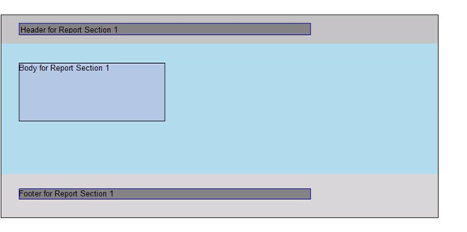

<html dir="LTR" xmlns:mshelp="http://msdn.microsoft.com/mshelp" xmlns:ddue="http://ddue.schemas.microsoft.com/authoring/2003/5" xmlns:xlink="http://www.w3.org/1999/xlink" xmlns:tool="http://www.microsoft.com/tooltip">
    <head>
        <meta http-equiv="Content-Type" content="text/html; CHARSET=utf-8"></meta>
        <meta name="save" content="history"></meta>
        <title>3.1 Report in RDL schema 2008/01</title>
        <xml>
            <mshelp:toctitle title="3.1 Report in RDL schema 2008/01"></mshelp:toctitle>
            <mshelp:rltitle title="[MS-RDL]: Report in RDL schema 2008/01"></mshelp:rltitle>
            <mshelp:keyword index="A" term="8b4e8f53-7260-45e0-b2a7-352784496121"></mshelp:keyword>
            <mshelp:attr name="DCSext.ContentType" value="open specification"></mshelp:attr>
            <mshelp:attr name="AssetID" value="8b4e8f53-7260-45e0-b2a7-352784496121"></mshelp:attr>
            <mshelp:attr name="TopicType" value="kbRef"></mshelp:attr>
            <mshelp:attr name="DCSext.Title" value="[MS-RDL]: Report in RDL schema 2008/01" />
        </xml>
    </head>
    <body>
        

            <h1 class="heading">3.1 Report in RDL schema 2008/01</h1>
        

        

            

                

                

                    

The following is an example of the RDL for a report in
Schema version <a href="1e855f94-4617-47e4-b89e-0856c6cb420f.md">RDL 2008/01</a>.
It shows the usage of the various properties of a <a href="6bbaafec-020b-406c-b4e7-5e4318b616cb.md">Report</a>. The example uses
elements for describing the data: <a href="9c54b70c-c593-422b-aa16-33cb335927a1.md">DataSources</a> and <a href="8a8301cb-c9b3-48ca-84fb-03e8724f959f.md">DataSets</a>; elements for
describing the structure and layout: <a href="b5e525d5-00d6-4e1a-8813-55f327da6b4c.md">Page</a>, including <a href="14a6255f-c4ba-4e2a-ab0f-1af47735910a.md">Page.PageHeader</a> and <a href="13d2727a-4342-4f62-9a53-432f55a9f3e9.md">Page.PageFooter</a>, and <a href="6bf4e125-fdfd-4d04-88aa-c4395ba8a252.md">Body</a>; and elements for
describing the <a href="615fae60-39c0-4770-8735-bdcf6d368031.md">ReportParameters</a>
and <a href="b457a0de-eba4-4d97-a742-ea0e67051372.md">Variables</a> for the
report.

The following figure shows an example rendering of this
report.

<b>Figure 9: RDL schema 2008/01 report rendering</b>

<dl>
<dd>

<pre> 1 &lt;?xml version=&quot;1.0&quot; encoding=&quot;utf-8&quot;?&gt;
 2 &lt;Report xmlns=&quot;http://schemas.microsoft.com/sqlserver/reporting/2008/01/reportdefinition&quot;&gt;
 3  &lt;DataSources&gt;
 4    &lt;DataSource Name=&quot;DataSource1&quot;&gt;
 5      &lt;ConnectionProperties&gt;
 6        &lt;DataProvider&gt;SQL&lt;/DataProvider&gt;
 7        &lt;ConnectString&gt;data source=DataServer; initial catalog=Northwind;&lt;/ConnectString&gt;
 8      &lt;/ConnectionProperties&gt;
 9    &lt;/DataSource&gt;
 10  &lt;/DataSources&gt;
 11  &lt;DataSets&gt;
 12    &lt;DataSet Name=&quot;DataSet1&quot;&gt;
 13      &lt;Fields&gt;
 14        &lt;Field Name=&quot;ProductID&quot;&gt;
 15          &lt;DataField&gt;ProductID&lt;/DataField&gt;
 16        &lt;/Field&gt;
 17        &lt;Field Name=&quot;ProductName&quot;&gt;
 18          &lt;DataField&gt;ProductName&lt;/DataField&gt;
 19        &lt;/Field&gt;
 20        &lt;Field Name=&quot;SupplierID&quot;&gt;
 21          &lt;DataField&gt;SupplierID&lt;/DataField&gt;
 22        &lt;/Field&gt;
 23        &lt;Field Name=&quot;CategoryID&quot;&gt;
 24          &lt;DataField&gt;CategoryID&lt;/DataField&gt;
 25        &lt;/Field&gt;
 26        &lt;Field Name=&quot;QuantityPerUnit&quot;&gt;
 27          &lt;DataField&gt;QuantityPerUnit&lt;/DataField&gt;
 28        &lt;/Field&gt;
 29        &lt;Field Name=&quot;UnitPrice&quot;&gt;
 30          &lt;DataField&gt;UnitPrice&lt;/DataField&gt;
 31        &lt;/Field&gt;
 32        &lt;Field Name=&quot;UnitsInStock&quot;&gt;
 33          &lt;DataField&gt;UnitsInStock&lt;/DataField&gt;
 34        &lt;/Field&gt;
 35        &lt;Field Name=&quot;UnitsOnOrder&quot;&gt;
 36          &lt;DataField&gt;UnitsOnOrder&lt;/DataField&gt;
 37        &lt;/Field&gt;
 38        &lt;Field Name=&quot;ReorderLevel&quot;&gt;
 39          &lt;DataField&gt;ReorderLevel&lt;/DataField&gt;
 40        &lt;/Field&gt;
 41        &lt;Field Name=&quot;Discontinued&quot;&gt;
 42          &lt;DataField&gt;Discontinued&lt;/DataField&gt;
 43        &lt;/Field&gt;
 44      &lt;/Fields&gt;
 45      &lt;Query&gt;
 46        &lt;DataSourceName&gt;DataSource1&lt;/DataSourceName&gt;
 47        &lt;CommandText&gt;Select * From Products&lt;/CommandText&gt;
 48      &lt;/Query&gt;
 49    &lt;/DataSet&gt;
 50  &lt;/DataSets&gt;
 51  &lt;Body&gt;
 52    &lt;ReportItems&gt;
 53      &lt;Textbox Name=&quot;BodyTextbox&quot;&gt;
 54        &lt;CanGrow&gt;true&lt;/CanGrow&gt;
 55        &lt;KeepTogether&gt;true&lt;/KeepTogether&gt;
 56        &lt;Paragraphs&gt;
 57          &lt;Paragraph&gt;
 58            &lt;TextRuns&gt;
 59              &lt;TextRun&gt;
 60                &lt;Value&gt;Body&lt;/Value&gt;
 61              &lt;/TextRun&gt;
 62            &lt;/TextRuns&gt;
 63          &lt;/Paragraph&gt;
 64        &lt;/Paragraphs&gt;
 65        &lt;Top&gt;0.33333in&lt;/Top&gt;
 66        &lt;Left&gt;0.3125in&lt;/Left&gt;
 67        &lt;Height&gt;1in&lt;/Height&gt;
 68        &lt;Width&gt;2.5in&lt;/Width&gt;
 69        &lt;Style&gt;
 70          &lt;Border&gt;
 71            &lt;Color&gt;Black&lt;/Color&gt;
 72            &lt;Style&gt;Solid&lt;/Style&gt;
 73            &lt;Width&gt;1pt&lt;/Width&gt;
 74          &lt;/Border&gt;
 75          &lt;BackgroundColor&gt;LightSteelBlue&lt;/BackgroundColor&gt;
 76        &lt;/Style&gt;
 77      &lt;/Textbox&gt;
 78    &lt;/ReportItems&gt;
 79    &lt;Height&gt;2.5in&lt;/Height&gt;
 80    &lt;Style&gt;
 81      &lt;BackgroundColor&gt;LightBlue&lt;/BackgroundColor&gt;
 82    &lt;/Style&gt;
 83  &lt;/Body&gt;
 84  &lt;Page&gt;
 85    &lt;PageHeader&gt;
 86      &lt;Height&gt;0.5in&lt;/Height&gt;
 87      &lt;PrintOnFirstPage&gt;true&lt;/PrintOnFirstPage&gt;
 88      &lt;PrintOnLastPage&gt;true&lt;/PrintOnLastPage&gt;
 89      &lt;ReportItems&gt;
 90        &lt;Textbox Name=&quot;HeaderTextbox&quot;&gt;
 91          &lt;Paragraphs&gt;
 92            &lt;Paragraph&gt;
 93              &lt;TextRuns&gt;
 94                &lt;TextRun&gt;
 95                  &lt;Value&gt;Header&lt;/Value&gt;
 96                &lt;/TextRun&gt;
 97              &lt;/TextRuns&gt;
 98            &lt;/Paragraph&gt;
 99          &lt;/Paragraphs&gt;
 100          &lt;Top&gt;0.14583in&lt;/Top&gt;
 101          &lt;Left&gt;0.3125in&lt;/Left&gt;
 102          &lt;Height&gt;0.19792in&lt;/Height&gt;
 103          &lt;Width&gt;5in&lt;/Width&gt;
 104          &lt;Style&gt;
 105            &lt;Border&gt;
 106              &lt;Color&gt;DarkBlue&lt;/Color&gt;
 107              &lt;Style&gt;Solid&lt;/Style&gt;
 108              &lt;Width&gt;1pt&lt;/Width&gt;
 109            &lt;/Border&gt;
 110            &lt;BackgroundColor&gt;Gray&lt;/BackgroundColor&gt;
 111            &lt;PaddingLeft&gt;2pt&lt;/PaddingLeft&gt;
 112            &lt;PaddingRight&gt;2pt&lt;/PaddingRight&gt;
 113            &lt;PaddingTop&gt;2pt&lt;/PaddingTop&gt;
 114            &lt;PaddingBottom&gt;2pt&lt;/PaddingBottom&gt;
 115          &lt;/Style&gt;
 116        &lt;/Textbox&gt;
 117      &lt;/ReportItems&gt;
 118      &lt;Style&gt;
 119        &lt;BackgroundColor&gt;Silver&lt;/BackgroundColor&gt;
 120      &lt;/Style&gt;
 121    &lt;/PageHeader&gt;
 122    &lt;PageFooter&gt;
  
 123      &lt;Height&gt;0.75in&lt;/Height&gt;
  
 124      &lt;PrintOnFirstPage&gt;true&lt;/PrintOnFirstPage&gt;
 125      &lt;PrintOnLastPage&gt;true&lt;/PrintOnLastPage&gt;
 126      &lt;ReportItems&gt;
 127        &lt;Textbox Name=&quot;FooterTextbox&quot;&gt;
 128          &lt;CanGrow&gt;true&lt;/CanGrow&gt;
 129          &lt;KeepTogether&gt;true&lt;/KeepTogether&gt;
 130          &lt;Paragraphs&gt;
 131            &lt;Paragraph&gt;
 132              &lt;TextRuns&gt;
 133                &lt;TextRun&gt;
 134                  &lt;Value&gt;Footer&lt;/Value&gt;
 135                &lt;/TextRun&gt;
 136              &lt;/TextRuns&gt;
 137            &lt;/Paragraph&gt;
 138          &lt;/Paragraphs&gt;
 139          &lt;Top&gt;0.25in&lt;/Top&gt;
 140          &lt;Left&gt;0.3125in&lt;/Left&gt;
 141          &lt;Height&gt;0.17708in&lt;/Height&gt;
 142          &lt;Width&gt;5in&lt;/Width&gt;
 143          &lt;Style&gt;
 144            &lt;Border&gt;
 145              &lt;Color&gt;DarkBlue&lt;/Color&gt;
 146              &lt;Style&gt;Solid&lt;/Style&gt;
 147              &lt;Width&gt;1pt&lt;/Width&gt;
 148            &lt;/Border&gt;
 149            &lt;BackgroundColor&gt;LightGray&lt;/BackgroundColor&gt;
 150          &lt;/Style&gt;
 151        &lt;/Textbox&gt;
 152      &lt;/ReportItems&gt;
 153      &lt;Style&gt;
 154        &lt;Border&gt;
 155          &lt;Style&gt;None&lt;/Style&gt;
 156        &lt;/Border&gt;
 157        &lt;BackgroundColor&gt;Silver&lt;/BackgroundColor&gt;
 158      &lt;/Style&gt;
 159    &lt;/PageFooter&gt;
 160    &lt;PageWidth&gt;8.5in&lt;/PageWidth&gt;
 161    &lt;PageHeight&gt;4in&lt;/PageHeight&gt;
 162    &lt;InteractiveWidth&gt;8.5in&lt;/InteractiveWidth&gt;
 163    &lt;LeftMargin&gt;0.5in&lt;/LeftMargin&gt;
 164    &lt;RightMargin&gt;0.5in&lt;/RightMargin&gt;
 165    &lt;TopMargin&gt;0.25in&lt;/TopMargin&gt;
 166    &lt;BottomMargin&gt;0.25in&lt;/BottomMargin&gt;
 167    &lt;Style&gt;        
 168      &lt;Border&gt;
 169        &lt;Color&gt;Black&lt;/Color&gt;
 170        &lt;Style&gt;Solid&lt;/Style&gt;
 171        &lt;Width&gt;1pt&lt;/Width&gt;
 172      &lt;/Border&gt;
 173    &lt;/Style&gt;
 174  &lt;/Page&gt;
 175  &lt;Width&gt;6.5in&lt;/Width&gt;
 176  &lt;Language&gt;=User!Language&lt;/Language&gt;
 177  &lt;Variables&gt;
 178    &lt;Variable Name=&quot;ReportVariable1&quot;&gt;
 179      &lt;Value&gt;=1&lt;/Value&gt;
 180    &lt;/Variable&gt;
 181  &lt;/Variables&gt;
 182  &lt;ConsumeContainerWhitespace&gt;true&lt;/ConsumeContainerWhitespace&gt;
 183  &lt;ReportParameters&gt;
 184    &lt;ReportParameter Name=&quot;Product&quot;&gt;
 185      &lt;DataType&gt;String&lt;/DataType&gt;
 186      &lt;DefaultValue&gt;
 187        &lt;DataSetReference&gt;
 188          &lt;DataSetName&gt;DataSet1&lt;/DataSetName&gt;
 189          &lt;ValueField&gt;ProductID&lt;/ValueField&gt;
 190        &lt;/DataSetReference&gt;
 191      &lt;/DefaultValue&gt;
 192      &lt;Prompt&gt;Product&lt;/Prompt&gt;
 193      &lt;ValidValues&gt;
 194        &lt;DataSetReference&gt;
 195          &lt;DataSetName&gt;DataSet1&lt;/DataSetName&gt;
 196          &lt;ValueField&gt;ProductID&lt;/ValueField&gt;
 197          &lt;LabelField&gt;ProductName&lt;/LabelField&gt;
 198        &lt;/DataSetReference&gt;
 199      &lt;/ValidValues&gt;
 200      &lt;MultiValue&gt;true&lt;/MultiValue&gt;
 201    &lt;/ReportParameter&gt;
 202    &lt;ReportParameter Name=&quot;Quantity&quot;&gt;
 203      &lt;DataType&gt;Integer&lt;/DataType&gt;
 204      &lt;DefaultValue&gt;
 205        &lt;Values&gt;
 206          &lt;Value DataType=&quot;Integer&quot;&gt;0&lt;/Value&gt;
 207        &lt;/Values&gt;
 208      &lt;/DefaultValue&gt;
 209      &lt;Prompt&gt;Quantity&lt;/Prompt&gt;
 210      &lt;ValidValues&gt;
 211        &lt;ParameterValues&gt;
 212          &lt;ParameterValue&gt;
 213            &lt;Value DataType=&quot;Integer&quot;&gt;0&lt;/Value&gt;
 214            &lt;Label&gt;0&lt;/Label&gt;
 215          &lt;/ParameterValue&gt;
 216          &lt;ParameterValue&gt;
 217            &lt;Value DataType=&quot;Integer&quot;&gt;10&lt;/Value&gt;
 218            &lt;Label&gt;10&lt;/Label&gt;
 219          &lt;/ParameterValue&gt;
 220          &lt;ParameterValue&gt;
 221            &lt;Value DataType=&quot;Integer&quot;&gt;50&lt;/Value&gt;
 222            &lt;Label&gt;50&lt;/Label&gt;
 223          &lt;/ParameterValue&gt;
 224        &lt;/ParameterValues&gt;
 225      &lt;/ValidValues&gt;
 226    &lt;/ReportParameter&gt;
 227  &lt;/ReportParameters&gt;
 228&lt;/Report&gt;
</pre>

</dd></dl>

                

            

        

    </body>
</html>